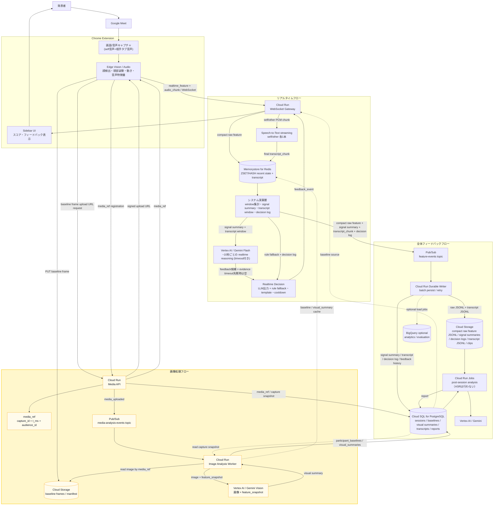
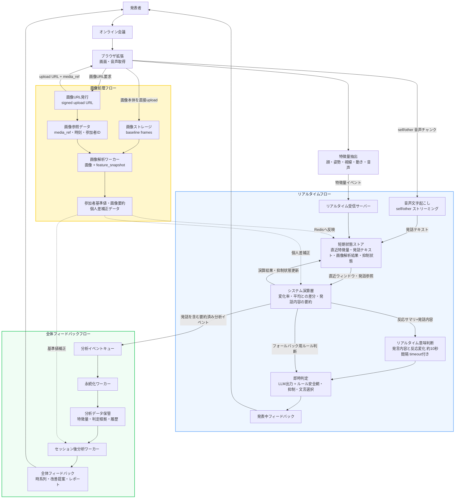

# Reaction Engine Architecture

## 目的

Reaction Engine は、Google Meet 上の発表・商談・授業・社内共有で、発表者にリアルタイムな反応フィードバックとセッション後レポートを返す。

重要な設計原則は、**動画や画像を常時サーバーへ送らない**こと。Chrome 拡張内で映像・音声を特徴量に変換し、サーバーには特徴量イベント、transcript、必要最小限の代表フレーム/短いクリップだけを送る。

このアーキテクチャは Google Cloud の managed services を中心に構成する。

## Google Cloud サービス対応表

| 論理コンポーネント | Google Cloud サービス | 役割 |
| --- | --- | --- |
| Chrome Extension | Chrome MV3 | Meet 画面/音声取得（self+other）、Edge Vision、feature event / 音声チャンク送信 |
| WebSocket Gateway | Cloud Run service | `realtime_feature` / `audio_chunk` 受信、Redis/Pub/Sub への分岐、`feedback_event` 返却 |
| システム演算層 | Cloud Run WebSocket Gateway 内 | window 集計、変化率、signal summary、transcript window 組み立て、~10秒ごとの Realtime LLM 呼び出し、decision log の計算 |
| Realtime Transcription | Speech-to-Text streaming | self/other 音声チャンクの即時文字起こし（session_idごとに2ストリーム） |
| Realtime LLM | Vertex AI / Gemini Flash | ~10秒間隔で反応サマリ+発話内容から feedback を生成（timeout + rule fallback） |
| Media API | Cloud Run service | baseline frame 用 signed upload URL 発行、media_ref 登録 |
| Realtime state | Memorystore for Redis | 直近 window、transcript window、latest state、feedback cooldown |
| Durable event pipeline | Pub/Sub | compact raw feature、signal summary、transcript_chunk、decision log を後続 worker に渡す durable queue |
| Image analysis event pipeline | Pub/Sub | media upload 完了 event を Image Analysis Worker に渡す |
| Durable Writer | Cloud Run service / Cloud Run worker | Pub/Sub を購読し、Cloud Storage / Cloud SQL に保存 |
| Image Analysis Worker | Cloud Run service / Cloud Run Jobs | 画像と画像取得時 snapshot から participant baseline / visual summary を計算 |
| Compact raw feature storage | Cloud Storage | compact raw feature JSONL、transcript JSONL、代表フレーム、短いクリップ |
| Baseline frame storage | Cloud Storage | baseline 用 screenshot / manifest |
| App database | Cloud SQL for PostgreSQL | session、participant、capture snapshot、participant baseline、visual summary、signal summary、transcript、decision log、feedback history、report |
| Post-session jobs | Cloud Run Jobs | セッション後分析、レポート生成（文字起こしは実施済みのため ASR は行わない） |
| LLM report | Vertex AI / Gemini | 反応タイムライン、改善提案、レポート生成 |
| Analytics optional | BigQuery | セッション横断分析、評価、集計 |
| Secrets | Secret Manager | DB password、API keys、署名鍵 |
| Observability | Cloud Logging / Cloud Monitoring | logs、metrics、alerts、latency/cost 監視（Realtime LLM呼び出しコスト含む） |

## 全体像

全体像は、3つのフローに分けて読む。

- リアルタイムフロー: 発表中に特徴量を受け取り、即時 feedback を返す
- 全体フィードバックフロー: セッション後の保存・集計・レポート生成を行う
- 画像処理フロー: screenshot の upload URL と `media_ref` を発行し、画像取得時の `feature_snapshot` から人ごとの baseline / visual summary を作る

画像処理フローは、リアルタイムフローの特徴量 window を参照しない。Chrome 拡張は画像本体を Cloud Storage に直接 upload し、画像取得時の compact `feature_snapshot` を Media API 経由で `capture_snapshots` に保存する。Image Analysis Worker は、この画像と `capture_snapshots.feature_snapshot` だけを入力にして、参加者ごとの `participant_baseline` と `visual_summary` を作る。

画像処理フローとリアルタイムフローは、生の特徴量や画像参照を共有しない。共有するのは、画像解析後に Redis / Cloud SQL へ保存された `participant_baselines` と `visual_summaries` だけ。Gateway は画像解析を同期的には待たず、Redis に反映済みの結果を次回以降の feedback で参照する。



## 概要データフロー

この図は、実装サービス名ではなく役割名で見たデータフロー。詳細な Google Cloud 構成を見る前に、どのデータがどのフローで使われるかを把握するための図。



## Chrome 拡張の責務

Chrome 拡張はリアルタイム分析の一次処理を担当する。

- Google Meet の画面/タブ/音声をユーザー同意のもと取得する
- `video -> canvas -> detector -> tracker -> features` の流れで特徴量を抽出する
- MediaPipe Face Detector / Face Landmarker で顔 bbox と顔ランドマークを取得する
- motion score、簡易 head pose、簡易 gaze、簡易 attention score、nod gesture を生成する
- self（マイク）/ other（タブ音声）それぞれの audio level、silence、speaking rate を VAD で算出する
- self/other の音声を PCM チャンクとして `realtime_feature` と同じ WebSocket コネクションに送る（別コネクションは張らない）
- `realtime_feature` を WebSocket で Cloud Run Gateway に送る
- Gateway からの `feedback_event` を sidebar に表示する
- baseline 取得期間は、数秒おきに screenshot を WebP で生成する
- baseline frame は WebSocket ではなく Media API の signed upload URL で Cloud Storage に直接 upload する
- 画像取得時の compact `feature_snapshot` を Media API に送り、画像処理フロー内の `capture_snapshots` として保存する
- 代表フレーム/短いクリップが必要な場合だけ upload 経路を使う

現状は Meet DOM の参加者名・タイル ID との紐づけ、本格的な視線推定は未実装。音声は self/other の VAD（音量ベース）までは実装済みだが、PCM チャンクの WebSocket 送信・Speech-to-Text streaming 連携・Realtime LLM 呼び出しは未実装（設計段階）。

## Media API / Baseline Frame Upload

baseline 用 screenshot は realtime WebSocket path に混ぜない。画像本体は重いため、Cloud Run Media API が signed upload URL と `media_ref` を発行し、Chrome 拡張が Cloud Storage に直接 upload する。

Gateway に画像本体や `media_ref` は送らない。画像処理フローでは、Media API が `media_ref`、`t_ms`、`audience_id`、`tile_id`、`feature_snapshot` を `capture_snapshots` として保存する。これにより、画像解析 worker はリアルタイムフローの Redis window を見に行かず、画像処理フロー内の snapshot だけで baseline / visual summary を作れる。

推奨 baseline capture:

- duration: session 開始後 30秒程度
- interval: 3〜5秒
- frame count: 6〜10枚
- format: `image/webp`
- quality: 0.6〜0.8

API:

```text
POST /sessions/{session_id}/media/upload-url
POST /sessions/{session_id}/media
POST /sessions/{session_id}/media/{capture_id}/complete
```

Upload URL request:

```json
{
  "purpose": "baseline_frame",
  "content_type": "image/webp",
  "capture_id": "cap_123",
  "t_ms": 12345,
  "audience_id": "aud_1",
  "tile_id": "tile_1",
  "feature_snapshot": {
    "attention_score": 0.55,
    "motion_score": 0.02,
    "gaze_estimate": "screen",
    "head_pose_estimate": { "yaw": 0.01, "pitch": -0.1, "roll": -0.2 },
    "mouth_openness": 0.01,
    "eye_openness": { "left": 0.4, "right": 0.5 },
    "face_bbox": { "x": 0.28, "y": 0.45, "w": 0.138, "h": 0.244 }
  }
}
```

Upload URL response:

```json
{
  "upload_url": "https://storage.googleapis.com/...",
  "media_ref": "gs://reaction-engine-sessions/sessions/sess_123/baseline/frames/12345-aud_1.webp",
  "expires_at": "2026-07-03T12:00:00Z"
}
```

media_ref registration:

```json
{
  "type": "media_ref",
  "purpose": "baseline_frame",
  "capture_id": "cap_123",
  "media_ref": "gs://reaction-engine-sessions/sessions/sess_123/baseline/frames/12345-aud_1.webp",
  "upload_status": "uploaded",
  "t_ms": 12345,
  "audience_id": "aud_1",
  "tile_id": "tile_1",
  "content_type": "image/webp",
  "nearest_feature_event_id": "evt_123",
  "feature_snapshot_ref": "capture_snapshots.cap_123"
}
```

Media API は upload URL 発行時に、`capture_id`、`media_ref`、`t_ms`、`audience_id`、`tile_id`、`feature_snapshot` を Cloud SQL の `capture_snapshots` に保存する。`feature_snapshot` は画像解析 worker の入力用 snapshot であり、通常の realtime feature event の source of truth ではない。

Chrome 拡張は upload 完了後、Media API に complete 通知を送る。`media_ref` は画像処理フロー内の metadata として扱い、`realtime_feature` には同梱しない。特徴量送信は画像 upload の完了を待たない。

`media/{capture_id}/complete` を受けた Media API は Cloud Storage object の存在を確認し、`capture_snapshots.upload_status = uploaded` と `media_refs.upload_status = uploaded` に更新してから Pub/Sub topic `media-analysis-events` に `media_uploaded` event を publish する。

Image Analysis Worker はこの event を起点に、`capture_snapshots` から `feature_snapshot` を読み、`media_ref` が指す画像と合わせて `participant_baselines` と `visual_summaries` を作る。画像処理フローの主目的は「画像だけの独立解析」ではなく、「画像 + 画像取得時の特徴量 snapshot」から人ごとの基準値をリアルタイム利用できる形に変換すること。

## Cloud Run WebSocket Gateway

Cloud Run Gateway は Chrome 拡張から WebSocket で `realtime_feature` と `audio_chunk` を受け取り、Gateway 内の **システム演算層** でリアルタイムの演算処理まで担当する。

システム演算層は、feature event ごとの軽量な rule 計算（低遅延）と、~10秒間隔の LLM 呼び出し（意味判断）の2段構えで動く。結果は2方向に分岐する。

- **リアルタイム feedback path**: LLM 出力（予算内に応答があれば）または rule の signal summary / decision log から `feedback_event` を返す。
- **永続化 path**: compact raw feature、signal summary、transcript_chunk、decision log を Pub/Sub に publish する。

1. **Memorystore for Redis**
   - compact raw feature、transcript_chunk（final）を保存する
   - 直近 window / transcript window / latest state / computed state / cooldown に使う
   - リアルタイム feedback の判定で読む
   - 物理的に別の短期 state store を増やすのではなく、同じ Redis 内で key を分ける

2. **Speech-to-Text streaming**
   - session_id ごとに self/other 各1本の streaming セッションを維持する
   - Gateway は audio_chunk をそのまま streaming セッションへ転送する
   - 確定（final）結果のみ `transcript_chunk` として組み立てる

3. **Pub/Sub**
   - compact raw feature、signal summary、transcript_chunk、decision log を publish する
   - Durable Writer / 後分析 pipeline へ渡す
   - Gateway は Cloud Storage や Cloud SQL へ同期保存しない

```text
on realtime_feature:
  validate payload
  assign event_id
  set server_received_at_ms

  Redis pipeline:
    for each audience feature:
      ZADD features:recent:{session_id}:{audience_id} t_ms compact_payload
      ZREMRANGEBYSCORE features:recent:{session_id}:{audience_id} -inf now-60000
    HSET session:state:{session_id} latest_feature compact_payload latest_t_ms t_ms
    EXPIRE features:recent:{session_id}:{audience_id} 3600
    EXPIRE session:state:{session_id} 3600

on audio_chunk:
  forward pcm to Speech-to-Text streaming session (speaker=self|other)
  on STT final result:
    assign event_id
    ZADD transcript:recent:{session_id}:{speaker} t_start_ms transcript_chunk
    EXPIRE transcript:recent:{session_id}:{speaker} 3600

every ~10s (per session):
  read 5s / 10s / 30s recent feature windows per audience + transcript window
  read baseline / cooldown / latest computed state
  calculate signal_summary
  call Gemini Flash(signal_summary, transcript_window) with timeout budget
  if response within budget:
    use LLM feedback candidate + evidence quote
  else:
    fall back to rule + template decision
  evaluate feedback decision with cooldown
  create decision_log
  HSET session:computed:{session_id}:{audience_id} latest_signal_summary latest_decision_log
  HSET feedback:cooldown:{session_id}:{audience_id} feedback_type last_emitted_at_ms

  Pub/Sub:
    publish topic feature-events with compact_raw_feature + signal_summary + transcript_chunk + decision_log
```

Cloud Run の WebSocket は long-running request なので、request timeout と reconnect を前提にする。接続先 Cloud Run instance が変わっても問題ないよう、session state は instance memory ではなく Memorystore / Pub/Sub 側に置く。

### Cloud Run のスケール単位

1つの Google Meet session に対して、発表者の Chrome 拡張から Gateway へ張る WebSocket は基本的に1本にする。その1本の WebSocket 内に、参加者ごとの `audience_id` を含む feature event をまとめて流す。

```text
WebSocket connection
  session_id: sess_123
  feature events:
    audience_id: aud_1
    audience_id: aud_2
    audience_id: aud_3
```

Cloud Run が直接 `audience_id` の数を見て scale out するわけではない。Cloud Run の水平スケールは、主に同時リクエスト数、WebSocket 接続数、CPU 使用率、メモリ使用量によって決まる。WebSocket は接続中の long-running HTTP request として扱われるため、1つの接続は基本的に同じ Cloud Run instance に張り付く。

```text
Meet session A -> WebSocket 1本 -> Cloud Run Gateway instance 1
Meet session B -> WebSocket 1本 -> Cloud Run Gateway instance 1
Meet session C -> WebSocket 1本 -> Cloud Run Gateway instance 2
```

そのため、1つの大きな Meet session 内の参加者20人分の処理が、自動的に複数の Gateway instance に分散されるわけではない。参加者数が増えると、1本の WebSocket 内の payload 量、Redis 書き込み回数、window 集計量、Pub/Sub publish 量、CPU 使用率が増える。その結果として Cloud Run 全体の負荷が上がり、別 session や別接続の処理は追加 instance に分散される。

設計上の分離単位は、Cloud Run instance ではなく `session_id + audience_id` にする。

```text
features:recent:{session_id}:{audience_id}
session:computed:{session_id}:{audience_id}
session:baseline:{session_id}:{audience_id}
feedback:cooldown:{session_id}:{audience_id}
```

音声の transcript は session 全体と speaker 単位で扱う。

```text
transcript:recent:{session_id}:{speaker}
```

Gateway は、1接続内で複数参加者分の feature event を受け取り、`session_id + audience_id` ごとに Redis window と computed state を更新する。重い画像解析は Gateway では実行せず、Chrome 拡張側または画像処理フローの worker に分離する。

## システム演算層

システム演算層は Cloud Run WebSocket Gateway 内に置く。目的は、raw な瞬間値をそのまま feedback や LLM に渡さず、低コストで安定した signal に変換すること。

入力:

- Chrome 拡張から届いた latest `realtime_feature`
- Memorystore for Redis の recent window（特徴量 + transcript）
- Speech-to-Text streaming が確定した `transcript_chunk`
- session baseline
- feedback cooldown state

出力:

- `compact_raw_feature`
- `signal_summary`
- `transcript_chunk`
- `decision_log`（LLM出力 or rule fallback の判断根拠を含む）
- optional `feedback_event`

この層で計算した `signal_summary` と `decision_log` を、リアルタイム feedback と後続の保存/分析の両方で使う。つまり、同じ演算を Durable Writer や後分析 worker で繰り返さない。Realtime LLM 呼び出し（~10秒間隔）はこの層から行い、timeout / quota超過時は rule + template によるフォールバックに切り替える。

## Memorystore for Redis

Memorystore for Redis はリアルタイム判定用の短期 state として使う。

主な key:

```text
features:recent:{session_id}:{audience_id}
transcript:recent:{session_id}:{speaker}
session:state:{session_id}
session:computed:{session_id}:{audience_id}
session:baseline:{session_id}:{audience_id}
session:visual_summary:{session_id}:{audience_id}
session:baseline_status:{session_id}:{audience_id}
feedback:cooldown:{session_id}:{audience_id}
```

用途:

- 参加者ごとの直近 10秒/30秒の feature window
- speaker ごとの直近~10秒の transcript_chunk（final）window
- latest feature state
- latest signal summary / latest decision log
- 画像解析 worker が作った participant baseline / visual summary
- baseline_status（warming_up / ready / failed）
- reconnect 時の session state
- feedback cooldown
- baseline / smoothing 用の一時状態

`features:recent:*` / `transcript:recent:*` は演算前の直近 window、`session:computed:*` は演算後のリアルタイム参照 state、`session:baseline:*` / `session:visual_summary:*` は画像処理フローで作った参加者ごとの基準値 cache、`session:baseline_status:*` は Gateway が補正を使えるか判断する state、`feedback:cooldown:*` は同じ feedback を出しすぎないための抑制 state。どれも同じ Memorystore for Redis の key であり、別の短期状態ストアを追加するわけではない。

TTL で消える前提。セッション後分析の source of truth にはしない。

## Pub/Sub

Pub/Sub は durable event pipeline として使う。Redis Stream の代わりに、Google Cloud managed service としての Pub/Sub を採用する。

Topic:

```text
feature-events
```

Subscription:

```text
feature-events-durable-writer
```

Pub/Sub message:

```json
{
  "event_id": "evt_123",
  "type": "realtime_analysis_event",
  "schema_version": 1,
  "session_id": "sess_123",
  "t_ms": 1783067121751,
  "server_received_at_ms": 1783067121800,
  "payload": {
    "compact_raw_feature": {},
    "signal_summary": {},
    "transcript_chunk": {},
    "decision_log": {}
  }
}
```

`transcript_chunk` は Speech-to-Text streaming が確定（final）した区間がある場合のみ含む。無い場合は省略する。

Pub/Sub は最終保存先ではない。Cloud Run Durable Writer が subscribe し、保存成功後に ack する。失敗時は retry / dead-letter topic を使う。

画像解析 worker 用には別 topic を使う。

Topic:

```text
media-analysis-events
```

Message:

```json
{
  "event_id": "evt_media_123",
  "type": "media_uploaded",
  "schema_version": 1,
  "session_id": "sess_123",
  "capture_id": "cap_123",
  "audience_id": "aud_1",
  "tile_id": "tile_1",
  "t_ms": 12345,
  "media_ref": "gs://reaction-engine-sessions/sessions/sess_123/baseline/frames/12345-aud_1.webp",
  "purpose": "baseline_frame"
}
```

## Durable Writer

Durable Writer は Cloud Run service または Cloud Run worker として動かす。Pub/Sub subscription から realtime analysis event を受け取り、後分析用データとして保存する。

処理:

1. Pub/Sub から message を受け取る
2. `event_id` で冪等性を確保する
3. session_id ごとに batch / buffer する
4. compact raw feature、transcript_chunk、signal summary / decision log を JSONL として Cloud Storage に保存する
5. signal summary、transcript、decision log、feedback history を Cloud SQL に upsert する
6. 保存成功後に Pub/Sub message を ack する
7. 保存失敗時は nack / retry、繰り返し失敗は dead-letter topic に送る

主な保存先:

```text
Cloud Storage:
  gs://reaction-engine-sessions/sessions/{session_id}/features/compact-raw/part-0001.jsonl
  gs://reaction-engine-sessions/sessions/{session_id}/features/signal-summary/part-0001.jsonl
  gs://reaction-engine-sessions/sessions/{session_id}/features/decision-log/part-0001.jsonl
  gs://reaction-engine-sessions/sessions/{session_id}/capture-snapshots/part-0001.jsonl
  gs://reaction-engine-sessions/sessions/{session_id}/media-refs/part-0001.jsonl
  gs://reaction-engine-sessions/sessions/{session_id}/transcript/part-0001.jsonl
  gs://reaction-engine-sessions/sessions/{session_id}/frames/...
  gs://reaction-engine-sessions/sessions/{session_id}/clips/...

Cloud SQL for PostgreSQL:
  sessions
  participants
  capture_snapshots
  participant_baselines
  visual_summaries
  signal_summaries
  transcripts
  media_refs
  decision_logs
  session_summaries
  feedback_events
  reports
```

Cloud Storage の JSONL は append ではなく、一定件数/一定時間ごとの chunk file として作る。重複は `event_id` で後分析時に dedupe できるようにする。

`capture_snapshots` と `media_refs` は Durable Writer ではなく Media API が作成・更新する。Realtime feature の保存経路とは分ける。

`capture_snapshots` は Image Analysis Worker の primary lookup 用なので Cloud SQL を主保存先にする。Cloud Storage の `capture-snapshots/*.jsonl` は archive / reprocess 用であり、worker の通常経路では Cloud SQL を `capture_id` で読む。

## Image Analysis Worker

Image Analysis Worker は Cloud Run service または Cloud Run Jobs として動かす。画像 upload 完了後の `media_uploaded` event を受け取り、Cloud SQL の `capture_snapshots.feature_snapshot` と画像を入力にして、参加者ごとの `participant_baselines` と `visual_summaries` を作る。

Realtime LLM とは別の worker にする。Realtime LLM は発表中の feedback 候補を作る処理で、Image Analysis Worker は参加者ごとの基準値・画像由来の補正データを作る処理。Gateway は画像解析 worker の完了を同期的には待たず、Redis に入った結果だけを次回以降の feedback に使う。

入力:

- Pub/Sub topic `media-analysis-events`
- Cloud Storage の baseline frames
- Cloud SQL の `capture_snapshots`
- `capture_snapshots.feature_snapshot`
- Cloud SQL / Cloud Storage manifest の `media_ref`

join key:

```text
primary: capture_id
```

処理:

1. `media_uploaded` event から `capture_id` / `session_id` / `audience_id` / `t_ms` / `media_ref` を受け取る。
2. `capture_id` で `capture_snapshots` を Cloud SQL から読む。
3. `media_ref` が指す画像を Cloud Storage から読む。
4. `feature_snapshot` が無い場合は画像解析を実行せず、`baseline_status = failed` または `insufficient_snapshot` として扱う。
5. 画像 + `feature_snapshot` を Vision model / Gemini Vision に渡し、visual summary を作る。
6. 複数 sample から `participant_baselines` を更新する。
7. Redis に `session:baseline:*` / `session:visual_summary:*` / `session:baseline_status:*` を保存する。
8. Cloud SQL に `participant_baselines` / `visual_summaries` / `media_refs` を保存する。

保存する baseline / visual summary 例:

```json
{
  "session_id": "sess_123",
  "audience_id": "aud_1",
  "baseline": {
    "attention_score_avg": 0.61,
    "motion_score_avg": 0.05,
    "gaze_screen_ratio": 0.72,
    "head_pose_center": { "yaw": 0.03, "pitch": -0.08, "roll": 0.01 },
    "eye_openness_avg": { "left": 0.42, "right": 0.44 }
  },
  "visual_summary": {
    "face_quality": "usable",
    "lighting": "normal",
    "camera_angle": "front",
    "baseline_expression": "neutral"
  },
  "sample_count": 8,
  "source_media_refs": ["gs://reaction-engine-sessions/sessions/sess_123/baseline/frames/12345-aud_1.webp"],
  "confidence": 0.74
}
```

baseline ができるまでの最初の 30〜60秒は `baseline_status = warming_up` として扱う。Gateway のシステム演算層は、baseline が未準備なら session default threshold で控えめに feedback を出し、`baseline_status = ready` になった参加者から個人差補正と visual summary を使う。

## リアルタイム分析

リアルタイム判定は Cloud Run Gateway 内のシステム演算層で行う。Gateway は Memorystore for Redis の直近 window だけを見る。Cloud SQL や Cloud Storage を判定のたびに読まない。

入力:

- `face_count`
- `face_visible`
- `attention_score`
- `motion_score`
- `gaze_estimate`
- `head_pose_estimate`
- `gestures`
- `audio_level`, `silence_ms`, `speaking_rate`（self/other 別）
- 直近~10秒の `transcript_chunk`（self/other 別）
- `participant_baseline`（Image Analysis Worker が作成）
- `visual_summary`（Image Analysis Worker が作成）
- `baseline_status`（warming_up / ready / failed）

システム演算層で計算する signal summary:

- latest
- 5秒平均
- 10秒平均
- 直前 window との差分
- session baseline との差分
- visual summary による補正
- slope
- low / high state の継続時間
- confidence
- cooldown state

signal summary と transcript window は、~10秒間隔で Gemini Flash に渡す。LLM には「この時間窓でどんな発言をしていて、反応がどう変化したか」を timeout 付きで判断させ、応答が予算内に得られた場合はその feedback 候補（reason + 発言の抜粋）を使う。timeout・エラー・quota超過の場合は、rule + template + cooldown による従来のフォールバック判断を使う。どちらの経路でも同じ cooldown / wording policy を通してから `feedback_event` を返す。

出力（LLMが応答した場合）:

```json
{
  "type": "feedback_event",
  "session_id": "sess_123",
  "t_ms": 65000,
  "feedback_type": "reaction_down_candidate",
  "severity": "low",
  "message": "価格の話をしている間、視線が画面から逸れる参加者が増えている可能性があります。説明を区切って質問を挟むとよさそうです。",
  "reason_codes": ["attention_score_drop", "motion_drop"],
  "evidence_quote": "ここから価格戦略について説明します",
  "source": "llm",
  "model_version": "gemini-flash-realtime",
  "confidence": 0.64,
  "cooldown_ms": 30000
}
```

出力（フォールバック時、`source: "rule"` で `evidence_quote` は null）:

```json
{
  "type": "feedback_event",
  "session_id": "sess_123",
  "t_ms": 65000,
  "feedback_type": "reaction_down_candidate",
  "severity": "low",
  "message": "一部の反応が薄くなっている可能性があります。ここで一度確認を挟むとよさそうです。",
  "reason_codes": ["attention_score_drop", "motion_drop"],
  "evidence_quote": null,
  "source": "rule",
  "confidence": 0.5,
  "cooldown_ms": 30000
}
```

フィードバックは断定的な感情推定にしない。同じ時間窓に発言と反応変化が同時に見えても、それは相関であって因果の証明ではないため、言い切らない表現にする。発表者がすぐ取れる小さい行動に落とす。

LLM呼び出しの頻度・レイテンシ・コスト・失敗率は Cloud Monitoring / Cost Dashboard で継続的に監視する。

## セッション後分析

セッション後分析は、Memorystore state ではなく Durable Writer が保存した Cloud Storage の compact raw feature JSONL と signal summary / decision log を基本入力にする。

入力:

- Cloud Storage の compact raw feature JSONL
- Cloud Storage / Cloud SQL の signal summary
- Cloud Storage / Cloud SQL の decision log（リアルタイムLLMの判断結果を含む）
- Cloud Storage / Cloud SQL の transcript chunk（会議中の streaming STT で確定済み）
- Cloud SQL の `visual_summaries`
- Cloud SQL の `capture_snapshots`
- feedback history
- session summary
- 代表フレーム/短いクリップ

処理:

1. Cloud Run Job を session end で起動する
2. feature timeline と transcript を timestamp で align する（transcript は既に session と同じ時計で記録済みなので、事後ASRのようなずれ補正は不要）
3. Cloud SQL の `visual_summaries` / `participant_baselines` を参加者ごとの補正情報として読む
4. attention / motion / gaze / audio の変化点を検出する
5. 変化点前後の発話内容、画像解析 worker が作った visual summary、リアルタイムLLMが既に出した decision log を evidence としてまとめる
6. Vertex AI / Gemini で report / coaching suggestion を生成する
7. report を Cloud SQL に保存する
8. 必要に応じて BigQuery に評価・分析用データを export する

## 録画アップロード分析（オプション）

リアルタイム経路（realtime feature + streaming STT）は単体で完結する。録画アップロード分析は、その精度を上げるための **任意（オプション）機能** であり必須ではない。

前提となる動線:

- 録画は Google Workspace 有料プランの Google Meet 録画機能で取得する（主催者の Google Drive の Meet Recordings に保存される）。拡張側では録画しない。
- ユーザーが会議後に、その録画ファイルを任意でアップロードする（アップロードは明示的なユーザー操作）。

分析ロジックは現行と同じ:

- フィードバック生成ロジックは、リアルタイム／セッション後分析と同一。すなわち **特徴量の変化量**（attention / gaze / motion / audio などの変化点）と、**文字起こしによる発話内容** を突き合わせて evidence を作り、Vertex AI / Gemini で report / coaching suggestion を生成する。
- 録画は「新しい分析ロジック」を持ち込むのではなく、**同じ分析に、より高品質な入力を与える**だけである。

録画で精度が上がる理由:

- リアルタイムは edge 処理のためフレーム間引き・取りこぼし・低解像度がある。録画は **全フレーム・フル解像度で vision（MediaPipe）を再解析** でき、feature timeline が密で正確になる。
- リアルタイムの streaming STT に対し、録画は **フル音声を asynchronous Speech-to-Text でバッチ認識** できるため、transcript の欠落・誤りが減る。
- → ユーザーには「録画をアップロードすると分析精度が上がる」という位置づけで提示する。

GCP 上の処理（既存のセッション後分析を再利用）:

1. Media API で録画ファイルの signed upload URL を発行し、Cloud Storage に直接 upload、session_id に紐付けて media_ref を登録する。
2. アップロード完了を契機に、録画あり用の Cloud Run Job を起動する。
3. 録画映像から vision を再解析し、高精度な feature timeline を生成する。
4. 録画音声を asynchronous Speech-to-Text で文字起こしし、session と同じ時計に align する（録画のタイムベースを session の絶対時刻へマップする）。
5. 以降は既存のセッション後分析（変化点検出 → evidence 集約 → Gemini で report / coaching 生成）と同じ処理を通す。
6. 既存のリアルタイム由来レポートを、録画由来の高精度版で補強または差し替える。

注意:

- 録画は顔映像・生音声を含むため、consent と retention を feature event / baseline frame より厳しく扱う。`Session.consent` に録画アップロード分析用の独立した同意項目を持たせる。
- リアルタイム経路が「生 PCM を保存しない／事後ASRを行わない」方針なのに対し、録画パスは **ユーザーが明示的にアップロードした録画に限り** asynchronous STT と映像再解析を行う例外として扱う。
- 処理後の録画本体の保持方針（保持しない／一定期間で削除など）を明示する。

## Speech-to-Text / Transcript

文字起こしは会議中に Speech-to-Text streaming でリアルタイムに行う。事後の非同期認識（asynchronous recognition）は行わない。

- Chrome 拡張が self（マイク）/ other（タブ音声）の PCM チャンクを既存の feature 用 WebSocket に相乗りさせて送る
- Cloud Run Gateway が session_id ごとに self/other 各1本の Speech-to-Text streaming セッションを維持し、audio_chunk をそのまま中継する
- 1ストリームの継続時間上限があるため、Gateway が会議中に定期的にストリームを再接続する
- 確定（final）した結果のみ `transcript_chunk`（`speaker: self|other`, `t_start_ms`, `t_end_ms`, `text`, `confidence`, `is_final`）として組み立て、Memorystore recent window と Pub/Sub の両方に送る
- 中間(interim)結果は永続化しない
- 生の PCM 音声はどこにも保存しない。保存するのは確定済みテキストのみ

これにより、`transcript_chunk` はリアルタイム分析（~10秒ごとの Realtime LLM 呼び出し）とセッション後分析の両方で同じデータをそのまま使う。

## データ契約

### Realtime Feature Event

```json
{
  "event_id": "evt_123",
  "type": "realtime_feature",
  "schema_version": 1,
  "session_id": "sess_123",
  "t_ms": 1783067121751,
  "server_received_at_ms": 1783067121800,
  "meeting_provider": "google_meet",
  "source": "chrome_side_panel",
  "features": {
    "face_visible": true,
    "face_count": 1,
    "face_tracks": [
      {
        "audience_id": "aud_1",
        "face_bbox": { "x": 0.28, "y": 0.45, "w": 0.138, "h": 0.244 },
        "gaze_estimate": "screen",
        "head_pose_estimate": { "yaw": 0.009, "pitch": -0.113, "roll": -0.195 },
        "gestures": { "nod_count": 0, "nod_score": 0 }
      }
    ],
    "motion_score": 0.002,
    "attention_score": 0.551,
    "gaze_estimate": "screen",
    "client_model_version": {
      "face_detector": "mediapipe-blaze-face-short-range-v1",
      "face_landmarker": "mediapipe-face-landmarker-v1"
    }
  }
}
```

`event_id` と `server_received_at_ms` は Gateway 側で付与する。Chrome 拡張から送られる時点では未設定でもよい。

画像処理フロー用の `media_ref` / `feature_snapshot` は `realtime_feature` には入れない。画像取得時は別途 Media API に `capture_snapshot` として送る。

### Capture Snapshot（クライアント→Media API）

画像取得時の compact feature snapshot。Image Analysis Worker の primary input として Cloud SQL の `capture_snapshots.feature_snapshot` に保存する。

```json
{
  "capture_id": "cap_123",
  "session_id": "sess_123",
  "audience_id": "aud_1",
  "tile_id": "tile_1",
  "t_ms": 12345,
  "media_ref": "gs://reaction-engine-sessions/sessions/sess_123/baseline/frames/12345-aud_1.webp",
  "upload_status": "pending",
  "feature_snapshot": {
    "attention_score": 0.55,
    "motion_score": 0.02,
    "gaze_estimate": "screen",
    "head_pose_estimate": { "yaw": 0.01, "pitch": -0.1, "roll": -0.2 },
    "mouth_openness": 0.01,
    "eye_openness": { "left": 0.4, "right": 0.5 },
    "face_bbox": { "x": 0.28, "y": 0.45, "w": 0.138, "h": 0.244 }
  }
}
```

`feature_snapshot` には画像解析に必要な compact feature だけを入れる。full landmarks / face_parts は原則入れない。必要な場合だけ debug / sampling / anomaly 用として Cloud Storage に別保存する。

### Audio Chunk（クライアント→Gateway）

```json
{
  "type": "audio_chunk",
  "session_id": "sess_123",
  "speaker": "self",
  "t_ms": 12345,
  "sample_rate": 16000,
  "pcm": "<base64 or binary frame>"
}
```

既存の feature 用 WebSocket コネクションに相乗りさせる。バイナリフレームで送る場合は `speaker`/`t_ms` を先頭の小さなヘッダに埋め込む。

### Transcript Chunk（Gateway→永続化）

```json
{
  "event_id": "evt_456",
  "type": "transcript_chunk",
  "schema_version": 1,
  "session_id": "sess_123",
  "speaker": "self",
  "t_start_ms": 12000,
  "t_end_ms": 17000,
  "text": "ここから価格戦略について説明します",
  "confidence": 0.91,
  "is_final": true
}
```

`speaker` は `self`（発信者マイク）/ `other`（タブ音声＝参加者側）。Speech-to-Text streaming の確定（final）結果のみを発行する。

## 保存方針

| データ | 用途 | Google Cloud 保存先 |
| --- | --- | --- |
| 直近 feature window | リアルタイム判定 | Memorystore for Redis ZSET |
| self/other 音声チャンク（PCM） | Speech-to-Text streaming への中継 | 保存しない（Gateway→STTへ転送するのみ） |
| transcript_chunk | リアルタイムLLM判断根拠・後分析 | Pub/Sub -> Cloud Storage / Cloud SQL |
| latest session state | realtime state / reconnect | Memorystore for Redis HASH |
| compact raw feature | 再集計・後分析 source of truth | Pub/Sub -> Cloud Storage |
| capture snapshot | 画像解析 worker の入力 snapshot | Cloud SQL JSONB primary / Cloud Storage JSONL archive |
| media_ref | 画像処理フロー内の画像参照 | Media API -> Cloud SQL / Cloud Storage manifest |
| signal summary | リアルタイム判断根拠・後分析 | Pub/Sub -> Cloud Storage / Cloud SQL |
| decision log | feedback の根拠・評価（LLM判断含む） | Pub/Sub -> Cloud Storage / Cloud SQL |
| baseline frame | baseline 計算・LLM evidence の画像本体 | Signed upload -> Cloud Storage |
| baseline manifest | baseline frame と feature event の対応 | Cloud Storage / Cloud SQL |
| participant baseline | 個人差補正・しきい値補正 | Cloud SQL / Memorystore cache |
| visual summary | 画像解析由来の参加者プロファイル・補正情報 | Cloud SQL / Memorystore cache |
| session metadata | lifecycle / consent / role | Cloud SQL for PostgreSQL |
| session summary | レポート・一覧表示 | Cloud SQL for PostgreSQL |
| feedback history | UI / 評価 / report | Cloud SQL for PostgreSQL |
| 代表フレーム/短いクリップ | evidence / 詳細分析 | Cloud Storage |
| 横断分析用データ | analytics / evaluation | BigQuery optional |

## MVP 実装順

1. Chrome 拡張の feature event を安定化する
2. Cloud Run WebSocket Gateway を実装する
3. Memorystore for Redis に recent state を保存する
4. Gateway 内で signal summary と decision log（rule ベース）を作る
5. Memorystore recent window から簡単な `feedback_event` を返す
6. Pub/Sub topic `feature-events` に compact raw feature + signal summary + decision log を publish する
7. Cloud Run Durable Writer で Pub/Sub から JSONL を Cloud Storage に保存する
8. Cloud SQL に session metadata / signal summary / decision log / feedback history を保存する
9. Chrome 拡張から self/other の音声チャンクを既存WebSocketに相乗りさせて送る
10. Cloud Run Gateway に session_id ごとの Speech-to-Text streaming セッション（self/other）を追加し、`transcript_chunk` を組み立てる
11. `transcript_chunk` を Memorystore recent window と Pub/Sub の両経路に流す
12. システム演算層に ~10秒間隔の Gemini Flash 呼び出し（signal summary + transcript window、timeout付き）を追加し、rule fallback と統合する
13. Media API で baseline frame の signed upload URL、`media_ref`、`capture_snapshots.feature_snapshot` 保存を実装する
14. Chrome 拡張が画像取得時の compact `feature_snapshot` を Media API に渡す。`media_ref` は `realtime_feature` に同梱しない
15. `media-analysis-events` と Image Analysis Worker を追加する
16. Image Analysis Worker が画像 + `capture_snapshots.feature_snapshot` から participant baseline / visual summary を作る
17. participant baseline / visual summary を Cloud SQL に保存し、Memorystore に cache する
18. session end で Cloud Run Job を起動する
19. compact raw JSONL + signal summary + transcript + participant baseline + visual summary からセッション後レポートを生成する

## 技術選定

- Extension: Chrome MV3
- Backend Language: Go
- Backend Runtime: Go 1.26
- Backend HTTP: standard `net/http` + lightweight router
- Backend WebSocket: `nhooyr.io/websocket` or `gorilla/websocket`
- Backend DB: `pgx` + Cloud SQL for PostgreSQL
- Backend Redis: `go-redis` + Memorystore for Redis
- Backend GCP SDK: `cloud.google.com/go/*`
- Edge Vision: MediaPipe Tasks Vision
- Edge Audio: Web Audio API（AudioWorklet で self/other PCM抽出）
- Realtime Transport: WebSocket（特徴量 + 音声チャンクを同一コネクションで多重化）
- WebSocket Gateway: Go service on Cloud Run
- Realtime State: Memorystore for Redis
- Realtime Transcription: Speech-to-Text streaming（session_idごとにself/other各1本）
- Realtime LLM: Vertex AI / Gemini Flash（~10秒間隔、timeout + rule fallback）
- Durable Event Pipeline: Pub/Sub
- Durable Writer: Go Cloud Run service / worker
- Durable Storage: Cloud Storage JSONL
- Media Upload: Cloud Run signed upload API + Cloud Storage signed URL
- Image Analysis Worker: Go Cloud Run service / Jobs + Pub/Sub + Vertex AI / Gemini Vision
- App DB: Cloud SQL for PostgreSQL
- Post-session Workers: Cloud Run Jobs（ASRは行わず、変化点検出・レポート生成のみ）
- LLM Report: Vertex AI / Gemini（post-session report + realtime reasoning）
- Analytics: BigQuery optional
- Observability: Cloud Logging / Cloud Monitoring
- Secrets: Secret Manager

## 設計上の注意

- Cloud Run WebSocket は timeout / reconnect を前提にする。
- Cloud Run instance memory に session state を置かない。状態は Memorystore / Cloud SQL / Cloud Storage に逃がす。
- Pub/Sub は at-least-once delivery 前提なので、Durable Writer は `event_id` で冪等にする。
- Cloud Storage JSONL は chunk file として保存し、後分析時に `event_id` で dedupe する。
- Cloud SQL に compact raw feature を全件 insert しない。Cloud SQL は metadata、signal summary、decision log、report、feedback history を持つ。
- full face landmarks / face_parts は常時保存しない。debug mode、sampling、anomaly segment、明示的な consent がある場合だけ保存する。
- baseline frame は WebSocket に流さない。signed upload URL で Cloud Storage に直接 upload し、Pub/Sub には `media_ref` / manifest だけを流す。
- baseline frame は顔画像を含むため、consent と retention を feature event より厳しく扱う。
- BigQuery は MVP では必須ではない。セッション横断分析や評価が必要になった段階で追加する。
- self/other の生 PCM 音声はどこにも保存しない。Gateway は Speech-to-Text streaming への中継のみ行い、保存するのは確定済み `transcript_chunk`（テキスト）だけにする。
- 発話内容のテキスト化・保存は音量ベースのVAD利用より機微度が高いため、`Session.consent` に `transcribe_audio` を独立した同意項目として持たせる。
- Speech-to-Text streaming は1ストリームの継続時間に上限があるため、Gateway は会議中に session_id ごとの self/other ストリームを定期的に再接続する。
- Realtime LLM 呼び出しは厳格な timeout を必須にし、timeout・エラー・quota超過時は必ず rule + template フォールバックに切り替える。呼び出し頻度・レイテンシ・コストは常時監視する。
- 同じ時間窓に発言内容と反応変化が同時に見えても、それは相関であって因果の証明ではない。feedback の文言・レポートの `evidence` は言い切らない表現にする。
