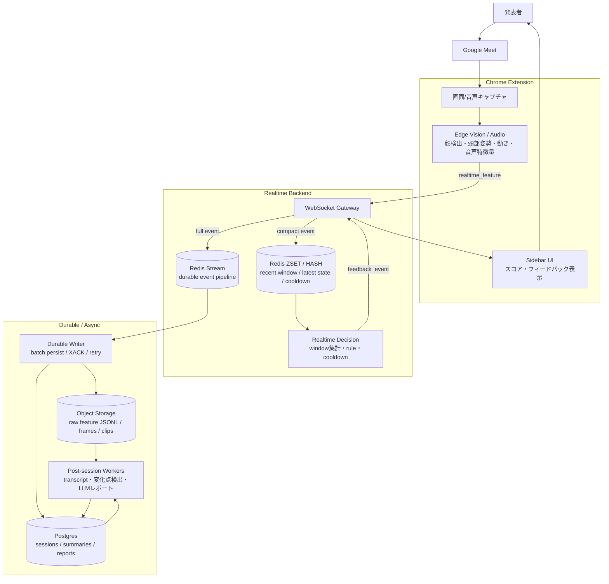

# Reaction Engine Architecture

## 目的

Reaction Engine は、Google Meet 上の発表・商談・授業・社内共有で、発表者にリアルタイムな反応フィードバックとセッション後レポートを返す。

重要な設計原則は、**動画や画像を常時サーバーへ送らない**こと。Chrome 拡張内で映像・音声を特徴量に変換し、サーバーには特徴量イベント、transcript、必要最小限の代表フレーム/短いクリップだけを送る。

## 全体像



## Chrome 拡張の責務

Chrome 拡張は、リアルタイム分析の一次処理を担当する。

- Google Meet の画面/タブ/音声をユーザー同意のもと取得する
- `video -> canvas -> detector -> tracker -> features` の流れで特徴量を抽出する
- MediaPipe Face Detector / Face Landmarker で顔 bbox と顔ランドマークを取得する
- motion score、簡易 head pose、簡易 gaze、簡易 attention score、nod gesture を生成する
- 将来的に audio level、silence、speaking rate などを生成する
- `realtime_feature` を WebSocket で Gateway に送る
- サーバーからの `feedback_event` を sidebar に表示する
- 代表フレーム/短いクリップが必要な場合だけ upload 経路を使う

現状は Meet DOM の参加者名・タイル ID との紐づけ、音声特徴量、本格的な視線推定は未実装。

## Realtime Gateway

Realtime Gateway は Chrome 拡張から WebSocket で `realtime_feature` を受け取り、1回の ingest で2つの Redis 経路に流す。

```text
on realtime_feature:
  validate payload
  assign event_id
  set server_received_at_ms

  Redis pipeline:
    ZADD features:recent:{session_id} t_ms compact_payload
    ZREMRANGEBYSCORE features:recent:{session_id} -inf now-60000
    HSET session:state:{session_id} latest_feature compact_payload latest_t_ms t_ms
    EXPIRE features:recent:{session_id} 3600
    EXPIRE session:state:{session_id} 3600
    XADD features:stream * event_id ... payload full_payload
```

Gateway は Postgres や Object Storage へ同期保存しない。低遅延 path では Redis への軽い書き込みまでに留める。

## Redis の役割

### Redis ZSET / HASH

リアルタイム判定用の短期 state。

主な key:

```text
features:recent:{session_id}
session:state:{session_id}
feedback:cooldown:{session_id}
```

用途:

- 直近 10秒/30秒の feature window
- 最新 feature state
- session status
- feedback cooldown
- baseline / smoothing 用の一時状態

TTL で消える前提。セッション後分析の source of truth にはしない。

### Redis Stream

Durable Writer へ渡す処理待ち event log。

主な key:

```text
features:stream
```

用途:

- full `realtime_feature` の append
- Durable Writer の batch 読み取り
- worker 失敗時の pending / retry

Redis Stream は最終保存先ではない。writer が Object Storage / Postgres に保存した後、`XACK` する。

## Durable Writer

Durable Writer は Redis Stream から event を読み、後分析用データとして保存する。

処理:

1. `XREADGROUP` で `features:stream` を batch 読みする
2. session_id ごとに event を group する
3. raw feature event を JSONL として Object Storage に保存する
4. session summary / feedback history を Postgres に upsert する
5. 保存成功後に `XACK` する
6. worker failure 時は `XAUTOCLAIM` で pending event を回収する

保存先:

```text
Object Storage:
  sessions/{session_id}/features/part-0001.jsonl
  sessions/{session_id}/frames/...
  sessions/{session_id}/clips/...

Postgres:
  sessions
  participants
  session_summaries
  feedback_events
  reports
```

`event_id` を使って冪等に扱う。Object Storage の JSONL は重複許容にするか、後分析時に `event_id` で dedupe する。

## リアルタイム分析

リアルタイム判定は Redis の直近 window だけを見る。RDB や Object Storage を判定のたびに読まない。

入力:

- `face_count`
- `face_visible`
- `attention_score`
- `motion_score`
- `gaze_estimate`
- `head_pose_estimate`
- `gestures`
- 将来: `audio_level`, `silence_ms`, `speaking_rate`

出力:

```json
{
  "type": "feedback_event",
  "session_id": "sess_123",
  "t_ms": 65000,
  "feedback_type": "reaction_down_candidate",
  "severity": "low",
  "message": "一部の反応が薄くなっている可能性があります。ここで一度確認を挟むとよさそうです。",
  "reason_codes": ["attention_score_drop", "motion_drop"],
  "confidence": 0.64,
  "cooldown_ms": 30000
}
```

フィードバックは断定的な感情推定にしない。発表者がすぐ取れる小さい行動に落とす。

## セッション後分析

セッション後分析は、Redis state ではなく Durable Writer が保存した raw feature JSONL を基本入力にする。

入力:

- Object Storage の raw feature JSONL
- transcript chunk
- feedback history
- session summary
- 代表フレーム/短いクリップ

処理:

1. feature timeline と transcript を timestamp で align する
2. attention / motion / gaze / audio の変化点を検出する
3. 変化点前後の発話内容と代表フレームを evidence としてまとめる
4. LLM で report / coaching suggestion を生成する
5. report を Postgres に保存する

## データ契約

### Realtime Feature Event

```json
{
  "event_id": "evt_123",
  "type": "realtime_feature",
  "schema_version": 1,
  "session_id": "sess_123",
  "t_ms": 1783067121751,
  "server_received_at_ms": 1783067121800,
  "meeting_provider": "google_meet",
  "source": "chrome_side_panel",
  "features": {
    "face_visible": true,
    "face_count": 1,
    "face_tracks": [
      {
        "audience_id": "aud_1",
        "face_bbox": { "x": 0.28, "y": 0.45, "w": 0.138, "h": 0.244 },
        "gaze_estimate": "screen",
        "head_pose_estimate": { "yaw": 0.009, "pitch": -0.113, "roll": -0.195 },
        "gestures": { "nod_count": 0, "nod_score": 0 }
      }
    ],
    "motion_score": 0.002,
    "attention_score": 0.551,
    "gaze_estimate": "screen",
    "client_model_version": {
      "face_detector": "mediapipe-blaze-face-short-range-v1",
      "face_landmarker": "mediapipe-face-landmarker-v1"
    }
  }
}
```

`event_id` と `server_received_at_ms` は Gateway 側で付与する。Chrome 拡張から送られる時点では未設定でもよい。

## 保存方針

| データ | 用途 | 保存先 |
| --- | --- | --- |
| 直近 feature window | リアルタイム判定 | Redis ZSET |
| latest session state | realtime state / reconnect | Redis HASH |
| full feature event | writer への処理待ち | Redis Stream |
| raw feature JSONL | 後分析 source of truth | Object Storage |
| session metadata | lifecycle / consent / role | Postgres |
| session summary | レポート・一覧表示 | Postgres |
| feedback history | UI / 評価 / report | Postgres |
| 代表フレーム/短いクリップ | evidence / 詳細分析 | Object Storage |

## MVP 実装順

1. Chrome 拡張の feature event を安定化する
2. Realtime Gateway を WebSocket server として実装する
3. Redis ZSET / HASH に recent state を保存する
4. Redis Stream に full event を append する
5. Redis recent window から簡単な `feedback_event` を返す
6. Durable Writer で Redis Stream から raw JSONL を保存する
7. session end で final flush / post-session job enqueue する
8. raw JSONL + transcript からセッション後レポートを生成する

## 技術選定

- Extension: Chrome MV3
- Edge Vision: MediaPipe Tasks Vision
- Realtime Transport: WebSocket
- Realtime State: Redis ZSET / HASH
- Event Stream: Redis Streams
- Durable Writer: Redis Stream consumer group
- Durable Storage: Object Storage JSONL
- App DB: Postgres
- Post-session Workers: Node.js または Python
- LLM Report: Gemini / OpenAI などの LLM

将来イベント量が増えた場合、Redis Stream は SQS / PubSub / Kafka / Redpanda に差し替え可能。MVP では Redis ひとつで recent state と stream を両方扱う。
