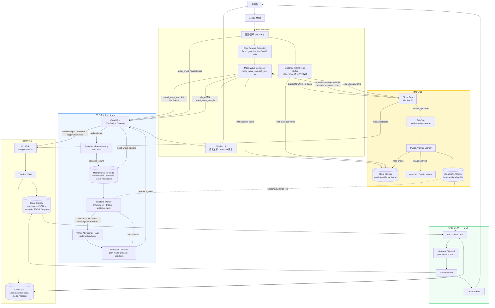
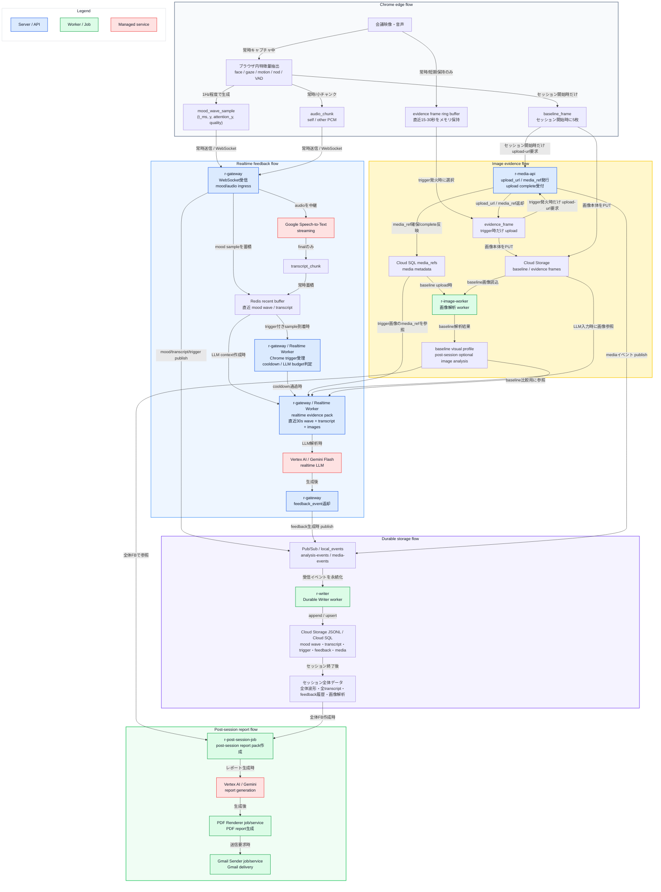

# Reaction Engine Architecture

## 目的

Reaction Engine は、Google Meet 上の発表・商談・授業・社内共有で、発表者にリアルタイムな反応フィードバックとセッション後の全体フィードバックレポートを返す。

重要な設計原則は、**動画・画像・raw feature を常時サーバーへ送らない**こと。Chrome 拡張はブラウザ内で映像・音声から特徴量を抽出し、その特徴量をさらに `mood_wave_sample` という軽量な時系列点に圧縮して送る。サーバーはこの `(t_ms, y)` 系列、transcript、必要時だけ upload された画像を組み合わせて LLM 入力を作る。

画像は2種類に分ける。

- `baseline_frame`: セッション開始時に数枚だけ取得し、通常時の見え方・参加者構成・表情基準を作るために使う
- `evidence_frame`: trigger 発火時の文脈補強用。Chrome 側の短期リングバッファから必要な画像だけ upload する

## Google Cloud サービス対応表

| 論理コンポーネント | Google Cloud サービス | 役割 |
| --- | --- | --- |
| Chrome Extension | Chrome MV3 | Meet 画面/音声取得、Edge Vision/Audio、`mood_wave_sample` 生成、baseline/evidence frame の取得 |
| WebSocket Gateway | Cloud Run service | `mood_wave_sample` / `audio_chunk` 受信、Redis/Pub/Sub への分岐、`feedback_event` 返却 |
| Realtime Worker | Cloud Run service / Gateway 内 worker | mood wave window 構築、Chrome trigger 受理、LLM evidence pack 作成、realtime feedback 生成 |
| Realtime Transcription | Speech-to-Text streaming | self/other 音声チャンクの即時文字起こし |
| Realtime LLM | Vertex AI / Gemini Flash | 直近30秒の mood wave、transcript、baseline/evidence frame から realtime feedback を生成 |
| Media API | Cloud Run service | baseline/evidence frame 用 signed upload URL 発行、media_ref 登録、upload complete 受付 |
| Realtime state | Memorystore for Redis | mood wave recent buffer、transcript recent window、trigger/cooldown |
| Durable event pipeline | Pub/Sub | mood sample、transcript、trigger、feedback、media event を後続 worker に渡す durable queue |
| Durable Writer | Cloud Run service / worker | Pub/Sub を購読し、Cloud Storage / Cloud SQL に保存 |
| Image Analysis Worker | Cloud Run service / Jobs | baseline frame から baseline visual profile を作る。evidence frame はリアルタイムLLMへ画像参照として直接渡し、必要な場合だけ事後分析で非同期解析する |
| Object storage | Cloud Storage | mood wave JSONL、transcript JSONL、baseline/evidence frames、report PDF |
| App database | Cloud SQL for PostgreSQL | sessions、media_refs、baseline_visual_profiles、evidence_frame_analyses、transcripts、feedback_events、reports |
| Post-session jobs | Cloud Run Jobs | 全体波形・transcript・realtime feedback・画像 evidence からレポート生成 |
| LLM report | Vertex AI / Gemini | セッション後の全体フィードバック、改善提案、レポート本文生成 |
| PDF renderer | Cloud Run Jobs / service | report JSON から PDF を生成 |
| Gmail sender | Gmail API / Workspace API | 生成済み PDF レポートを送信 |
| Analytics optional | BigQuery | セッション横断分析、評価、集計 |
| Secrets | Secret Manager | DB password、API keys、署名鍵、Gmail OAuth credentials |
| Observability | Cloud Logging / Cloud Monitoring | logs、metrics、alerts、latency/cost 監視 |

## 全体像

全体像は、4つのフローに分けて読む。

- **Chrome edge flow**: ブラウザ内で raw feature を抽出し、`mood_wave_sample` に圧縮する
- **リアルタイムFBフロー**: 発表中に mood wave / transcript / 必要画像から即時 feedback を返す
- **画像フロー**: baseline frame と trigger 時 evidence frame を signed upload し、LLM evidence として使える形にする
- **全体FBレポートフロー**: セッション後に全体波形・transcript・feedback履歴・画像 evidence から PDF レポートを作り、Gmail で送る

raw feature は Chrome 内部の計算材料であり、通常のサーバー保存対象ではない。サーバー側の source of truth は `mood_wave_sample`、`transcript_chunk`、`trigger_event`、`feedback_event`、`media_ref`、画像解析結果である。



## 概要データフロー

この図は、どのデータがどこで作られ、どの server / worker が処理し、どの LLM 入力に使われるかを示す。



## Chrome 拡張の責務

Chrome 拡張はリアルタイム分析の一次処理を担当する。サーバーに raw feature を垂れ流さず、ブラウザ内で `mood_wave_sample` に圧縮する。

- Google Meet の画面/タブ/音声をユーザー同意のもと取得する
- `video -> canvas -> detector -> tracker -> features` の流れで raw feature を抽出する
- MediaPipe Face Detector / Face Landmarker で顔 bbox と顔ランドマークを取得する
- motion、head pose、gaze、eye/mouth openness、nod gesture、VAD を算出する
- raw feature から `room_engagement` を作り、`mood_wave_sample` を生成する
- sidebar には簡易 mood wave を描画する
- WebSocket には基本的に `mood_wave_sample` と `audio_chunk` を送る
- baseline frame はセッション開始時に5枚程度だけ upload する
- evidence frame は常時 upload しない。短期リングバッファに保持し、Chrome 側 trigger 発火時だけ必要画像を upload する
- Gateway からの `feedback_event` を sidebar に表示する

現状実装では、Chrome 側に `moodHistory`、`moodTimeline`、`snapshotBuffer` があり、簡易 mood wave と moment snapshot はすでにブラウザ内で成立している。今後は WebSocket payload を `realtime_feature` 中心から `mood_wave_sample` 中心へ寄せる。

## Mood Wave

`mood_wave_sample` は、LLM へ直接渡す raw feature ではなく、サーバーで window 化・要約されるための軽量な時系列点である。

Chrome 側の算出は次の考え方にする。

```text
raw video/audio
  -> face / motion / gaze / nod / VAD
  -> room_engagement
  -> raw mood score
  -> short EMA
  -> long EMA baseline
  -> y = mood_ema - mood_baseline
```

現状の mood 合成式:

```text
valence = clamp((valence_mean + 1) / 2, 0, 1)
attention = clamp(0.5 + 2.5 * attention_mean, 0, 1)
nod = nod_ratio
speech_ratio = max(self.speech_ratio, other.speech_ratio)

mood = 0.40 * valence
     + 0.25 * attention
     + 0.20 * nod
     + 0.15 * speech_ratio

y = mood_ema - mood_baseline
attention_y = attention_ema - attention_baseline
```

サーバーへ送る最小 payload:

```json
{
  "type": "mood_wave_sample",
  "schema_version": 1,
  "session_id": "sess_123",
  "t_ms": 1783067121751,
  "meeting_provider": "google_meet",
  "source": "chrome_side_panel",
  "mood": {
    "value": 0.58,
    "baseline": 0.52,
    "y": 0.06
  },
  "attention_y": -0.02,
  "signals": {
    "visible_faces": 5,
    "nod_ratio": 0.2,
    "speech_ratio": 0.7,
    "brow_flag": false
  },
  "quality": {
    "calibrating": false,
    "confidence": 0.82
  },
  "client_model_version": {
    "mood_wave": "chrome-mood-wave-v1"
  }
}
```

`y` が波形の y 軸、`t_ms` が x 軸である。Chrome は window を送らない。サーバー側が `mood_wave_sample` を recent buffer に蓄積し、LLM 呼び出し時に任意の window を切り出す。

サーバー側で行う演算は、raw feature 解析ではない。顔検出、視線推定、頷き検出、表情特徴、VAD、mood 合成、Chrome 側 trigger 判定は Chrome 側で完了させる。サーバー側は `mood_wave_sample` の時系列に対して、window 化、統計要約、cooldown、transcript alignment、LLM evidence pack 作成だけを行う。

## リアルタイムFBフロー

リアルタイムFBフローは、直近30秒の mood wave、同じ時間帯の transcript、baseline frame、trigger 時 evidence frame を LLM に渡して feedback を作る。

処理:

1. Chrome が `mood_wave_sample` を 1Hz 程度で Gateway に送る
2. Chrome が self/other の `audio_chunk` を同じ WebSocket に多重化して送る
3. Gateway は audio を Speech-to-Text streaming へ中継し、final のみ `transcript_chunk` にする
4. Gateway / Realtime Worker は Redis に mood sample と transcript を蓄積する
5. Chrome がローカル trigger を検出したら、ring buffer から該当時刻付近の evidence frame を選ぶ
6. Chrome が Media API に upload-url を要求し、`upload_url` と予約済み `media_ref` を取得する
7. Chrome が `trigger_id` と `evidence_frame.media_ref`（`upload_status: uploading`）を付けた `mood_wave_sample` を Gateway に送る
8. Chrome は並行して signed upload URL へ evidence frame を PUT し、完了後に Media API へ complete 通知する
9. Realtime Worker は trigger 付き sample を受理し、cooldown / LLM budget を確認する
10. Realtime Worker は直近30秒の `mood_wave_window`、`transcript_window`、baseline/evidence frame refs を組み立てる
11. LLM context 作成時に evidence frame が `uploaded` なら画像を使い、未完了なら短い待機後に画像なしで進む
12. Gemini Flash に realtime evidence pack を渡す
13. LLM が間に合わない場合は rule fallback で feedback を作る
14. cooldown / wording policy を通して `feedback_event` を返す

Realtime LLM 入力:

```json
{
  "purpose": "realtime_feedback",
  "session_id": "sess_123",
  "window": {
    "start_t_ms": 1783067091751,
    "end_t_ms": 1783067121751,
    "duration_sec": 30,
    "trigger_t_ms": 1783067120000,
    "trigger_type": "wave_drop"
  },
  "mood_wave": {
    "points": [
      { "t_ms": 1783067092000, "y": 0.03, "attention_y": 0.01 },
      { "t_ms": 1783067093000, "y": 0.02, "attention_y": 0.00 },
      { "t_ms": 1783067094000, "y": -0.01, "attention_y": -0.03 }
    ],
    "summary": {
      "overall": "declined",
      "start_y": 0.03,
      "end_y": -0.12,
      "min_y": -0.14,
      "max_y": 0.04,
      "slope_per_sec": -0.006,
      "volatility": 0.04
    },
    "quality": {
      "visible_faces_avg": 5.2,
      "confidence_avg": 0.82
    }
  },
  "transcript_window": [
    {
      "speaker": "self",
      "t_start_ms": 1783067101000,
      "t_end_ms": 1783067108000,
      "text": "ここから価格戦略について説明します"
    }
  ],
  "baseline_frames": [
    {
      "media_ref": "gs://reaction-engine-sessions/sessions/sess_123/baseline/frame_001.webp"
    }
  ],
  "evidence_frames": [
    {
      "media_ref": "gs://reaction-engine-sessions/sessions/sess_123/evidence/frame_1783067120000.webp",
      "t_ms": 1783067120000
    }
  ]
}
```

`mood_wave.points` はサーバー側で構築する。Chrome が `mood_wave_window` を送る必要はない。

## 画像フロー

### Baseline Frame

baseline frame は参加者ごとの基準作成と LLM の比較材料に使う。セッション開始直後に5枚程度だけ取得する。

推奨:

- duration: session 開始後 30秒程度
- frame count: 5枚
- format: `image/webp`
- quality: 0.6〜0.8
- upload: Media API の signed upload URL 経由

baseline frame は WebSocket には流さない。Media API が `media_ref` を発行し、Chrome が Cloud Storage に直接 PUT する。

### Evidence Frame

evidence frame は常時 upload しない。Chrome の side panel document 上の短期リングバッファに保持し、trigger 発火時だけ必要な画像を upload する。

推奨:

- buffer window: 15〜30秒
- capture interval: 250〜1000ms
- format: `image/jpeg` or `image/webp`
- upload trigger: Chrome 側のローカル moment trigger
- selection: trigger_t_ms に最も近い1〜数枚

### Media API

API:

```text
POST /sessions/{session_id}/media/upload-url
POST /sessions/{session_id}/media/{capture_id}/complete
```

Upload URL request:

```json
{
  "purpose": "baseline_frame",
  "content_type": "image/webp",
  "capture_id": "cap_123",
  "t_ms": 1783067000000,
  "audience_id": "aud_1",
  "tile_id": "tile_1",
  "mood_wave_sample_ref": {
    "t_ms": 1783067000000,
    "nearest_sample_lag_ms": 120
  }
}
```

Evidence frame の場合:

```json
{
  "purpose": "evidence_frame",
  "content_type": "image/jpeg",
  "capture_id": "cap_ev_123",
  "t_ms": 1783067120000,
  "trigger_id": "trig_123",
  "mood_wave_sample_ref": {
    "t_ms": 1783067120000,
    "nearest_sample_lag_ms": -80
  }
}
```

Media API は upload URL request の時点で `upload_url` と `media_ref` を返し、`media_refs.upload_status = pending` として予約する。Chrome はこの `media_ref` を trigger 付き `mood_wave_sample` に載せて Gateway へ送る。画像本体の PUT 完了は待たない。

Upload URL response:

```json
{
  "upload_url": "https://storage.googleapis.com/...",
  "media_ref": "gs://reaction-engine-sessions/sessions/sess_123/evidence/cap_ev_123.jpg",
  "expires_at": "2026-07-03T12:00:00Z"
}
```

Chrome はその後、signed upload URL へ画像本体を PUT し、Media API に complete 通知を送る。Media API は complete 後に `media_refs.upload_status = uploaded` へ更新し、`media_uploaded` event を publish する。

Realtime Worker は evidence frame を画像解析 worker に通さない。LLM context 作成時に `media_ref` の upload が完了していれば、その画像参照を Gemini Flash に直接渡す。未完了なら短い待機後に画像なしで進む。Image Analysis Worker は baseline frame から `baseline_visual_profile` を作るのが主責務で、evidence frame の非同期解析は全体FBや監査で必要になった場合だけ行う。

## WebSocket Gateway / Realtime Worker

Gateway は WebSocket の入口であり、Realtime Worker は trigger 付き mood sample と transcript から LLM 入力を作る。MVP では同じ Cloud Run service 内に置いてよいが、責務は分ける。

Realtime Worker の演算範囲は軽量な mood wave 時系列処理に限定する。サーバー側で raw feature から `mood_wave_sample` を再計算しない。

Gateway:

- `mood_wave_sample` を validate し、`event_id` / `server_received_at_ms` を付与する
- Redis recent buffer に `mood_wave_sample` を保存する
- Pub/Sub `analysis-events` に durable event として publish する
- `audio_chunk` を Speech-to-Text streaming に中継する
- Realtime Worker からの `feedback_event` を Chrome に返す

Realtime Worker:

- Redis から直近30秒の mood sample と transcript を読む
- mood sample の点列から start / end / min / max / mean / slope / volatility / threshold duration を計算する
- Chrome から届いた trigger 付き sample を受理し、cooldown / LLM budget を判定する
- LLM 用に `mood_wave_window` と summary を構築する
- baseline/evidence frame refs を evidence pack に入れる
- LLM feedback または rule fallback を作る
- cooldown を適用する
- 顔検出、ランドマーク処理、視線推定、頷き検出、VAD、mood 合成は行わない

Redis key:

```text
mood_wave:recent:{session_id}
transcript:recent:{session_id}:{speaker}
trigger:recent:{session_id}
feedback:cooldown:{session_id}
session:state:{session_id}
```

擬似処理:

```text
on mood_wave_sample:
  validate payload
  assign event_id
  ZADD mood_wave:recent:{session_id} t_ms sample
  ZREMRANGEBYSCORE mood_wave:recent:{session_id} -inf now-10min
  HSET session:state:{session_id} latest_mood_sample sample
  publish analysis-events mood_wave_sample

on audio_chunk:
  forward pcm to Speech-to-Text streaming
  on STT final:
    ZADD transcript:recent:{session_id}:{speaker} t_start_ms transcript_chunk
    publish analysis-events transcript_chunk

every 1s or on sample:
  read recent 30s mood_wave + transcript
  calculate wave summary (min/max/mean/slope/volatility/duration)
  if sample has trigger:
    validate trigger_id / evidence_frame media_ref
    apply cooldown and LLM budget

on accepted trigger:
  build mood_wave_window from Redis samples
  build transcript_window
  attach baseline/evidence media_refs
  call Gemini Flash with timeout
  if timeout/error:
    use rule fallback
  emit feedback_event
  publish trigger_event + feedback_event
```

## Pub/Sub / Durable Writer

Pub/Sub は durable event pipeline として使う。Redis は短期 state であり、セッション後分析の source of truth にはしない。

Topic:

```text
analysis-events
media-analysis-events
```

`analysis-events` message examples:

```json
{
  "event_id": "evt_123",
  "type": "mood_wave_sample",
  "schema_version": 1,
  "session_id": "sess_123",
  "t_ms": 1783067121751,
  "server_received_at_ms": 1783067121800,
  "payload": {}
}
```

```json
{
  "event_id": "evt_fb_123",
  "type": "feedback_event",
  "schema_version": 1,
  "session_id": "sess_123",
  "t_ms": 1783067123000,
  "payload": {
    "feedback_type": "reaction_down_candidate",
    "source": "llm",
    "trigger_id": "trig_123"
  }
}
```

Durable Writer:

1. Pub/Sub から message を受け取る
2. `event_id` で冪等性を確保する
3. session_id ごとに batch / chunk 化する
4. Cloud Storage に JSONL を保存する
5. Cloud SQL に検索・一覧・レポート参照用 metadata を upsert する
6. 保存成功後に ack する

主な保存先:

```text
Cloud Storage:
  gs://reaction-engine-sessions/sessions/{session_id}/mood-wave/part-0001.jsonl
  gs://reaction-engine-sessions/sessions/{session_id}/transcript/part-0001.jsonl
  gs://reaction-engine-sessions/sessions/{session_id}/triggers/part-0001.jsonl
  gs://reaction-engine-sessions/sessions/{session_id}/feedback/part-0001.jsonl
  gs://reaction-engine-sessions/sessions/{session_id}/reports/report.pdf

Cloud SQL:
  sessions
  media_refs
  baseline_visual_profiles
  evidence_frame_analyses
  transcripts
  trigger_events
  feedback_events
  reports
  report_deliveries
```

Cloud SQL に `mood_wave_sample` 全件を insert しない。高頻度時系列は Cloud Storage JSONL を primary archive にし、Cloud SQL は session metadata、イベント索引、レポート参照を持つ。

## 全体FBレポートフロー

全体フィードバックフローは、セッション終了後に起動する。リアルタイムで使った材料を再利用し、より長い文脈で LLM がレポートを作る。

入力:

- Cloud Storage の `mood_wave_sample` JSONL
- Cloud Storage / Cloud SQL の transcript
- trigger_events
- realtime feedback history
- baseline frames / baseline visual profile
- evidence frame refs / 必要時の事後画像解析結果
- session metadata

処理:

1. session end で Post-session Job を起動する
2. mood wave samples から全体波形を再構築する
3. 1分単位、5分単位、trigger 前後などに window summary を作る
4. transcript を timestamp で mood wave と align する
5. realtime feedback と trigger を参照し、重要区間を抽出する
6. baseline visual profile と evidence frame refs を evidence として加える。必要なら事後画像解析結果も加える
7. Gemini で全体 feedback report を生成する
8. report JSON を Cloud SQL / Cloud Storage に保存する
9. PDF renderer が PDF を生成し Cloud Storage に保存する
10. Gmail sender が PDF を添付して送信する
11. delivery status を Cloud SQL に保存する

LLM 入力は全点列をそのまま渡さず、全体波形の summary と重要区間の点列を組み合わせる。

```json
{
  "purpose": "post_session_report",
  "session": {
    "session_id": "sess_123",
    "duration_min": 42
  },
  "wave_overview": {
    "overall": "mostly_stable_with_two_drops",
    "peak_positive_sections": ["00:08:10-00:10:30"],
    "drop_sections": ["00:18:20-00:21:00", "00:33:10-00:35:00"]
  },
  "important_windows": [
    {
      "start": "00:18:20",
      "end": "00:21:00",
      "mood_wave_summary": {
        "overall": "declined",
        "min_y": -0.14,
        "slope_per_sec": -0.006
      },
      "transcript_summary": "価格説明に入った区間",
      "evidence_refs": ["gs://.../evidence/frame_001.jpg"]
    }
  ],
  "realtime_feedback_history": [],
  "baseline_context": {}
}
```

PDF / Gmail は分析本体とは分離する。レポート生成に成功して PDF 送信に失敗した場合でも、report 自体は保存済みとして扱い、delivery retry を別管理する。

## Speech-to-Text / Transcript

文字起こしは会議中に Speech-to-Text streaming でリアルタイムに行う。

- Chrome 拡張が self（マイク）/ other（タブ音声）の PCM チャンクを既存 WebSocket に相乗りさせて送る
- Gateway が session_id ごとに self/other 各1本の Speech-to-Text streaming セッションを維持する
- 1ストリームの継続時間上限があるため、Gateway が会議中に定期的にストリームを再接続する
- 確定（final）した結果のみ `transcript_chunk` として組み立てる
- transcript は Redis recent window と Pub/Sub durable event の両方に流す
- 中間(interim)結果は永続化しない
- 生の PCM 音声は保存しない

`transcript_chunk` はリアルタイムFBと全体FBレポートの両方で同じ source of truth として使う。

## データ契約

### Mood Wave Sample（Chrome -> Gateway）

```json
{
  "type": "mood_wave_sample",
  "schema_version": 1,
  "session_id": "sess_123",
  "t_ms": 1783067121751,
  "meeting_provider": "google_meet",
  "source": "chrome_side_panel",
  "mood": {
    "value": 0.58,
    "baseline": 0.52,
    "y": 0.06
  },
  "attention_y": -0.02,
  "signals": {
    "visible_faces": 5,
    "nod_ratio": 0.2,
    "speech_ratio": 0.7,
    "brow_flag": false
  },
  "quality": {
    "calibrating": false,
    "confidence": 0.82
  }
}
```

trigger がない通常 sample は上記の軽量 payload のまま送る。Chrome 側で trigger が発火した場合は、まず Media API から `upload_url` と予約済み `media_ref` を取得し、その `media_ref` を `upload_status: "uploading"` として `trigger` / `evidence_frame` に同梱する。画像本体の upload 完了は待たない。

```json
{
  "type": "mood_wave_sample",
  "schema_version": 1,
  "session_id": "sess_123",
  "t_ms": 1783067120000,
  "meeting_provider": "google_meet",
  "source": "chrome_side_panel",
  "mood": {
    "value": 0.43,
    "baseline": 0.55,
    "y": -0.12
  },
  "attention_y": -0.08,
  "signals": {
    "visible_faces": 5,
    "nod_ratio": 0.0,
    "speech_ratio": 0.72,
    "brow_flag": false
  },
  "quality": {
    "calibrating": false,
    "confidence": 0.82
  },
  "trigger": {
    "trigger_id": "trig_123",
    "type": "wave_drop",
    "source": "chrome",
    "peak_t_ms": 1783067120000,
    "delta": 0.12
  },
  "evidence_frame": {
    "capture_id": "cap_ev_123",
    "media_ref": "gs://reaction-engine-sessions/sessions/sess_123/evidence/trig_123.jpg",
    "upload_status": "uploading",
    "snapshot_t_ms": 1783067119800,
    "snapshot_lag_ms": -200,
    "content_type": "image/jpeg"
  }
}
```

画像 upload 完了後は、Chrome または Media API 経由で upload complete event が流れ、同じ `trigger_id` / `capture_id` / `media_ref` に紐づく。

```json
{
  "type": "evidence_upload_complete",
  "session_id": "sess_123",
  "trigger_id": "trig_123",
  "capture_id": "cap_ev_123",
  "media_ref": "gs://reaction-engine-sessions/sessions/sess_123/evidence/trig_123.jpg",
  "upload_status": "uploaded"
}
```

### Audio Chunk（Chrome -> Gateway）

```json
{
  "type": "audio_chunk",
  "session_id": "sess_123",
  "speaker": "self",
  "t_ms": 1783067121751,
  "sample_rate": 16000,
  "pcm": "<base64 or binary frame>"
}
```

### Transcript Chunk（Gateway -> Pub/Sub / Redis）

```json
{
  "event_id": "evt_456",
  "type": "transcript_chunk",
  "schema_version": 1,
  "session_id": "sess_123",
  "speaker": "self",
  "t_start_ms": 1783067101000,
  "t_end_ms": 1783067108000,
  "text": "ここから価格戦略について説明します",
  "confidence": 0.91,
  "is_final": true
}
```

### Feedback Event（Gateway -> Chrome / Pub/Sub）

```json
{
  "type": "feedback_event",
  "session_id": "sess_123",
  "t_ms": 1783067123000,
  "trigger_id": "trig_123",
  "feedback_type": "reaction_down_candidate",
  "severity": "low",
  "message": "価格の話に入ったあたりで反応が少し下がっている可能性があります。ここで一度確認を挟むとよさそうです。",
  "reason_codes": ["mood_wave_drop", "attention_y_drop"],
  "evidence_quote": "ここから価格戦略について説明します",
  "source": "llm",
  "model_version": "gemini-flash-realtime",
  "confidence": 0.64,
  "cooldown_ms": 30000
}
```

## 保存方針

| データ | 用途 | 保存先 |
| --- | --- | --- |
| raw feature | Chrome 内部の計算材料 | 通常保存しない |
| `mood_wave_sample` | リアルタイム判定・全体波形再構築 | Redis recent / Pub/Sub -> Cloud Storage JSONL |
| `audio_chunk` PCM | Speech-to-Text streaming 中継 | 保存しない |
| `transcript_chunk` | LLM evidence・全体レポート | Redis recent / Pub/Sub -> Cloud Storage / Cloud SQL |
| `baseline_frame` | LLM比較材料・baseline visual profile | Signed upload -> Cloud Storage |
| `evidence_frame` | trigger 時の文脈補強 | Trigger時のみ signed upload -> Cloud Storage |
| `media_ref` | 画像参照 metadata | Media API -> Cloud SQL |
| `baseline_visual_profile` | baseline frame 解析結果 | Cloud SQL / Redis cache |
| evidence post-analysis optional | evidence frame の事後補助解析 | 必要時のみ Cloud SQL / Cloud Storage |
| `trigger_event` | feedback 発火根拠・後分析 | Pub/Sub -> Cloud Storage / Cloud SQL |
| `feedback_event` | UI表示・履歴・レポート | Pub/Sub -> Cloud Storage / Cloud SQL |
| `report` JSON | 全体FB本文 | Cloud SQL / Cloud Storage |
| `report.pdf` | Gmail送信用成果物 | Cloud Storage |
| `report_delivery` | Gmail送信状態 | Cloud SQL |

## MVP 実装順

1. Chrome 拡張の既存 `mood` 計算を `mood_wave_sample` payload に整理する
2. Gateway が `mood_wave_sample` を受け取り、Redis recent に保存する
3. Pub/Sub `analysis-events` と Durable Writer で mood sample JSONL を保存する
4. 音声チャンク送信と Speech-to-Text streaming を接続し、`transcript_chunk` を作る
5. Chrome 側 trigger 発火時に Media API から upload_url / media_ref を取得し、uploading 状態の trigger_id / media_ref 付き sample を送る
6. Realtime Worker が trigger 付き sample を受理し、直近30秒の mood wave window と transcript window を作る
7. Media API で baseline frame の signed upload を実装し、セッション開始時に5枚保存する
8. Realtime LLM に mood wave + transcript + baseline/evidence frame refs を渡して feedback を作る
9. feedback_event を Chrome に返し、Pub/Sub / Cloud SQL に保存する
10. Image Analysis Worker で baseline visual profile を作る。evidence frame 解析は必要時の事後処理に限定する
11. session end で Post-session Job を起動し、全体FB report JSON を生成する
12. PDF renderer で report PDF を生成する
13. Gmail sender で PDF を送信し、delivery status を保存する

## 技術選定

- Extension: Chrome MV3
- Backend Language: Go
- Backend Runtime: Go 1.26
- Backend HTTP: standard `net/http` + lightweight router
- Backend WebSocket: `nhooyr.io/websocket` or `gorilla/websocket`
- Backend DB: `pgx` + Cloud SQL for PostgreSQL
- Backend Redis: `go-redis` + Memorystore for Redis
- Backend GCP SDK: `cloud.google.com/go/*`
- Edge Vision: MediaPipe Tasks Vision
- Edge Audio: Web Audio API
- Realtime Transport: WebSocket（mood wave sample + audio chunk を同一コネクションで多重化）
- Realtime Transcription: Speech-to-Text streaming
- Realtime LLM: Vertex AI / Gemini Flash
- Durable Event Pipeline: Pub/Sub
- Durable Storage: Cloud Storage JSONL
- Media Upload: Cloud Run Media API + Cloud Storage signed URL
- Image Analysis: Vertex AI / Gemini Vision
- Post-session Workers: Cloud Run Jobs
- PDF: HTML to PDF renderer or headless Chromium service
- Gmail: Gmail API / Workspace API
- Analytics: BigQuery optional
- Observability: Cloud Logging / Cloud Monitoring
- Secrets: Secret Manager

## 設計上の注意

- Chrome から raw feature を常時送らない。通常の realtime payload は `mood_wave_sample` と `audio_chunk` に限定する。
- Chrome が `mood_wave_window` を送る必要はない。window 化・summary 作成・cooldown・LLM evidence pack 作成はサーバー側で行う。
- Cloud Run WebSocket は timeout / reconnect を前提にする。
- Cloud Run instance memory に session state を置かない。状態は Redis / Cloud SQL / Cloud Storage に逃がす。
- Redis は短期 state。セッション後分析の source of truth にはしない。
- Cloud SQL に mood sample 全件を insert しない。高頻度時系列は Cloud Storage JSONL に置く。
- baseline frame は最初に少数だけ upload する。WebSocket に画像本体を流さない。
- evidence frame は trigger 時だけ upload する。Chrome 側では短期リングバッファに限定する。
- baseline/evidence frame は顔画像を含むため、consent と retention を mood sample より厳しく扱う。
- 生 PCM 音声は保存しない。保存するのは確定済み transcript のみ。
- 発話内容のテキスト化・保存は機微度が高いため、`Session.consent` に `transcribe_audio` を独立した同意項目として持たせる。
- Realtime LLM 呼び出しは timeout 必須。失敗時は rule fallback に切り替える。
- feedback と report は因果を断定しない。同じ時間帯に発言と反応変化が見えても相関として扱う。
- PDF 生成と Gmail 送信は post-session report 生成から分離し、delivery retry を別管理する。
