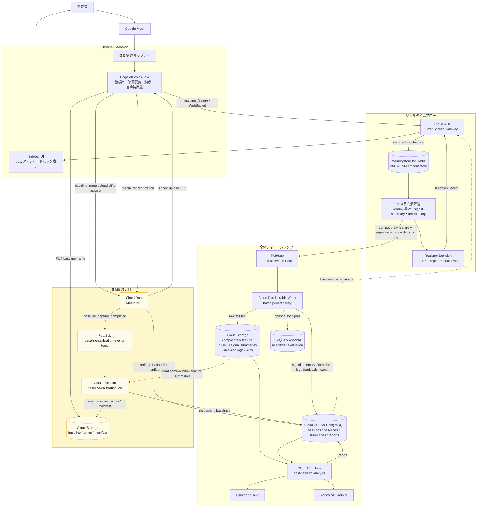

# Reaction Engine Architecture

## 目的

Reaction Engine は、Google Meet 上の発表・商談・授業・社内共有で、発表者にリアルタイムな反応フィードバックとセッション後レポートを返す。

重要な設計原則は、**動画や画像を常時サーバーへ送らない**こと。Chrome 拡張内で映像・音声を特徴量に変換し、サーバーには特徴量イベント、transcript、必要最小限の代表フレーム/短いクリップだけを送る。

このアーキテクチャは Google Cloud の managed services を中心に構成する。

## Google Cloud サービス対応表

| 論理コンポーネント | Google Cloud サービス | 役割 |
| --- | --- | --- |
| Chrome Extension | Chrome MV3 | Meet 画面/音声取得、Edge Vision、feature event 送信 |
| WebSocket Gateway | Cloud Run service | `realtime_feature` 受信、Redis/Pub/Sub への分岐、`feedback_event` 返却 |
| システム演算層 | Cloud Run WebSocket Gateway 内 | window 集計、変化率、signal summary、decision log の一回計算 |
| Media API | Cloud Run service | baseline frame 用 signed upload URL 発行、media_ref 登録 |
| Realtime state | Memorystore for Redis | 直近 window、latest state、feedback cooldown |
| Durable event pipeline | Pub/Sub | compact raw feature、signal summary、decision log を後続 worker に渡す durable queue |
| Baseline event pipeline | Pub/Sub | baseline capture 完了 event を Baseline Calibration Job に渡す |
| Durable Writer | Cloud Run service / Cloud Run worker | Pub/Sub を購読し、Cloud Storage / Cloud SQL に保存 |
| Baseline Calibration Job | Cloud Run Jobs | baseline frames と特徴量から participant baseline を計算 |
| Compact raw feature storage | Cloud Storage | compact raw feature JSONL、代表フレーム、短いクリップ |
| Baseline frame storage | Cloud Storage | baseline 用 screenshot / manifest |
| App database | Cloud SQL for PostgreSQL | session、participant、participant baseline、signal summary、decision log、feedback history、report |
| Post-session jobs | Cloud Run Jobs | セッション後分析、レポート生成 |
| Transcript | Speech-to-Text | 発話の文字起こし |
| LLM report | Vertex AI / Gemini | 反応タイムライン、改善提案、レポート生成 |
| Analytics optional | BigQuery | セッション横断分析、評価、集計 |
| Secrets | Secret Manager | DB password、API keys、署名鍵 |
| Observability | Cloud Logging / Cloud Monitoring | logs、metrics、alerts、latency/cost 監視 |

## 全体像

全体像は、3つのフローに分けて読む。

- リアルタイムフロー: 発表中に特徴量を受け取り、即時 feedback を返す
- 全体フィードバックフロー: セッション後の保存・集計・レポート生成を行う
- 画像処理フロー: baseline 用 screenshot を扱い、個人差補正の基準値を作る



## Chrome 拡張の責務

Chrome 拡張はリアルタイム分析の一次処理を担当する。

- Google Meet の画面/タブ/音声をユーザー同意のもと取得する
- `video -> canvas -> detector -> tracker -> features` の流れで特徴量を抽出する
- MediaPipe Face Detector / Face Landmarker で顔 bbox と顔ランドマークを取得する
- motion score、簡易 head pose、簡易 gaze、簡易 attention score、nod gesture を生成する
- 将来的に audio level、silence、speaking rate などを生成する
- `realtime_feature` を WebSocket で Cloud Run Gateway に送る
- Gateway からの `feedback_event` を sidebar に表示する
- baseline 取得期間は、数秒おきに screenshot を WebP で生成する
- baseline frame は WebSocket ではなく Media API の signed upload URL で Cloud Storage に直接 upload する
- 代表フレーム/短いクリップが必要な場合だけ upload 経路を使う

現状は Meet DOM の参加者名・タイル ID との紐づけ、音声特徴量、本格的な視線推定は未実装。

## Media API / Baseline Frame Upload

baseline 用 screenshot は realtime WebSocket path に混ぜない。画像は重いため、Cloud Run Media API が signed upload URL を発行し、Chrome 拡張が Cloud Storage に直接 upload する。

推奨 baseline capture:

- duration: session 開始後 30秒程度
- interval: 3〜5秒
- frame count: 6〜10枚
- format: `image/webp`
- quality: 0.6〜0.8

API:

```text
POST /sessions/{session_id}/media/upload-url
POST /sessions/{session_id}/media
POST /sessions/{session_id}/baseline/complete
```

Upload URL request:

```json
{
  "purpose": "baseline_frame",
  "content_type": "image/webp",
  "t_ms": 12345,
  "audience_id": "aud_1",
  "tile_id": "tile_1"
}
```

Upload URL response:

```json
{
  "upload_url": "https://storage.googleapis.com/...",
  "media_ref": "gs://reaction-engine-sessions/sessions/sess_123/baseline/frames/12345-aud_1.webp",
  "expires_at": "2026-07-03T12:00:00Z"
}
```

media_ref registration:

```json
{
  "type": "media_ref",
  "purpose": "baseline_frame",
  "media_ref": "gs://reaction-engine-sessions/sessions/sess_123/baseline/frames/12345-aud_1.webp",
  "t_ms": 12345,
  "audience_id": "aud_1",
  "tile_id": "tile_1",
  "content_type": "image/webp",
  "nearest_feature_event_id": "evt_123"
}
```

`baseline/complete` を受けた Media API は Pub/Sub topic `baseline-calibration-events` に `baseline_capture_completed` event を publish する。

## Cloud Run WebSocket Gateway

Cloud Run Gateway は Chrome 拡張から WebSocket で `realtime_feature` を受け取り、Gateway 内の **システム演算層** でリアルタイムの軽量な演算処理まで担当する。

システム演算層は、同じ feature event に対して一度だけ演算する。その結果を2方向に分岐する。

- **リアルタイム feedback path**: signal summary / decision log から `feedback_event` を返す。
- **永続化 path**: compact raw feature、signal summary、decision log を Pub/Sub に publish する。

1. **Memorystore for Redis**
   - compact raw feature を保存する
   - 直近 window / latest state / cooldown に使う
   - リアルタイム feedback の判定で読む

2. **Pub/Sub**
   - compact raw feature、signal summary、decision log を publish する
   - Durable Writer / 後分析 pipeline へ渡す
   - Gateway は Cloud Storage や Cloud SQL へ同期保存しない

```text
on realtime_feature:
  validate payload
  assign event_id
  set server_received_at_ms

  Redis pipeline:
    ZADD features:recent:{session_id} t_ms compact_payload
    ZREMRANGEBYSCORE features:recent:{session_id} -inf now-60000
    HSET session:state:{session_id} latest_feature compact_payload latest_t_ms t_ms
    EXPIRE features:recent:{session_id} 3600
    EXPIRE session:state:{session_id} 3600

  Realtime processing:
    read 5s / 10s / 30s recent windows
    calculate signal_summary
    create decision_log
    evaluate feedback decision with cooldown

  Pub/Sub:
    publish topic feature-events with compact_raw_feature + signal_summary + decision_log
```

Cloud Run の WebSocket は long-running request なので、request timeout と reconnect を前提にする。接続先 Cloud Run instance が変わっても問題ないよう、session state は instance memory ではなく Memorystore / Pub/Sub 側に置く。

## システム演算層

システム演算層は Cloud Run WebSocket Gateway 内に置く。目的は、raw な瞬間値をそのまま feedback や LLM に渡さず、低コストで安定した signal に変換すること。

入力:

- Chrome 拡張から届いた latest `realtime_feature`
- Memorystore for Redis の recent window
- session baseline
- feedback cooldown state

出力:

- `compact_raw_feature`
- `signal_summary`
- `decision_log`
- optional `feedback_event`

この層で計算した `signal_summary` と `decision_log` を、リアルタイム feedback と後続の保存/分析の両方で使う。つまり、同じ演算を Durable Writer や後分析 worker で繰り返さない。

## Memorystore for Redis

Memorystore for Redis はリアルタイム判定用の短期 state として使う。

主な key:

```text
features:recent:{session_id}
session:state:{session_id}
feedback:cooldown:{session_id}
```

用途:

- 直近 10秒/30秒の feature window
- latest feature state
- reconnect 時の session state
- feedback cooldown
- baseline / smoothing 用の一時状態

TTL で消える前提。セッション後分析の source of truth にはしない。

## Pub/Sub

Pub/Sub は durable event pipeline として使う。Redis Stream の代わりに、Google Cloud managed service としての Pub/Sub を採用する。

Topic:

```text
feature-events
```

Subscription:

```text
feature-events-durable-writer
```

Pub/Sub message:

```json
{
  "event_id": "evt_123",
  "type": "realtime_analysis_event",
  "schema_version": 1,
  "session_id": "sess_123",
  "t_ms": 1783067121751,
  "server_received_at_ms": 1783067121800,
  "payload": {
    "compact_raw_feature": {},
    "signal_summary": {},
    "decision_log": {}
  }
}
```

Pub/Sub は最終保存先ではない。Cloud Run Durable Writer が subscribe し、保存成功後に ack する。失敗時は retry / dead-letter topic を使う。

Baseline calibration 用には別 topic を使う。

Topic:

```text
baseline-calibration-events
```

Message:

```json
{
  "event_id": "evt_baseline_123",
  "type": "baseline_capture_completed",
  "schema_version": 1,
  "session_id": "sess_123",
  "t_start_ms": 0,
  "t_end_ms": 30000,
  "frame_count": 8,
  "manifest_ref": "gs://reaction-engine-sessions/sessions/sess_123/baseline/manifest.jsonl"
}
```

## Durable Writer

Durable Writer は Cloud Run service または Cloud Run worker として動かす。Pub/Sub subscription から realtime analysis event を受け取り、後分析用データとして保存する。

処理:

1. Pub/Sub から message を受け取る
2. `event_id` で冪等性を確保する
3. session_id ごとに batch / buffer する
4. compact raw feature と signal summary / decision log を JSONL として Cloud Storage に保存する
5. signal summary / decision log / feedback history を Cloud SQL に upsert する
6. 保存成功後に Pub/Sub message を ack する
7. 保存失敗時は nack / retry、繰り返し失敗は dead-letter topic に送る

保存先:

```text
Cloud Storage:
  gs://reaction-engine-sessions/sessions/{session_id}/features/compact-raw/part-0001.jsonl
  gs://reaction-engine-sessions/sessions/{session_id}/features/signal-summary/part-0001.jsonl
  gs://reaction-engine-sessions/sessions/{session_id}/features/decision-log/part-0001.jsonl
  gs://reaction-engine-sessions/sessions/{session_id}/frames/...
  gs://reaction-engine-sessions/sessions/{session_id}/clips/...

Cloud SQL for PostgreSQL:
  sessions
  participants
  signal_summaries
  decision_logs
  session_summaries
  feedback_events
  reports
```

Cloud Storage の JSONL は append ではなく、一定件数/一定時間ごとの chunk file として作る。重複は `event_id` で後分析時に dedupe できるようにする。

## Baseline Calibration Job

Baseline Calibration Job は Cloud Run Jobs として動かす。session 開始直後の baseline frames と同じ時間帯の compact raw feature / signal summary をまとめて読み、参加者または face track ごとの baseline を作る。

入力:

- `baseline-calibration-events`
- Cloud Storage の baseline frames
- Cloud Storage の baseline manifest
- Cloud Storage の compact raw feature JSONL
- Cloud Storage / Cloud SQL の signal summary

処理:

1. `session_id` と baseline capture window を受け取る。
2. baseline frames と manifest を読む。
3. 同じ時間帯の compact raw feature / signal summary を読む。
4. `audience_id` / `tile_id` / `face_track_id` ごとに baseline を計算する。
5. `participant_baselines` を Cloud SQL に保存する。
6. 必要なら `session:baseline:{session_id}` として Memorystore に cache する。

保存する baseline 例:

```json
{
  "session_id": "sess_123",
  "audience_id": "aud_1",
  "baseline": {
    "attention_score_avg": 0.61,
    "motion_score_avg": 0.05,
    "gaze_screen_ratio": 0.72,
    "head_pose_center": { "yaw": 0.03, "pitch": -0.08, "roll": 0.01 },
    "eye_openness_avg": { "left": 0.42, "right": 0.44 }
  },
  "sample_count": 8,
  "confidence": 0.74
}
```

baseline ができるまでの最初の 30〜60秒は `baseline_status = warming_up` として扱う。Gateway のシステム演算層は、baseline が未準備なら session default threshold で控えめに feedback を出し、baseline 完了後に個人差補正を使う。

## リアルタイム分析

リアルタイム判定は Cloud Run Gateway 内のシステム演算層で行う。Gateway は Memorystore for Redis の直近 window だけを見る。Cloud SQL や Cloud Storage を判定のたびに読まない。

入力:

- `face_count`
- `face_visible`
- `attention_score`
- `motion_score`
- `gaze_estimate`
- `head_pose_estimate`
- `gestures`
- 将来: `audio_level`, `silence_ms`, `speaking_rate`

システム演算層で計算する signal summary:

- latest
- 5秒平均
- 10秒平均
- 直前 window との差分
- session baseline との差分
- slope
- low / high state の継続時間
- confidence
- cooldown state

出力:

```json
{
  "type": "feedback_event",
  "session_id": "sess_123",
  "t_ms": 65000,
  "feedback_type": "reaction_down_candidate",
  "severity": "low",
  "message": "一部の反応が薄くなっている可能性があります。ここで一度確認を挟むとよさそうです。",
  "reason_codes": ["attention_score_drop", "motion_drop"],
  "confidence": 0.64,
  "cooldown_ms": 30000
}
```

フィードバックは断定的な感情推定にしない。発表者がすぐ取れる小さい行動に落とす。

リアルタイムでは LLM を基本的に使わない。低遅延・低コスト・安定性を優先し、rule + template + cooldown で `feedback_event` を返す。

## セッション後分析

セッション後分析は、Memorystore state ではなく Durable Writer が保存した Cloud Storage の compact raw feature JSONL と signal summary / decision log を基本入力にする。

入力:

- Cloud Storage の compact raw feature JSONL
- Cloud Storage / Cloud SQL の signal summary
- Cloud Storage / Cloud SQL の decision log
- transcript chunk
- feedback history
- session summary
- 代表フレーム/短いクリップ

処理:

1. Cloud Run Job を session end で起動する
2. feature timeline と transcript を timestamp で align する
3. attention / motion / gaze / audio の変化点を検出する
4. 変化点前後の発話内容と代表フレームを evidence としてまとめる
5. Vertex AI / Gemini で report / coaching suggestion を生成する
6. report を Cloud SQL に保存する
7. 必要に応じて BigQuery に評価・分析用データを export する

## Speech-to-Text / Transcript

MVP では transcript を必須にしない。後分析の品質を上げる段階で Speech-to-Text を追加する。

候補:

- 会議音声または録音ファイルを Cloud Storage に保存
- Cloud Run Job から Speech-to-Text の asynchronous recognition を実行
- transcript chunk を Cloud SQL または Cloud Storage JSONL に保存

リアルタイム字幕が必要になった場合は Streaming Speech-to-Text を検討する。ただし初期 MVP では feature event と反応変化の保存を優先する。

## データ契約

### Realtime Feature Event

```json
{
  "event_id": "evt_123",
  "type": "realtime_feature",
  "schema_version": 1,
  "session_id": "sess_123",
  "t_ms": 1783067121751,
  "server_received_at_ms": 1783067121800,
  "meeting_provider": "google_meet",
  "source": "chrome_side_panel",
  "features": {
    "face_visible": true,
    "face_count": 1,
    "face_tracks": [
      {
        "audience_id": "aud_1",
        "face_bbox": { "x": 0.28, "y": 0.45, "w": 0.138, "h": 0.244 },
        "gaze_estimate": "screen",
        "head_pose_estimate": { "yaw": 0.009, "pitch": -0.113, "roll": -0.195 },
        "gestures": { "nod_count": 0, "nod_score": 0 }
      }
    ],
    "motion_score": 0.002,
    "attention_score": 0.551,
    "gaze_estimate": "screen",
    "client_model_version": {
      "face_detector": "mediapipe-blaze-face-short-range-v1",
      "face_landmarker": "mediapipe-face-landmarker-v1"
    }
  }
}
```

`event_id` と `server_received_at_ms` は Gateway 側で付与する。Chrome 拡張から送られる時点では未設定でもよい。

## 保存方針

| データ | 用途 | Google Cloud 保存先 |
| --- | --- | --- |
| 直近 feature window | リアルタイム判定 | Memorystore for Redis ZSET |
| latest session state | realtime state / reconnect | Memorystore for Redis HASH |
| compact raw feature | 再集計・後分析 source of truth | Pub/Sub -> Cloud Storage |
| signal summary | リアルタイム判断根拠・後分析 | Pub/Sub -> Cloud Storage / Cloud SQL |
| decision log | feedback の根拠・評価 | Pub/Sub -> Cloud Storage / Cloud SQL |
| baseline frame | baseline 計算の根拠・短期再処理 | Signed upload -> Cloud Storage |
| baseline manifest | baseline frame と feature event の対応 | Cloud Storage / Cloud SQL |
| participant baseline | 個人差補正・しきい値補正 | Cloud SQL / Memorystore cache |
| session metadata | lifecycle / consent / role | Cloud SQL for PostgreSQL |
| session summary | レポート・一覧表示 | Cloud SQL for PostgreSQL |
| feedback history | UI / 評価 / report | Cloud SQL for PostgreSQL |
| 代表フレーム/短いクリップ | evidence / 詳細分析 | Cloud Storage |
| 横断分析用データ | analytics / evaluation | BigQuery optional |

## MVP 実装順

1. Chrome 拡張の feature event を安定化する
2. Cloud Run WebSocket Gateway を実装する
3. Memorystore for Redis に recent state を保存する
4. Gateway 内で signal summary と decision log を作る
5. Memorystore recent window から簡単な `feedback_event` を返す
6. Pub/Sub topic `feature-events` に compact raw feature + signal summary + decision log を publish する
7. Cloud Run Durable Writer で Pub/Sub から JSONL を Cloud Storage に保存する
8. Cloud SQL に session metadata / signal summary / decision log / feedback history を保存する
9. Media API で baseline frame の signed upload URL と media_ref 登録を実装する
10. `baseline-calibration-events` と Baseline Calibration Job を追加する
11. participant baseline を Cloud SQL に保存し、必要なら Memorystore に cache する
12. session end で Cloud Run Job を起動する
13. compact raw JSONL + signal summary + transcript からセッション後レポートを生成する

## 技術選定

- Extension: Chrome MV3
- Edge Vision: MediaPipe Tasks Vision
- Realtime Transport: WebSocket
- WebSocket Gateway: Cloud Run
- Realtime State: Memorystore for Redis
- Durable Event Pipeline: Pub/Sub
- Durable Writer: Cloud Run service / worker
- Durable Storage: Cloud Storage JSONL
- Media Upload: Cloud Run signed upload API + Cloud Storage signed URL
- Baseline Calibration: Cloud Run Jobs + Pub/Sub
- App DB: Cloud SQL for PostgreSQL
- Post-session Workers: Cloud Run Jobs
- Transcript: Speech-to-Text
- LLM Report: Vertex AI / Gemini
- Analytics: BigQuery optional
- Observability: Cloud Logging / Cloud Monitoring
- Secrets: Secret Manager

## 設計上の注意

- Cloud Run WebSocket は timeout / reconnect を前提にする。
- Cloud Run instance memory に session state を置かない。状態は Memorystore / Cloud SQL / Cloud Storage に逃がす。
- Pub/Sub は at-least-once delivery 前提なので、Durable Writer は `event_id` で冪等にする。
- Cloud Storage JSONL は chunk file として保存し、後分析時に `event_id` で dedupe する。
- Cloud SQL に compact raw feature を全件 insert しない。Cloud SQL は metadata、signal summary、decision log、report、feedback history を持つ。
- full face landmarks / face_parts は常時保存しない。debug mode、sampling、anomaly segment、明示的な consent がある場合だけ保存する。
- baseline frame は WebSocket に流さない。signed upload URL で Cloud Storage に直接 upload し、Pub/Sub には `media_ref` / manifest だけを流す。
- baseline frame は顔画像を含むため、consent と retention を feature event より厳しく扱う。
- BigQuery は MVP では必須ではない。セッション横断分析や評価が必要になった段階で追加する。
