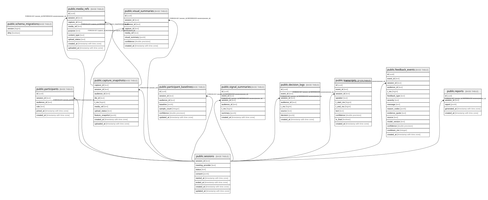

# reaction

## Tables

| Name | Columns | Comment | Type |
| ---- | ------- | ------- | ---- |
| [public.schema_migrations](public.schema_migrations.md) | 2 |  | BASE TABLE |
| [public.sessions](public.sessions.md) | 8 |  | BASE TABLE |
| [public.participants](public.participants.md) | 6 |  | BASE TABLE |
| [public.capture_snapshots](public.capture_snapshots.md) | 10 |  | BASE TABLE |
| [public.media_refs](public.media_refs.md) | 9 |  | BASE TABLE |
| [public.participant_baselines](public.participant_baselines.md) | 7 |  | BASE TABLE |
| [public.visual_summaries](public.visual_summaries.md) | 8 |  | BASE TABLE |
| [public.signal_summaries](public.signal_summaries.md) | 7 |  | BASE TABLE |
| [public.decision_logs](public.decision_logs.md) | 8 |  | BASE TABLE |
| [public.transcripts](public.transcripts.md) | 10 |  | BASE TABLE |
| [public.feedback_events](public.feedback_events.md) | 15 |  | BASE TABLE |
| [public.reports](public.reports.md) | 5 |  | BASE TABLE |

## Relations

---

> Generated by [tbls](https://github.com/k1LoW/tbls)
