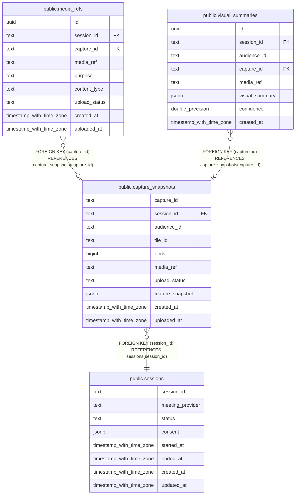

# public.capture_snapshots

## Description

## Columns

| Name | Type | Default | Nullable | Children | Parents | Comment |
| ---- | ---- | ------- | -------- | -------- | ------- | ------- |
| capture_id | text |  | false | [public.media_refs](public.media_refs.md) [public.visual_summaries](public.visual_summaries.md) |  |  |
| session_id | text |  | false |  | [public.sessions](public.sessions.md) |  |
| audience_id | text |  | false |  |  |  |
| tile_id | text |  | true |  |  |  |
| t_ms | bigint |  | false |  |  |  |
| media_ref | text |  | false |  |  |  |
| upload_status | text |  | false |  |  |  |
| feature_snapshot | jsonb |  | false |  |  |  |
| created_at | timestamp with time zone | now() | false |  |  |  |
| uploaded_at | timestamp with time zone |  | true |  |  |  |

## Constraints

| Name | Type | Definition |
| ---- | ---- | ---------- |
| capture_snapshots_session_id_fkey | FOREIGN KEY | FOREIGN KEY (session_id) REFERENCES sessions(session_id) |
| capture_snapshots_pkey | PRIMARY KEY | PRIMARY KEY (capture_id) |

## Indexes

| Name | Definition |
| ---- | ---------- |
| capture_snapshots_pkey | CREATE UNIQUE INDEX capture_snapshots_pkey ON public.capture_snapshots USING btree (capture_id) |
| idx_capture_snapshots_session | CREATE INDEX idx_capture_snapshots_session ON public.capture_snapshots USING btree (session_id) |

## Relations

---

> Generated by [tbls](https://github.com/k1LoW/tbls)
