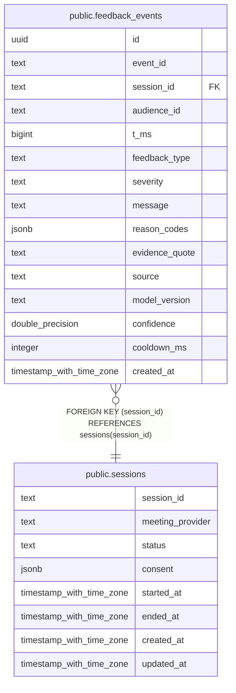

# public.feedback_events

## Description

## Columns

| Name | Type | Default | Nullable | Children | Parents | Comment |
| ---- | ---- | ------- | -------- | -------- | ------- | ------- |
| id | uuid | gen_random_uuid() | false |  |  |  |
| event_id | text |  | false |  |  |  |
| session_id | text |  | false |  | [public.sessions](public.sessions.md) |  |
| audience_id | text |  | true |  |  |  |
| t_ms | bigint |  | false |  |  |  |
| feedback_type | text |  | false |  |  |  |
| severity | text |  | false |  |  |  |
| message | text |  | false |  |  |  |
| reason_codes | jsonb |  | true |  |  |  |
| evidence_quote | text |  | true |  |  |  |
| source | text |  | false |  |  |  |
| model_version | text |  | true |  |  |  |
| confidence | double precision |  | true |  |  |  |
| cooldown_ms | integer |  | true |  |  |  |
| created_at | timestamp with time zone | now() | false |  |  |  |

## Constraints

| Name | Type | Definition |
| ---- | ---- | ---------- |
| feedback_events_session_id_fkey | FOREIGN KEY | FOREIGN KEY (session_id) REFERENCES sessions(session_id) |
| feedback_events_pkey | PRIMARY KEY | PRIMARY KEY (id) |
| feedback_events_event_id_key | UNIQUE | UNIQUE (event_id) |

## Indexes

| Name | Definition |
| ---- | ---------- |
| feedback_events_pkey | CREATE UNIQUE INDEX feedback_events_pkey ON public.feedback_events USING btree (id) |
| feedback_events_event_id_key | CREATE UNIQUE INDEX feedback_events_event_id_key ON public.feedback_events USING btree (event_id) |
| idx_feedback_events_session | CREATE INDEX idx_feedback_events_session ON public.feedback_events USING btree (session_id) |

## Relations

---

> Generated by [tbls](https://github.com/k1LoW/tbls)
