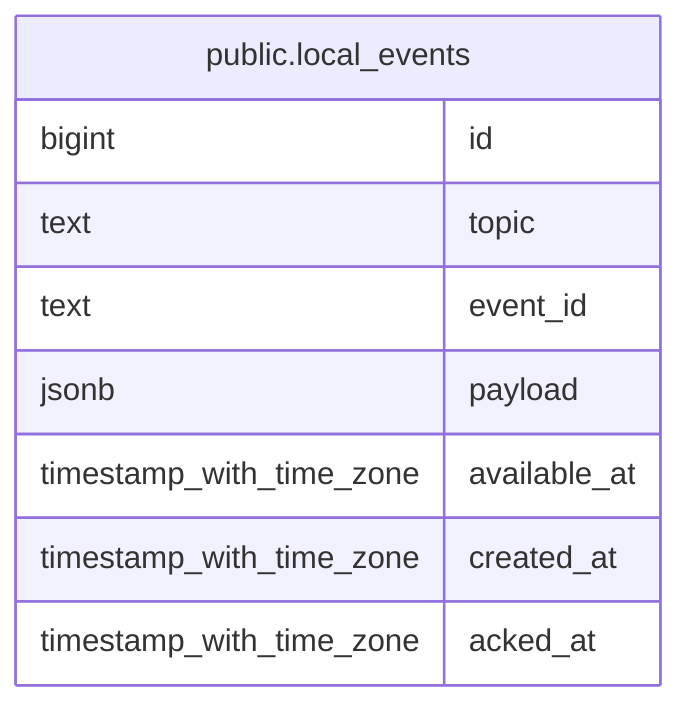

# public.local_events

## Description

## Columns

| Name | Type | Default | Nullable | Children | Parents | Comment |
| ---- | ---- | ------- | -------- | -------- | ------- | ------- |
| id | bigint | nextval('local_events_id_seq'::regclass) | false |  |  |  |
| topic | text |  | false |  |  |  |
| event_id | text |  | false |  |  |  |
| payload | jsonb |  | false |  |  |  |
| available_at | timestamp with time zone | now() | false |  |  |  |
| created_at | timestamp with time zone | now() | false |  |  |  |
| acked_at | timestamp with time zone |  | true |  |  |  |

## Constraints

| Name | Type | Definition |
| ---- | ---- | ---------- |
| local_events_pkey | PRIMARY KEY | PRIMARY KEY (id) |

## Indexes

| Name | Definition |
| ---- | ---------- |
| local_events_pkey | CREATE UNIQUE INDEX local_events_pkey ON public.local_events USING btree (id) |
| idx_local_events_topic_unacked | CREATE INDEX idx_local_events_topic_unacked ON public.local_events USING btree (topic, available_at) WHERE (acked_at IS NULL) |

## Relations

---

> Generated by [tbls](https://github.com/k1LoW/tbls)
