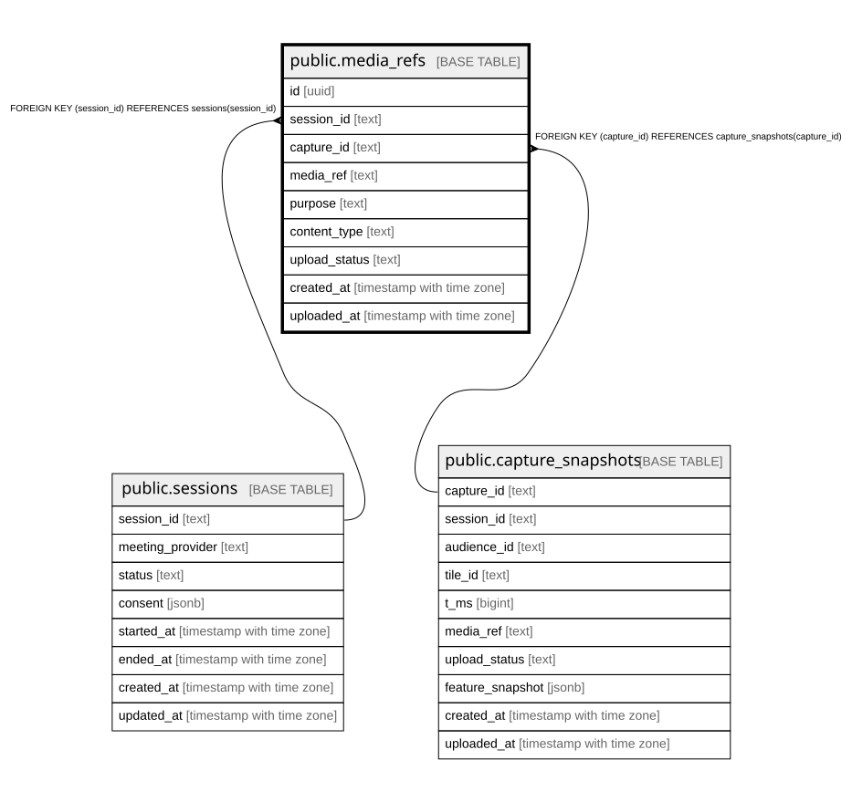

# public.media_refs

## Description

## Columns

| Name | Type | Default | Nullable | Children | Parents | Comment |
| ---- | ---- | ------- | -------- | -------- | ------- | ------- |
| id | uuid | gen_random_uuid() | false |  |  |  |
| session_id | text |  | false |  | [public.sessions](public.sessions.md) |  |
| capture_id | text |  | true |  | [public.capture_snapshots](public.capture_snapshots.md) |  |
| media_ref | text |  | false |  |  |  |
| purpose | text |  | false |  |  |  |
| content_type | text |  | false |  |  |  |
| upload_status | text |  | false |  |  |  |
| created_at | timestamp with time zone | now() | false |  |  |  |
| uploaded_at | timestamp with time zone |  | true |  |  |  |

## Constraints

| Name | Type | Definition |
| ---- | ---- | ---------- |
| media_refs_session_id_fkey | FOREIGN KEY | FOREIGN KEY (session_id) REFERENCES sessions(session_id) |
| media_refs_capture_id_fkey | FOREIGN KEY | FOREIGN KEY (capture_id) REFERENCES capture_snapshots(capture_id) |
| media_refs_pkey | PRIMARY KEY | PRIMARY KEY (id) |
| media_refs_media_ref_key | UNIQUE | UNIQUE (media_ref) |

## Indexes

| Name | Definition |
| ---- | ---------- |
| media_refs_pkey | CREATE UNIQUE INDEX media_refs_pkey ON public.media_refs USING btree (id) |
| media_refs_media_ref_key | CREATE UNIQUE INDEX media_refs_media_ref_key ON public.media_refs USING btree (media_ref) |
| idx_media_refs_session | CREATE INDEX idx_media_refs_session ON public.media_refs USING btree (session_id) |

## Relations

---

> Generated by [tbls](https://github.com/k1LoW/tbls)
