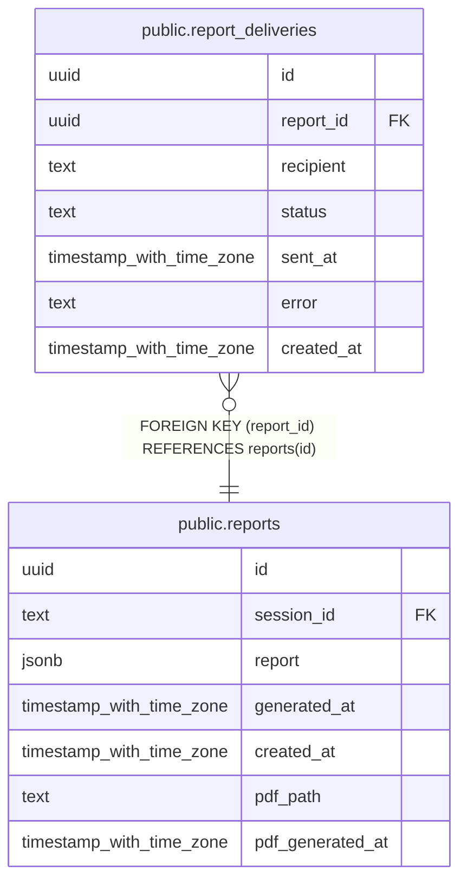

# public.report_deliveries

## Description

## Columns

| Name | Type | Default | Nullable | Children | Parents | Comment |
| ---- | ---- | ------- | -------- | -------- | ------- | ------- |
| id | uuid | gen_random_uuid() | false |  |  |  |
| report_id | uuid |  | false |  | [public.reports](public.reports.md) |  |
| recipient | text |  | false |  |  |  |
| status | text |  | false |  |  |  |
| sent_at | timestamp with time zone |  | true |  |  |  |
| error | text |  | true |  |  |  |
| created_at | timestamp with time zone | now() | false |  |  |  |

## Constraints

| Name | Type | Definition |
| ---- | ---- | ---------- |
| report_deliveries_report_id_fkey | FOREIGN KEY | FOREIGN KEY (report_id) REFERENCES reports(id) |
| report_deliveries_pkey | PRIMARY KEY | PRIMARY KEY (id) |

## Indexes

| Name | Definition |
| ---- | ---------- |
| report_deliveries_pkey | CREATE UNIQUE INDEX report_deliveries_pkey ON public.report_deliveries USING btree (id) |
| idx_report_deliveries_report | CREATE INDEX idx_report_deliveries_report ON public.report_deliveries USING btree (report_id) |

## Relations

---

> Generated by [tbls](https://github.com/k1LoW/tbls)
