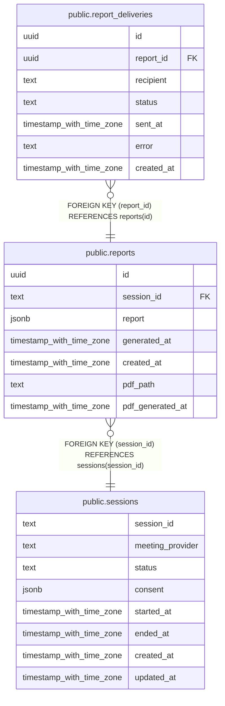

# public.reports

## Description

## Columns

| Name | Type | Default | Nullable | Children | Parents | Comment |
| ---- | ---- | ------- | -------- | -------- | ------- | ------- |
| id | uuid | gen_random_uuid() | false | [public.report_deliveries](public.report_deliveries.md) |  |  |
| session_id | text |  | false |  | [public.sessions](public.sessions.md) |  |
| report | jsonb |  | false |  |  |  |
| generated_at | timestamp with time zone | now() | false |  |  |  |
| created_at | timestamp with time zone | now() | false |  |  |  |
| pdf_path | text |  | true |  |  |  |
| pdf_generated_at | timestamp with time zone |  | true |  |  |  |

## Constraints

| Name | Type | Definition |
| ---- | ---- | ---------- |
| reports_session_id_fkey | FOREIGN KEY | FOREIGN KEY (session_id) REFERENCES sessions(session_id) |
| reports_pkey | PRIMARY KEY | PRIMARY KEY (id) |

## Indexes

| Name | Definition |
| ---- | ---------- |
| reports_pkey | CREATE UNIQUE INDEX reports_pkey ON public.reports USING btree (id) |
| idx_reports_session | CREATE INDEX idx_reports_session ON public.reports USING btree (session_id) |

## Relations

---

> Generated by [tbls](https://github.com/k1LoW/tbls)
