# public.sessions

## Description

## Columns

| Name | Type | Default | Nullable | Children | Parents | Comment |
| ---- | ---- | ------- | -------- | -------- | ------- | ------- |
| session_id | text |  | false | [public.participants](public.participants.md) [public.capture_snapshots](public.capture_snapshots.md) [public.media_refs](public.media_refs.md) [public.participant_baselines](public.participant_baselines.md) [public.visual_summaries](public.visual_summaries.md) [public.signal_summaries](public.signal_summaries.md) [public.decision_logs](public.decision_logs.md) [public.transcripts](public.transcripts.md) [public.feedback_events](public.feedback_events.md) [public.reports](public.reports.md) [public.trigger_events](public.trigger_events.md) |  |  |
| meeting_provider | text |  | false |  |  |  |
| status | text | 'active'::text | false |  |  |  |
| consent | jsonb | '{}'::jsonb | false |  |  |  |
| started_at | timestamp with time zone | now() | false |  |  |  |
| ended_at | timestamp with time zone |  | true |  |  |  |
| created_at | timestamp with time zone | now() | false |  |  |  |
| updated_at | timestamp with time zone | now() | false |  |  |  |

## Constraints

| Name | Type | Definition |
| ---- | ---- | ---------- |
| sessions_pkey | PRIMARY KEY | PRIMARY KEY (session_id) |

## Indexes

| Name | Definition |
| ---- | ---------- |
| sessions_pkey | CREATE UNIQUE INDEX sessions_pkey ON public.sessions USING btree (session_id) |

## Relations

```mermaid
erDiagram

"public.participants" }o--|| "public.sessions" : "FOREIGN KEY (session_id) REFERENCES sessions(session_id)"
"public.capture_snapshots" }o--|| "public.sessions" : "FOREIGN KEY (session_id) REFERENCES sessions(session_id)"
"public.media_refs" }o--|| "public.sessions" : "FOREIGN KEY (session_id) REFERENCES sessions(session_id)"
"public.participant_baselines" }o--|| "public.sessions" : "FOREIGN KEY (session_id) REFERENCES sessions(session_id)"
"public.visual_summaries" }o--|| "public.sessions" : "FOREIGN KEY (session_id) REFERENCES sessions(session_id)"
"public.signal_summaries" }o--|| "public.sessions" : "FOREIGN KEY (session_id) REFERENCES sessions(session_id)"
"public.decision_logs" }o--|| "public.sessions" : "FOREIGN KEY (session_id) REFERENCES sessions(session_id)"
"public.transcripts" }o--|| "public.sessions" : "FOREIGN KEY (session_id) REFERENCES sessions(session_id)"
"public.feedback_events" }o--|| "public.sessions" : "FOREIGN KEY (session_id) REFERENCES sessions(session_id)"
"public.reports" }o--|| "public.sessions" : "FOREIGN KEY (session_id) REFERENCES sessions(session_id)"
"public.trigger_events" }o--|| "public.sessions" : "FOREIGN KEY (session_id) REFERENCES sessions(session_id)"

"public.sessions" {
  text session_id
  text meeting_provider
  text status
  jsonb consent
  timestamp_with_time_zone started_at
  timestamp_with_time_zone ended_at
  timestamp_with_time_zone created_at
  timestamp_with_time_zone updated_at
}
"public.participants" {
  uuid id
  text session_id FK
  text audience_id
  text role
  timestamp_with_time_zone joined_at
  timestamp_with_time_zone created_at
}
"public.capture_snapshots" {
  text capture_id
  text session_id FK
  text audience_id
  text tile_id
  bigint t_ms
  text media_ref
  text upload_status
  jsonb feature_snapshot
  timestamp_with_time_zone created_at
  timestamp_with_time_zone uploaded_at
  text trigger_id
}
"public.media_refs" {
  uuid id
  text session_id FK
  text capture_id FK
  text media_ref
  text purpose
  text content_type
  text upload_status
  timestamp_with_time_zone created_at
  timestamp_with_time_zone uploaded_at
  text trigger_id
}
"public.participant_baselines" {
  uuid id
  text session_id FK
  text audience_id
  jsonb baseline
  integer sample_count
  double_precision confidence
  timestamp_with_time_zone updated_at
}
"public.visual_summaries" {
  uuid id
  text session_id FK
  text audience_id
  text capture_id FK
  text media_ref
  jsonb visual_summary
  double_precision confidence
  timestamp_with_time_zone created_at
}
"public.signal_summaries" {
  uuid id
  text event_id
  text session_id FK
  text audience_id
  bigint t_ms
  jsonb summary
  timestamp_with_time_zone created_at
}
"public.decision_logs" {
  uuid id
  text event_id
  text session_id FK
  text audience_id
  bigint t_ms
  text source
  jsonb decision
  timestamp_with_time_zone created_at
}
"public.transcripts" {
  uuid id
  text event_id
  text session_id FK
  text speaker
  bigint t_start_ms
  bigint t_end_ms
  text text
  double_precision confidence
  boolean is_final
  timestamp_with_time_zone created_at
}
"public.feedback_events" {
  uuid id
  text event_id
  text session_id FK
  text audience_id
  bigint t_ms
  text feedback_type
  text severity
  text message
  jsonb reason_codes
  text evidence_quote
  text source
  text model_version
  double_precision confidence
  integer cooldown_ms
  timestamp_with_time_zone created_at
}
"public.reports" {
  uuid id
  text session_id FK
  jsonb report
  timestamp_with_time_zone generated_at
  timestamp_with_time_zone created_at
}
"public.trigger_events" {
  uuid id
  text event_id
  text session_id FK
  text trigger_id
  text type
  text source
  bigint t_ms
  bigint peak_t_ms
  double_precision delta
  timestamp_with_time_zone created_at
}
```

---

> Generated by [tbls](https://github.com/k1LoW/tbls)
