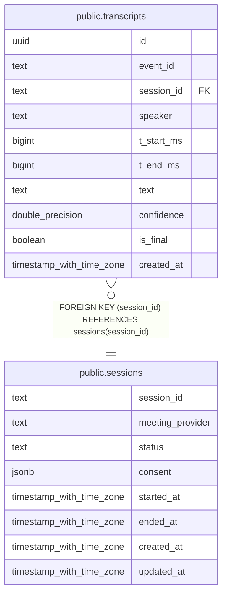

# public.transcripts

## Description

## Columns

| Name | Type | Default | Nullable | Children | Parents | Comment |
| ---- | ---- | ------- | -------- | -------- | ------- | ------- |
| id | uuid | gen_random_uuid() | false |  |  |  |
| event_id | text |  | false |  |  |  |
| session_id | text |  | false |  | [public.sessions](public.sessions.md) |  |
| speaker | text |  | false |  |  |  |
| t_start_ms | bigint |  | false |  |  |  |
| t_end_ms | bigint |  | false |  |  |  |
| text | text |  | false |  |  |  |
| confidence | double precision |  | true |  |  |  |
| is_final | boolean | true | false |  |  |  |
| created_at | timestamp with time zone | now() | false |  |  |  |

## Constraints

| Name | Type | Definition |
| ---- | ---- | ---------- |
| transcripts_session_id_fkey | FOREIGN KEY | FOREIGN KEY (session_id) REFERENCES sessions(session_id) |
| transcripts_pkey | PRIMARY KEY | PRIMARY KEY (id) |
| transcripts_event_id_key | UNIQUE | UNIQUE (event_id) |

## Indexes

| Name | Definition |
| ---- | ---------- |
| transcripts_pkey | CREATE UNIQUE INDEX transcripts_pkey ON public.transcripts USING btree (id) |
| transcripts_event_id_key | CREATE UNIQUE INDEX transcripts_event_id_key ON public.transcripts USING btree (event_id) |
| idx_transcripts_session | CREATE INDEX idx_transcripts_session ON public.transcripts USING btree (session_id) |

## Relations

---

> Generated by [tbls](https://github.com/k1LoW/tbls)
