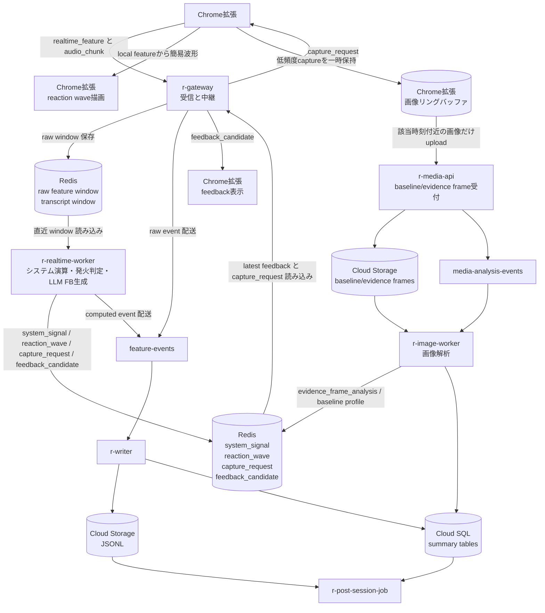

# システム演算フロー

このドキュメントは、Chrome 拡張から送られる特徴量ログをそのまま LLM に渡さず、システム側で圧縮・波形化・変化検出・基準値補正を行ってからリアルタイム FB と全体 FB の両方に利用するための設計メモ。

## 目的

システム演算層の目的は、raw feature log を LLM に大量投入しないこと。LLM には顔ランドマークや瞬間値の羅列ではなく、発表者に返すフィードバックを作るために必要な「観察結果」を渡す。

具体的には次の情報に変換する。

- 秒単位の安定した反応シグナル
- ブラウザ表示と発火条件に使う reaction wave
- baseline との差分
- 変化点
- 変化の継続時間
- 何人に起きたか
- 発火イベント時刻付近の evidence frame 解析結果
- 該当する発話内容
- LLM に渡すための window evidence pack

## 前提

Chrome 拡張は Google Meet 上で参加者ごとの特徴量を取得し、`r-gateway` に送る。現時点の想定は 1fps から開始し、必要なら 2fps 程度まで上げる。

Chrome 拡張は特徴量から簡易的な reaction wave を描画する。サーバー側では `r-realtime-worker` が正式な `system_signal` / `reaction_wave` を作り、発火条件と LLM 入力に使う。

画像は2種類に分ける。

- baseline frame: 参加者ごとの基準作成用。最初に数枚だけ保存する。
- evidence frame: 波形イベント発火時の文脈補強用。Chrome 側の短期リングバッファから必要な画像だけ upload する。

baseline frame は画像と、その時点の `feature_snapshot` を使って `participant_baseline` と `baseline_visual_profile` を作る。

evidence frame は常時 upload しない。Chrome 側で一時的に保持し、time trigger または wave trigger で必要になった時だけ upload する。

現在の DB スキーマ上は `visual_summaries` という名前を使っているが、意味としては「リアルタイム時点の画像説明」ではなく「参加者の基準状態を説明する visual profile」。以降このドキュメントでは `baseline_visual_profile` と呼ぶ。

## コンポーネント責務

### r-gateway

Gateway は WebSocket の受信と中継を担当する。重い分析は持たない。

- Chrome から `realtime_feature` を受ける
- Chrome から `audio_chunk` を受ける
- Redis に raw feature window を保存する
- Redis に transcript window を保存する
- `feature-events` に raw feature / transcript を配送する
- Redis に `capture_request` があれば Chrome に返す
- Redis に新しい `feedback_candidate` があれば Chrome に返す

Gateway は LLM を同期的に呼ばない。リアルタイム FB の生成は `r-realtime-worker` が行う。

### r-realtime-worker

Realtime worker はシステム演算層の中心。

- Redis から raw feature window を読む
- 1秒ごとに `system_signal` を作る
- `system_signal` から `reaction_wave` を作る
- `system_signal` から `change_event` を作る
- time trigger と wave trigger を判定する
- wave trigger 時に必要なら `capture_request` を作る
- 20秒から30秒ごと、または重要な wave trigger 時に `window_evidence_pack` を作る
- transcript window、participant baseline、baseline visual profile、evidence frame analysis を合わせる
- LLM に `window_evidence_pack` を渡す
- `feedback_candidate` を Redis に保存する
- `system_signal`、`reaction_wave`、`change_event`、`window_evidence_pack`、`feedback_candidate` を `feature-events` に流す

### r-media-api

Media API は画像保存の入口。

- baseline frame の upload を受ける
- evidence frame の upload を受ける
- `capture_snapshots` に `feature_snapshot`、`media_ref`、`purpose` を保存する
- upload 完了後に `media-analysis-events` に流す

### r-image-worker

Image worker は画像解析担当。

- baseline frame から `participant_baseline` と `baseline_visual_profile` を作る
- evidence frame から `evidence_frame_analysis` を作る
- baseline / profile / evidence analysis を Redis と Cloud SQL に保存する

### r-writer

Writer は永続化担当。

- `feature-events` を読む
- Cloud Storage に JSONL を保存する
- Cloud SQL に検索・集計しやすい summary 系データを保存する

### r-post-session-job

Post-session job は全体 FB を作る。

- 保存済みの `system_signal`、`change_event`、`window_evidence_pack` を読む
- 保存済みの `reaction_wave` と `evidence_frame_analysis` を読む
- transcript、participant baseline、baseline visual profile を読む
- セッション全体の傾向を LLM またはルールでまとめる
- report を保存する

## 推奨周期

最初の推奨値:

| 処理 | 推奨周期 | 理由 |
| --- | --- | --- |
| Chrome feature 送信 | 1fps | MVP では十分。負荷と精度のバランスがよい |
| Chrome feature 送信の上限候補 | 2fps | 短い変化を拾いたい場合の上限候補 |
| Redis raw window 保存 | 受信ごと | 後段の演算が取りこぼさないようにする |
| system_signal 作成 | 1秒ごと | 発表中の反応変化として意味があり、LLM入力にも圧縮しやすい |
| reaction_wave 作成 | 1秒ごと | UI表示、発火条件、LLM入力に同じ波形を使う |
| change_event 検出 | 1秒ごと | system_signal 更新と同じタイミングでよい |
| LLM リアルタイム FB | 20秒から30秒ごと、または重要イベント時 | 発話内容と反応変化を合わせた提案に必要な長さ |
| evidence frame リングバッファ | 2秒から5秒に1枚 | 常時 upload せず、発火時刻付近の画像だけ後から選ぶ |
| evidence frame 保持 | 30秒から60秒 | worker 検出の遅延を吸収する |
| Redis raw feature 保持 | 60秒から120秒 | realtime worker の再処理と遅延吸収用 |
| Redis system_signal 保持 | セッション中または数時間 | Gateway 返却、再集計、障害時確認用 |

10秒未満の LLM FB は短すぎる可能性が高い。発話内容と反応の因果を作りにくい。まずは20秒または30秒を標準にする。ただし、大きな reaction wave が出た場合は time trigger を待たずに wave trigger として扱う。

## データフロー



## 演算結果の4層

システム演算層は、次の4層のデータを作る。

### 1. system_signal

1秒単位の演算済みシグナル。raw feature を LLM に渡さないための最小単位。

例:

```json
{
  "type": "system_signal",
  "schema_version": 1,
  "session_id": "sess_123",
  "audience_id": "aud_1",
  "bucket_start_ms": 1783175200000,
  "bucket_end_ms": 1783175201000,
  "sample_count": 2,
  "attention": {
    "avg": 0.54,
    "min": 0.49,
    "max": 0.58,
    "delta_from_prev": -0.08,
    "delta_from_baseline": -0.16,
    "state": "down"
  },
  "gaze": {
    "screen_ratio": 0.5,
    "away_ratio": 0.5,
    "state": "unstable"
  },
  "face": {
    "visible_ratio": 1.0,
    "lost": false
  },
  "gesture": {
    "nod_count": 0,
    "nod_score_avg": 0.0
  },
  "motion": {
    "avg": 0.02,
    "state": "low"
  },
  "mouth": {
    "openness_avg": 0.01,
    "activity": "low"
  },
  "flags": [
    "attention_drop",
    "gaze_away"
  ]
}
```

### 2. change_event

意味のある変化点。LLM が「どこで反応が変わったか」を理解するための evidence。

例:

```json
{
  "type": "change_event",
  "schema_version": 1,
  "session_id": "sess_123",
  "audience_id": "aud_1",
  "event_type": "attention_drop",
  "start_ms": 1783175212000,
  "end_ms": 1783175219000,
  "duration_sec": 7,
  "severity": "medium",
  "baseline_delta": -0.18,
  "confidence": 0.72,
  "reason_codes": [
    "attention_below_baseline",
    "gaze_away_increased"
  ]
}
```

### 3. reaction_wave

ブラウザ描画、発火条件、LLM入力に使う波形データ。`system_signal` から作る。Chrome 側でも簡易波形を出すが、正式な判定はサーバー側の `reaction_wave` を使う。

例:

```json
{
  "type": "reaction_wave",
  "schema_version": 1,
  "session_id": "sess_123",
  "bucket_start_ms": 1783175200000,
  "bucket_end_ms": 1783175201000,
  "group": {
    "intensity": 0.72,
    "direction": "down",
    "affected_participants": 4,
    "total_participants": 12,
    "flags": [
      "group_attention_drop",
      "gaze_away_increased"
    ]
  },
  "participants": [
    {
      "audience_id": "aud_1",
      "intensity": 0.81,
      "direction": "down",
      "baseline_delta": -0.19,
      "flags": [
        "attention_drop",
        "gaze_away"
      ]
    }
  ]
}
```

初期計算式の考え方:

```text
reaction_intensity =
  abs(attention_delta_from_baseline) * 0.50
+ gaze_change_score * 0.25
+ motion_change_score * 0.15
+ gesture_change_score * 0.10
```

数式は固定ではない。MVP では説明可能性を優先し、単純な重み付きスコアから始める。

### 4. window_evidence_pack

LLM に渡す20秒から30秒単位の圧縮コンテキスト。リアルタイム FB と全体 FB の両方で使う。

例:

```json
{
  "type": "window_evidence_pack",
  "schema_version": 1,
  "session_id": "sess_123",
  "window_start_ms": 1783175200000,
  "window_end_ms": 1783175220000,
  "window_sec": 20,
  "speaker_transcript": "次に料金プランについて説明します。基本プランは月額...",
  "topic_hint": "料金プラン",
  "trigger": {
    "type": "wave",
    "reason": "group_attention_drop",
    "trigger_ms": 1783175215000
  },
  "reaction_wave_summary": {
    "peak": 0.82,
    "direction": "down",
    "affected_participants": 5,
    "total_participants": 12
  },
  "group_reaction": {
    "overall": "attention_declined",
    "participants_total": 12,
    "participants_affected": 4,
    "participants_recovered": 2
  },
  "notable_events": [
    {
      "event_type": "attention_drop",
      "timing_hint": "料金プランの説明開始直後",
      "audience_ids": ["aud_1", "aud_4", "aud_7"],
      "duration_sec": 8,
      "evidence": "baseline比で平均 -0.16"
    }
  ],
  "participant_context": [
    {
      "audience_id": "aud_1",
      "baseline_attention_avg": 0.68,
      "current_low": 0.49,
      "baseline_visual_profile": "通常時は画面注視が多く、表情変化は少なめ"
    }
  ],
  "evidence_frame_analysis": [
    {
      "audience_id": "aud_1",
      "capture_t_ms": 1783175213000,
      "trigger_t_ms": 1783175215000,
      "summary": "画面外を見る傾向があり、表情変化は少ない",
      "confidence": 0.68
    }
  ]
}
```

## baseline と baseline_visual_profile

画像処理フローには baseline 用と evidence 用がある。

baseline 用の画像処理は、リアルタイム中に毎回画像を解析するためのものではない。最初の数枚の baseline frame と、その時点の `feature_snapshot` から、参加者ごとの基準を作る。

evidence 用の画像処理は、reaction wave が大きく動いた時や time trigger の window に重要な変化があった時だけ使う。Chrome のリングバッファから該当時刻付近の画像を upload し、`evidence_frame_analysis` を作る。

### participant_baseline

数値的な基準値。

例:

```json
{
  "attention_score_avg": 0.62,
  "attention_score_stddev": 0.08,
  "gaze_screen_ratio_avg": 0.78,
  "head_pose_pitch_avg": -0.08,
  "motion_avg": 0.03,
  "mouth_openness_avg": 0.01
}
```

### baseline_visual_profile

画像から得た、その参加者の通常状態の説明。DB 上は当面 `visual_summaries.visual_summary` に保存する。

例:

```json
{
  "description": "通常時は画面を見ており、表情変化は少なめ。軽いうなずきは少ないタイプ。",
  "baseline_expression": "neutral",
  "confidence": 0.72
}
```

リアルタイム FB と全体 FB では、画像本体ではなく `participant_baseline` と `baseline_visual_profile` を使う。

## evidence frame

evidence frame は、波形イベント発火時の視覚的文脈を補強するための画像。常時 upload しない。

### Chrome 側リングバッファ

Chrome 拡張は低頻度でスクリーンショットを作り、短時間だけ保持する。

初期値:

- 参加者ごとに2秒から5秒に1枚
- 保持期間は30秒から60秒
- WebP または JPEG の低解像度
- audience_id / tile_id / capture_t_ms / feature_snapshot を一緒に持つ
- upload しなかった画像は自動破棄する

### capture_request

`r-realtime-worker` が wave trigger を検出したら、Redis に `capture_request` を置く。`r-gateway` はそれを Chrome に返す。

例:

```json
{
  "type": "capture_request",
  "schema_version": 1,
  "session_id": "sess_123",
  "audience_id": "aud_1",
  "trigger_event_id": "chg_456",
  "trigger_t_ms": 1783175215000,
  "preferred_capture_t_ms": 1783175215000,
  "purpose": "evidence_frame",
  "reason": "attention_drop",
  "priority": "medium",
  "expires_at_ms": 1783175245000
}
```

Chrome は `preferred_capture_t_ms` に最も近いリングバッファ内画像を選び、`r-media-api` に upload する。発火後に新しく撮影するだけでは遅れるため、リングバッファから過去画像を拾う。

### evidence_frame_analysis

`r-image-worker` は evidence frame と `feature_snapshot` を見て、LLM に渡せる短い解析結果を作る。

例:

```json
{
  "type": "evidence_frame_analysis",
  "schema_version": 1,
  "session_id": "sess_123",
  "audience_id": "aud_1",
  "capture_id": "cap_123",
  "trigger_event_id": "chg_456",
  "capture_t_ms": 1783175213000,
  "trigger_t_ms": 1783175215000,
  "summary": "画面外を見る傾向があり、表情変化は少ない",
  "supports_event": true,
  "confidence": 0.68
}
```

`evidence_frame_analysis` は補助 evidence。画像解析が間に合わない場合でも、reaction wave、transcript、baseline 差分だけで FB を作れるようにする。

## 発火条件

リアルタイム FB の発火条件は2種類に分ける。

### time trigger

時間ベースの発火。静かな変化や緩やかな理解低下を拾う。

初期ルール:

- 20秒から30秒ごと
- transcript が一定量ある
- 直近 window に未送信の `change_event` がある
- 何も大きな変化がなくても、最低60秒に1回は状態確認する

### wave trigger

reaction wave ベースの発火。大きな反応変化を逃さない。

初期ルール:

- group `reaction_wave.intensity >= 0.70`
- participant `reaction_wave.intensity >= 0.75` が2秒以上継続
- `attention.delta_from_baseline <= -0.18` が3秒以上継続
- 参加者の30%以上に同方向の変化がある
- 10秒以内に複数の `change_event` がある
- 大きな低下だけでなく、急回復も `recovery_event` として拾う

### 抑制ルール

画像と LLM の呼びすぎを避ける。

- 同一 audience_id の evidence frame は30秒から60秒 cooldown
- 同一 LLM window で upload する evidence frame は最大3枚
- baseline capture 中は evidence capture を抑制する
- face lost 中の wave trigger は confidence を下げる
- transcript が空の場合は、画像ありでも断定的な FB を避ける

## 演算ルール

### attention

入力:

- `attention_score`
- `participant_baseline.attention_score_avg`
- 直前 bucket の `attention.avg`

計算:

- `avg`: bucket 内平均
- `min`: bucket 内最小
- `max`: bucket 内最大
- `delta_from_prev`: 現 bucket 平均 - 直前 bucket 平均
- `delta_from_baseline`: 現 bucket 平均 - baseline 平均

初期ルール:

- `delta_from_baseline <= -0.15` なら `attention_drop`
- `delta_from_prev <= -0.10` なら `attention_drop_candidate`
- `attention_drop` が3秒以上継続したら `change_event` に昇格
- baseline 未準備なら session default threshold を使うが、confidence を下げる

### gaze

入力:

- `gaze_estimate`
- `face_visible`

計算:

- `screen_ratio`: bucket 内で screen と判定された割合
- `away_ratio`: bucket 内で screen 以外の割合
- `state`: `stable` / `unstable` / `away`

初期ルール:

- `away_ratio >= 0.5` なら `gaze_away`
- `gaze_away` が3秒以上継続し、attention 低下もある場合は severity を上げる

### face

入力:

- `face_visible`
- `face_count`

計算:

- `visible_ratio`: bucket 内で顔が見えていた割合
- `lost`: `visible_ratio < 0.5`

初期ルール:

- face lost 中の attention 低下は confidence を下げる
- face lost 自体を発表内容への反応低下として強く扱わない

### gesture

入力:

- `nod_count`
- `nod_score`

計算:

- `nod_count`: bucket 内合計
- `nod_score_avg`: bucket 内平均

初期ルール:

- nod 増加は positive signal として扱う
- nod が少ないこと単体では negative と判定しない

### motion

入力:

- `motion_score`

計算:

- `avg`: bucket 内平均
- `state`: `low` / `normal` / `high`

初期ルール:

- high motion はノイズの可能性があるため、attention や gaze の confidence 補正に使う
- motion 単体では FB の主根拠にしない

### mouth

入力:

- `mouth_openness`

計算:

- `openness_avg`
- `activity`: `low` / `normal` / `high`

初期ルール:

- audience 側の mouth activity は発話や笑いの可能性があるが、初期版では補助情報に留める

## LLM に渡す情報

LLM には raw feature log を渡さない。渡すのは次の情報。

- 直近20秒から30秒の transcript
- window evidence pack
- reaction wave summary
- trigger 情報（time trigger / wave trigger）
- group reaction summary
- notable change events
- evidence frame analysis
- audience ごとの baseline 差分
- baseline visual profile の短い説明
- 必要最小限の feature snapshot summary

LLM に渡さない情報:

- face landmark 座標
- bbox の全履歴
- eye / nose / mouth の point 配列
- raw feature の全サンプル
- baseline frame / evidence frame の画像本体

LLM input の基本形:

```json
{
  "trigger": {
    "type": "wave",
    "reason": "group_attention_drop",
    "trigger_ms": 1783175215000
  },
  "transcript_window": {
    "start_ms": 1783175195000,
    "end_ms": 1783175225000,
    "text": "料金プランについて説明します..."
  },
  "reaction_wave_summary": {
    "group": {
      "peak": 0.82,
      "direction": "down",
      "affected_participants": 5,
      "total_participants": 12
    },
    "notable_participants": [
      {
        "audience_id": "aud_1",
        "baseline_delta": -0.19,
        "duration_sec": 6
      }
    ]
  },
  "evidence_frame_analysis": [
    {
      "audience_id": "aud_1",
      "capture_t_ms": 1783175213000,
      "summary": "画面外を見る傾向があり、表情変化は少ない",
      "confidence": 0.68
    }
  ],
  "feature_snapshot_summary": {
    "attention_drop": true,
    "gaze_away_increased": true,
    "face_visible_ratio": 1.0
  }
}
```

## リアルタイム FB の作り方

LLM には次のような役割を持たせる。

- 数値の再計算をさせない
- 変化イベントを発話内容と結びつける
- 発表者向けの短い提案に変換する
- 断定を避ける

出力例:

```json
{
  "type": "feedback_candidate",
  "session_id": "sess_123",
  "window_start_ms": 1783175200000,
  "window_end_ms": 1783175220000,
  "message": "料金プランの説明に入った直後、複数人の反応が基準より少し下がっています。価格の根拠や具体例を一つ補足するとよさそうです。",
  "severity": "suggestion",
  "confidence": 0.74,
  "reason_codes": [
    "group_attention_declined",
    "pricing_topic_detected"
  ]
}
```

画像解析が間に合わない場合の出力も許可する。つまり、リアルタイム FB は `evidence_frame_analysis` を必須にしない。

優先順位:

1. reaction wave + transcript + baseline 差分で速い FB を作る
2. evidence frame analysis が間に合った場合だけ、根拠を補強する
3. evidence frame analysis が遅れた場合は、次回 window または全体 FB で使う

## 保存方針

### Redis

Redis はリアルタイム参照用。

```text
features:recent:{session_id}:{audience_id}
transcript:recent:{session_id}:{speaker}
system_signal:recent:{session_id}:{audience_id}
reaction_wave:recent:{session_id}
change_events:recent:{session_id}
capture_requests:pending:{session_id}
evidence_frame_analysis:recent:{session_id}
feedback:latest:{session_id}
feedback:history:{session_id}
session:baseline:{session_id}:{audience_id}
session:visual_summary:{session_id}:{audience_id}
session:baseline_status:{session_id}:{audience_id}
```

### Pub/Sub feature-events

`feature-events` は永続化と全体 FB 用の配送路。

流すもの:

- raw compact feature
- transcript_chunk
- system_signal
- reaction_wave
- change_event
- window_evidence_pack
- evidence_frame_analysis
- feedback_candidate
- decision_log

### Cloud Storage

Cloud Storage は高頻度 JSONL の保存先。

- raw compact feature JSONL
- system_signal JSONL
- reaction_wave JSONL
- change_event JSONL
- window_evidence_pack JSONL
- evidence_frame_analysis JSONL
- transcript JSONL
- baseline/evidence frame image objects

### Cloud SQL

Cloud SQL は検索・集計・レポート生成に必要な構造化データを保存する。

- sessions
- participants
- participant_baselines
- visual_summaries
- capture_snapshots
- media_refs
- signal_summaries
- decision_logs
- transcripts
- feedback_events
- reports

## 設計上の判断

### システム演算は一度だけ行う

リアルタイム FB 用と全体 FB 用に別々に演算しない。`r-realtime-worker` が一度だけ `system_signal`、`reaction_wave`、`change_event`、`window_evidence_pack` を作り、Redis と `feature-events` の両方に流す。

### LLM は外部分析器として扱う

Gateway は LLM を同期的に待たない。LLM 処理は `r-realtime-worker` が20秒から30秒ごとに行い、結果を Redis に置く。Gateway は新しい `feedback_candidate` があれば Chrome に返す。

### 画像は毎回使わない

baseline frame は基準作成用。リアルタイム FB と全体 FB では、画像本体ではなく `participant_baseline` と `baseline_visual_profile` を判断基準として使う。

evidence frame は波形イベント時の補助 evidence。常時 upload せず、Chrome のリングバッファから発火時刻付近の画像だけ upload する。

### 発火条件は time trigger と wave trigger に分ける

time trigger は一定間隔の状態確認、wave trigger は大きな反応変化の検出に使う。どちらも最終的には `window_evidence_pack` を作るが、wave trigger では必要に応じて `capture_request` を発行する。

### 波形はUI・発火条件・LLM入力で共通利用する

Chrome 側の波形は体感のための簡易表示。サーバー側の `reaction_wave` は正式な判定用。LLM には raw feature ではなく、`reaction_wave_summary` と `change_event` を渡す。

### raw feature は監査と再解析用に残す

通常の LLM 入力には raw feature を使わない。ただし、後から演算ルールを変更したい場合やバグ調査に備えて、compact raw feature JSONL は保存する。

## 検証ステップ

実装検証は次の順番で進める。

1. Chrome 側で feature を取得し、簡易 reaction wave を描画する
2. `r-gateway` に feature / audio を送り、Redis に raw window を保存する
3. `r-realtime-worker` で `system_signal` と `reaction_wave` を作る
4. time trigger / wave trigger で `window_evidence_pack` を作る
5. 画像なしで LLM FB を作る
6. wave trigger 時に `capture_request` を Chrome に返す
7. Chrome のリングバッファから該当時刻付近の evidence frame を upload する
8. `r-image-worker` が `evidence_frame_analysis` を作る
9. evidence frame analysis がある場合だけ LLM input に追加する
10. 全体 FB でも保存済みの reaction wave / evidence analysis を利用する
