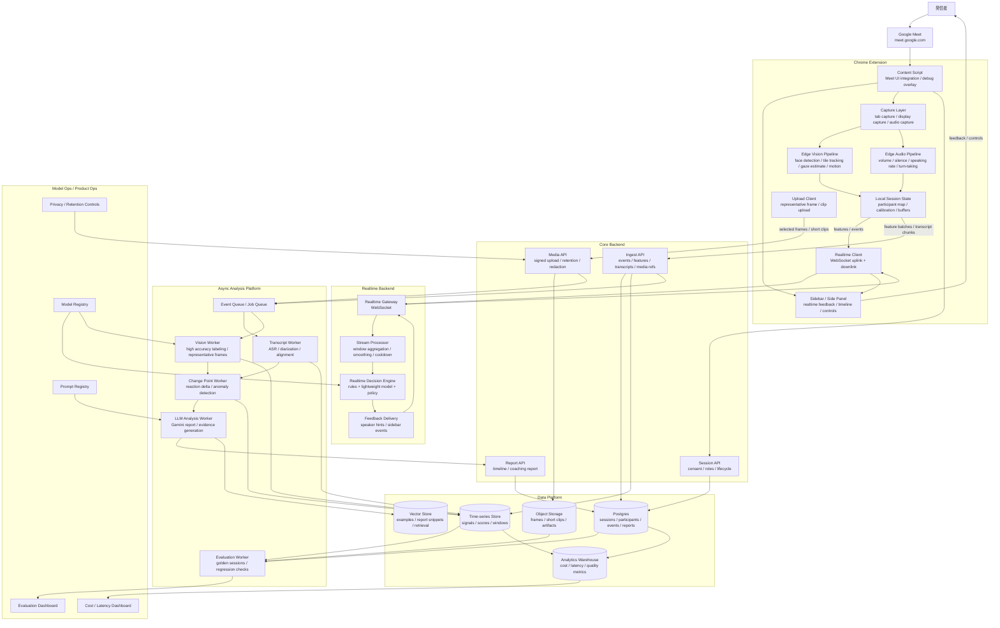
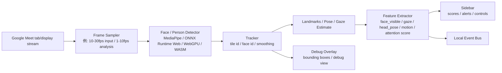
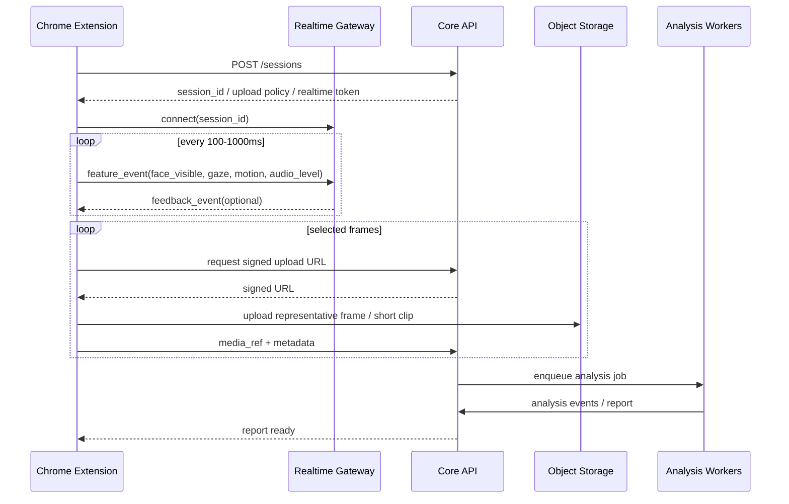
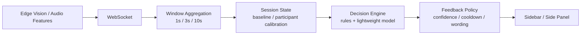
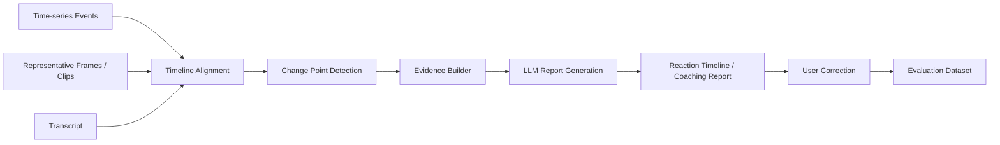

# Google Meet リアクション分析プロダクト アーキテクチャ案

## 目的

Google Meet 上の発表・商談・授業・社内共有などで、発信者に対して次の価値を返す。

1. **リアルタイム理解**: 傍聴者の顔・タイル・視線・姿勢・動き・音声反応を会議中に解析し、発信者へ小さなフィードバックを返す。
2. **セッション後分析**: 発話内容、画面上の反応、傍聴者ごとの時系列変化を統合し、反応が落ちた区間や改善点を根拠つきで提示する。
3. **継続改善**: ユーザー修正、確定ラベル、評価データを蓄積し、プロンプト・モデル・しきい値・個人較正を継続的に改善する。

重要なのは、Chrome 拡張で画像を扱うとしても、画像を常にサーバーへ流す設計にしないこと。最終形では、**リアルタイムな視覚処理はできるだけブラウザ内で実行し、サーバーには特徴量・イベント・必要最小限の代表フレームだけを送る**。

## リアルタイムな顔分析は可能か

可能。カメラ映像や画面キャプチャから人の顔を検出して、顔の周囲を矩形で囲うような処理は、ブラウザ上でも実装できる。

ただし Google Meet 連携では、カメラの生映像を直接扱うというより、以下のどちらかになる。

- **画面キャプチャ方式**: Google Meet の画面またはタブをキャプチャし、映っている参加者タイルから顔・上半身・動き・視線推定を行う。
- **DOM 補助方式**: Google Meet の DOM から参加者タイル、発話者状態、名前表示などを補助的に取得し、画面キャプチャ上の検出結果と対応づける。

最終形ではこの2つを併用する。DOM は変更に弱いので主経路にはせず、視覚検出の補助情報として扱う。

## 全体アーキテクチャ



## Edge Vision Pipeline

発信者が見たことのある「顔を四角で囲ってリアルタイムに検出する」処理は、この層で実現する。基本は Chrome 拡張内で `video -> canvas -> detector -> tracking -> features -> sidebar/debug overlay` の流れを作る。



この処理はリアルタイムにできる。ただし負荷が高いので、常に30fpsで重いモデルを回すのではなく、以下のように分ける。

- 表示用の矩形追跡: 軽量・高頻度
- 反応スコア用の特徴抽出: 中頻度
- 高精度ラベリング: 低頻度またはサーバー後処理

## 通信設計

画像そのものを WebSocket で送ることは可能だが、最終形でも主経路にはしない。リアルタイムで必要なのは画像本体ではなく、画像から抽出した特徴量とイベントだから。



### WebSocket で送るもの

- `face_visible`
- `face_bbox`
- `tile_bbox`
- `gaze_estimate`
- `head_pose`
- `motion_score`
- `attention_score`
- `audio_level`
- `silence_ms`
- `speaking_rate`
- `speaker_change`
- `feedback_ack`

### REST / signed upload で送るもの

- 代表フレーム
- 短いクリップ
- transcript chunk
- セッション終了イベント
- レポート取得
- ユーザー修正・確定ラベル

### 原則

- WebSocket は **低遅延イベント用**。
- REST は **状態変更・確定データ・メディア参照用**。
- Object Storage は **画像・短い動画・分析 artifact 用**。
- DB には画像本体を入れず、`media_ref` と metadata を保存する。

## リアルタイム分析パス



リアルタイムパスでは断定的な感情推定を避ける。出すべきなのは「退屈しています」ではなく、「一部の反応が薄くなっている可能性があります」「発話速度が上がっています」「間を置いて確認するとよさそうです」のような、発信者がすぐ行動に移せる表現。

## セッション後分析パス



セッション後分析では、リアルタイム中に捨てた情報を必要に応じて補う。代表フレーム、発話前後の transcript、反応スコアの変化点をまとめて Gemini に渡し、理由・根拠・確信度を生成する。

## Chrome 拡張の責務

Chrome 拡張は最終形でも重要な分析コンポーネントになる。ただし、重い統合分析や長期保存は担当しない。

- Google Meet 上に sidebar / side panel を表示する
- 顔 bbox などの矩形表示は、通常 UI ではなく debug overlay として扱う
- ユーザー同意を取り、Meet のタブ/画面/音声を取得する
- 画面キャプチャから参加者タイルと顔領域を検出する
- 顔 bbox、タイル bbox、視線推定、頭部姿勢、動き量をリアルタイムに抽出する
- 発信者音声の音量、無音、話速、話者交代を抽出する
- 参加者ごとの baseline をローカルで保持する
- WebSocket で軽量イベントを送る
- 必要な代表フレーム/短いクリップだけを upload する
- サーバーからの feedback event を UI に反映する

## バックエンドの責務

バックエンドは「セッション状態、リアルタイム判断、後処理分析、評価」を管理する。

- session lifecycle、role、consent、retention policy の管理
- WebSocket gateway によるリアルタイムイベント受信
- window aggregation、baseline 補正、cooldown 制御
- feedback policy による文言・頻度・確信度制御
- 代表フレーム/短いクリップの保存先管理
- 文字起こし、視覚ラベリング、変化点検出、LLM レポート生成
- ユーザー修正の収集
- golden sessions による評価
- prompt/model/threshold version の管理
- cost、latency、quality、confidence の可観測性

## データ契約

### 1. Session

```json
{
  "session_id": "sess_123",
  "started_at": "2026-07-01T10:00:00Z",
  "meeting_provider": "google_meet",
  "speaker_user_id": "user_1",
  "consent": {
    "capture_screen": true,
    "capture_audio": true,
    "store_representative_frames": true,
    "store_raw_video": false,
    "retention_days": 30
  }
}
```

### 2. Realtime Feature Event

```json
{
  "type": "realtime_feature",
  "session_id": "sess_123",
  "t_ms": 12345,
  "audience_id": "aud_2",
  "tile_bbox": { "x": 112, "y": 240, "w": 320, "h": 180 },
  "face_bbox": { "x": 174, "y": 265, "w": 82, "h": 92 },
  "features": {
    "face_visible": true,
    "gaze_estimate": "screen",
    "head_pose": { "yaw": -8.2, "pitch": 4.1, "roll": 1.0 },
    "motion_score": 0.42,
    "attention_score": 0.66
  },
  "client_model_version": "edge-vision-v1"
}
```

### 3. Media Reference

```json
{
  "type": "media_ref",
  "session_id": "sess_123",
  "t_ms": 12345,
  "audience_id": "aud_2",
  "media_ref": "storage://sessions/sess_123/frames/frame_12345.webp",
  "mime": "image/webp",
  "purpose": "representative_frame",
  "redaction": {
    "applied": false
  }
}
```

### 4. Transcript Chunk

```json
{
  "session_id": "sess_123",
  "t_start_ms": 12000,
  "t_end_ms": 17000,
  "speaker": "presenter",
  "text": "ここから価格戦略について説明します",
  "confidence": 0.91
}
```

### 5. Feedback Event

```json
{
  "type": "feedback_event",
  "session_id": "sess_123",
  "t_ms": 65000,
  "feedback_type": "reaction_down_candidate",
  "severity": "low",
  "message": "一部の反応が薄くなっている可能性があります",
  "reason_codes": ["attention_score_drop", "motion_drop"],
  "confidence": 0.64,
  "cooldown_ms": 30000
}
```

### 6. Analysis Event

```json
{
  "session_id": "sess_123",
  "t_start_ms": 60000,
  "t_end_ms": 90000,
  "audience_id": "aud_2",
  "event_type": "reaction_drop",
  "score_before": 0.72,
  "score_after": 0.48,
  "delta": -0.24,
  "label": "説明密度が高く反応が低下した可能性",
  "evidence": ["価格表の説明開始後に視線推定と動きが低下", "同区間で発話速度が上昇"],
  "confidence": 0.68,
  "model_version": "gemini-flash",
  "prompt_version": "reaction_report_v1"
}
```

## 画像データの扱い

Chrome 拡張は画像を扱う。ただし、常時サーバーへ転送するのではなく、以下の3段階に分ける。

| データ | 主な用途 | 通信 | 保存 |
| --- | --- | --- | --- |
| 顔 bbox / 視線 / 動き量などの特徴量 | リアルタイム判断 | WebSocket | Time-series store |
| 代表フレーム | 後処理分析、根拠表示、評価 | REST + signed upload | Object Storage |
| 短いクリップ | 詳細分析、デバッグ、ユーザー許可ありの再分析 | REST + signed upload | Object Storage |

WebSocket で画像バイナリを送ること自体は可能。ただし、低遅延 feedback と大きな画像転送を同じ経路に混ぜると、詰まりや再送設計が難しくなる。最終形でも、画像本体は upload 経路、リアルタイム判断は特徴量経路に分ける。

## 技術選定

- Extension: Chrome MV3, TypeScript, React または Web Components
- Capture: `chrome.tabCapture`, `getDisplayMedia`, Web Audio API
- Edge Vision: MediaPipe Tasks Vision, ONNX Runtime Web, WebGPU/WASM backend
- Realtime: WebSocket
- Core API: FastAPI または Node.js/Fastify
- Queue: Cloud Tasks / Pub/Sub / BullMQ / Celery
- DB: Postgres
- Time-series: TimescaleDB, ClickHouse, BigQuery など
- Object Storage: GCS / S3 互換
- Analysis Workers: Python
- Transcription: Whisper 系 API またはクラウド ASR
- Vision/LLM: Gemini Flash 系
- Evaluation: golden sessions + expected feedback/analysis events

## 責務分担

| Role | Ownership | 主な成果物 |
| --- | --- | --- |
| A. Extension / Edge AI | Chrome 拡張、Google Meet 連携、画面/音声取得、Edge Vision、sidebar | 顔 bbox デバッグ表示、特徴量抽出、WebSocket 送信、feedback 表示 |
| B. Realtime / Product Intelligence | リアルタイム集計、baseline 補正、feedback policy、低遅延判断 | feedback engine、cooldown、文言制御、反応スコア |
| C. Analysis / LLM | 文字起こし、変化点検出、Gemini 統合分析、レポート | reaction timeline、analysis events、coaching report |
| D. Platform / Evaluation | API、DB、queue、media storage、評価、可観測性、コスト | session platform、評価 dashboard、prompt/model registry |

3人で作る場合は B と C を統合してもよい。ただし最終形の責務としては、リアルタイム判断とセッション後分析は分けて考える。

## 主要リスク

- Google Meet の DOM / UI 変更
- Chrome 拡張での画面/音声取得制約
- Edge Vision の CPU/GPU 負荷
- 顔・視線・反応推定の過信
- プライバシー、同意、保存期間の設計
- リアルタイム feedback が発信者の邪魔になること
- 生メディア保存によるコスト増大
- 個人ごとの反応差を無視した誤判定

対策として、最終形でも「画像本体より特徴量中心」「代表フレームのみ保存」「断定しない feedback」「個人 baseline 補正」「モデル/プロンプト/しきい値の評価管理」を設計原則にする。
