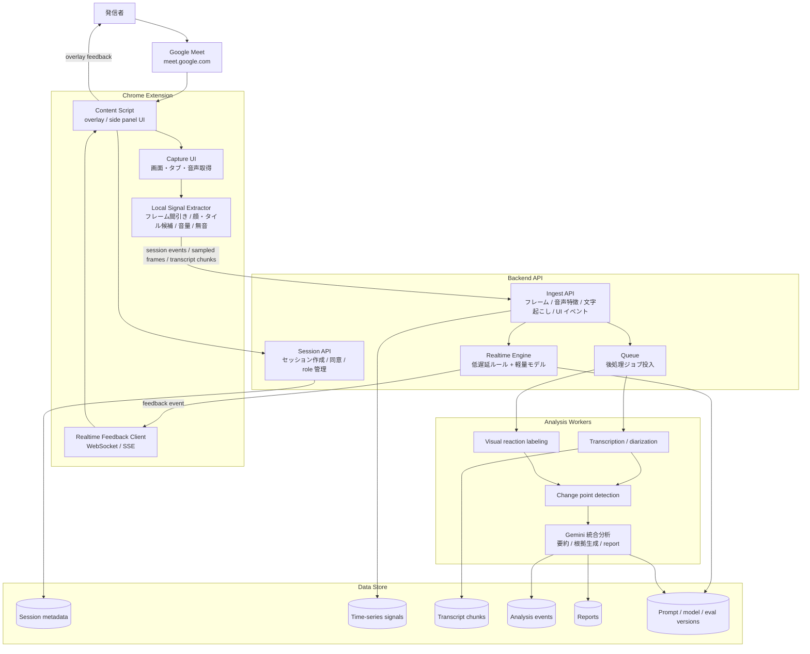
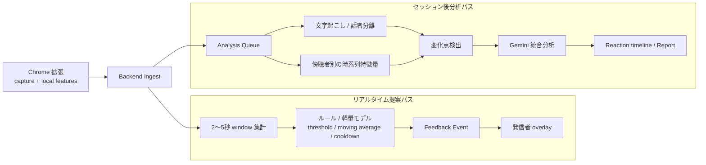

# Chrome 拡張を用いた分析系プロダクト 初期アーキテクチャ案

## 目的

発信者と傍聴者が明確に分かれるオンライン会議/発表の場で、発信者に次の2種類の価値を返す。

1. **リアルタイム提案**: 発表中に「反応が落ちている」「間が長い」「説明が詰まっている」などの小さなフィードバックを出す。
2. **セッション後分析**: どの発話・どの区間で傍聴者の反応が変化したかを、タイムラインと根拠つきレポートで返す。

このプロダクトの核は「Chrome 拡張で会議中のシグナルを取り、リアルタイムには軽く返し、セッション後には重く分析する」こと。最初から全てを高精度にやるより、**取得できるデータ、低遅延で返すデータ、後処理で分析するデータを分離する**。

## MVP の前提

- 対象は Google Meet に固定する。
- Chrome 拡張は MV3 を前提にする。
- 画面/タブ/音声の取得はユーザー許可ベースで行う。
- 生の映像・音声を長期保存する設計にはしない。保存する場合もセッション単位の明示同意を必須にする。
- 最初の精度目標は「表情や反応を完全に当てる」ではなく、**反応変化の候補区間をそれらしく提示できること**。

## 全体アーキテクチャ



## 2パス設計



### 1. リアルタイム提案パス

目的は「発表中に邪魔にならない小さいヒント」を出すこと。精密な解釈より、低遅延・低ノイズ・安全な表現を優先する。

- 入力
  - 発信者音声の音量、無音時間、話速
  - 傍聴者タイルの簡易特徴量
  - 直近の文字起こし chunk
- 処理
  - 2〜5秒ごとの短い窓で集計
  - 閾値、移動平均、cooldown を使って出しすぎを防ぐ
  - 初期はルールベース中心でよい
- 出力
  - `reaction_down_candidate`
  - `long_silence`
  - `too_fast`
  - `low_confidence`

注意点: リアルタイム UI は断定しない。「反応が落ちています」より「反応が薄くなっている可能性があります」のような表現にする。モデルの解釈をそのまま出さず、UI 表現の policy layer を挟む。

### 2. セッション後分析パス

目的は「なぜ反応が変化したのか」を発話内容・画面上の反応・時間変化から説明すること。数十秒から数分の遅延は許容し、根拠と再現性を優先する。

- 入力
  - セッション全体の文字起こし
  - 傍聴者ごとの時系列特徴量
  - 低頻度サンプリングされた代表フレーム
  - リアルタイム提案イベント
- 処理
  - 変化点検出で候補区間を抽出
  - 候補区間の前後発話を Gemini に渡して要約・理由付け
  - 傍聴者ごとの反応スコアを計算
  - 低 confidence の結果は「不確実」として残す
- 出力
  - 反応タイムライン
  - 発話区間ごとの reaction delta
  - 傍聴者別スコア
  - コーチングレポート
  - 次回改善 suggestion

## Chrome 拡張の責務

Chrome 拡張は「全てを分析する場所」ではなく、**取得・軽量前処理・表示**に責務を絞る。

- 会議ページ上に overlay または side panel を表示する
- ユーザー許可を取り、画面/タブ/音声を取得する
- 映像はそのまま全量送らず、まずは低頻度サンプリングする
- 可能ならローカルで顔/タイル候補を抽出する
- 発信者にリアルタイム提案を表示する
- セッション終了後にレポート画面へ遷移する

初期 MVP では Google Meet の DOM 構造に深く依存しすぎない方がよい。Meet の DOM は変わりやすいため、最初は画面キャプチャ上のタイル検出を基本にし、Meet 専用の参加者名・タイル位置・発話者状態の補助抽出は後から追加する。

## バックエンドの責務

バックエンドは「セッション状態を管理し、リアルタイム処理と後処理を分岐させる」場所。

- session lifecycle の管理
- データ同意/保存ポリシーの管理
- 拡張からの ingest
- リアルタイム提案の生成
- 後処理ジョブの投入
- 分析結果の保存と配信
- prompt/model version、cost、latency、confidence の記録

## データ契約

Day 1 でここを固定する。これが決まれば、拡張・分析・基盤をサンプルデータで並行開発できる。

### 1. Session

```json
{
  "session_id": "sess_123",
  "started_at": "2026-07-01T10:00:00Z",
  "meeting_provider": "google_meet",
  "speaker_user_id": "user_1",
  "consent": {
    "capture_screen": true,
    "capture_audio": true,
    "store_raw_media": false
  }
}
```

### 2. Capture Event

```json
{
  "session_id": "sess_123",
  "t_ms": 12345,
  "source": "screen_sample",
  "audience_id": "aud_2",
  "frame_ref": "storage://sample-frame.jpg",
  "features": {
    "face_visible": true,
    "gaze_estimate": "screen",
    "motion_score": 0.42
  }
}
```

### 3. Transcript Chunk

```json
{
  "session_id": "sess_123",
  "t_start_ms": 12000,
  "t_end_ms": 17000,
  "speaker": "presenter",
  "text": "ここから価格戦略について説明します",
  "confidence": 0.91
}
```

### 4. Analysis Event

```json
{
  "session_id": "sess_123",
  "t_start_ms": 60000,
  "t_end_ms": 90000,
  "audience_id": "aud_2",
  "event_type": "reaction_drop",
  "score_before": 0.72,
  "score_after": 0.48,
  "delta": -0.24,
  "label": "説明密度が高く反応が低下した可能性",
  "evidence": ["価格表の説明開始後に視線推定と動きが低下", "同区間で発話速度が上昇"],
  "confidence": 0.68,
  "model_version": "gemini-flash",
  "prompt_version": "reaction_report_v1"
}
```

### 5. Feedback Event

```json
{
  "session_id": "sess_123",
  "t_ms": 65000,
  "feedback_type": "reaction_down_candidate",
  "severity": "low",
  "message": "一部の反応が薄くなっている可能性があります",
  "cooldown_ms": 30000
}
```

## 責務分担

Role は肩書きではなく、依存関係を切るための ownership として置く。

| Role | Ownership | 主な成果物 |
| --- | --- | --- |
| A. Extension / UX | Chrome 拡張、取得許可、overlay、リアルタイム表示 | 拡張 MVP、画面/音声取得、feedback 表示 |
| B. Signal / AI | 特徴量、文字起こし、変化点検出、Gemini 分析 | reaction score、analysis event、report |
| C. Platform / Evaluation | API、DB、queue、評価、cost/latency 可視化 | session API、ingest、worker 実行基盤、評価 dashboard |

3人で作る場合、C を「余り」ではなく本丸に置く。分析系プロダクトは、単発の AI 出力よりも **データ契約・評価・再実行性・可観測性** が価値になる。

## MVP スコープ

### 作る

- Chrome 拡張から会議画面をサンプリング取得する
- 発信者音声またはタブ音声を取得し、短い transcript chunk を作る
- session / capture / transcript / analysis / feedback の API を用意する
- リアルタイムにはルールベースの feedback を overlay に出す
- セッション後に reaction timeline と report を表示する
- デモ用に「ユーザー修正 → 評価データ追加 → report 改善」の流れを見せる

### まだ作らない

- Google Meet 以外の会議サービス対応
- 完全な感情推定
- 高精度な個人識別
- 常時録画保存
- 複雑な権限管理
- 本格的なモデル学習

## 技術選定の初期案

- Extension: Chrome MV3, TypeScript, React または素の Web Components
- UI: overlay + side panel
- Backend API: Node.js/Fastify または Python/FastAPI
- Realtime: WebSocket または SSE
- Queue: BullMQ / Cloud Tasks / Celery のいずれか
- DB: Postgres
- Object Storage: GCS / S3 互換
- Analysis: Python workers
- Transcription: Whisper 系 API またはローカル whisper 実行
- Vision/LLM: Gemini Flash 系
- Evaluation: golden sessions + expected analysis events

ハッカソンなら、最初は API と worker を同一リポジトリの monolith として作り、queue だけ抽象化するのが現実的。分散システムとして綺麗に分けるより、セッションを1本通す方を優先する。

## 開発順序

1. データ契約とサンプル JSON を固定する。
2. Backend の session / ingest / feedback / report API を mock 実装する。
3. Chrome 拡張で overlay と capture permission flow を作る。
4. サンプルデータから analysis event と report を生成する worker を作る。
5. 拡張の実 capture を backend に流し、report まで1本通す。
6. リアルタイム feedback の閾値・cooldown・文言を調整する。
7. golden sessions を作り、prompt/model version ごとの結果差分を見える化する。

## デモの見せ方

1. 発信者が Chrome 拡張を起動し、会議画面の取得を許可する。
2. 発表中に overlay が小さい feedback を出す。
3. セッション終了後、反応タイムラインが生成される。
4. 「この発話区間で反応が下がった可能性」と根拠を表示する。
5. ユーザーが分析結果を修正する。
6. 修正が評価データに入り、次回の report/prompt 評価に反映されることを dashboard で見せる。

## 最大のリスク

- Chrome 拡張で安定して映像/音声を取得できるか
- Google Meet の DOM / UI 変更
- 反応推定の過信
- プライバシー/同意設計
- リアルタイム提案が邪魔になること
- 生データ保存とコストの肥大化

対策として、MVP では「低頻度サンプリング」「断定しない feedback」「保存しない/短期保存」「サービス1つに限定」「後処理重視」に寄せる。
