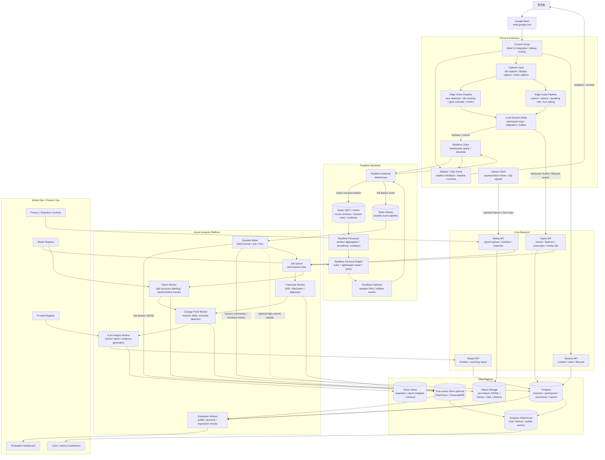
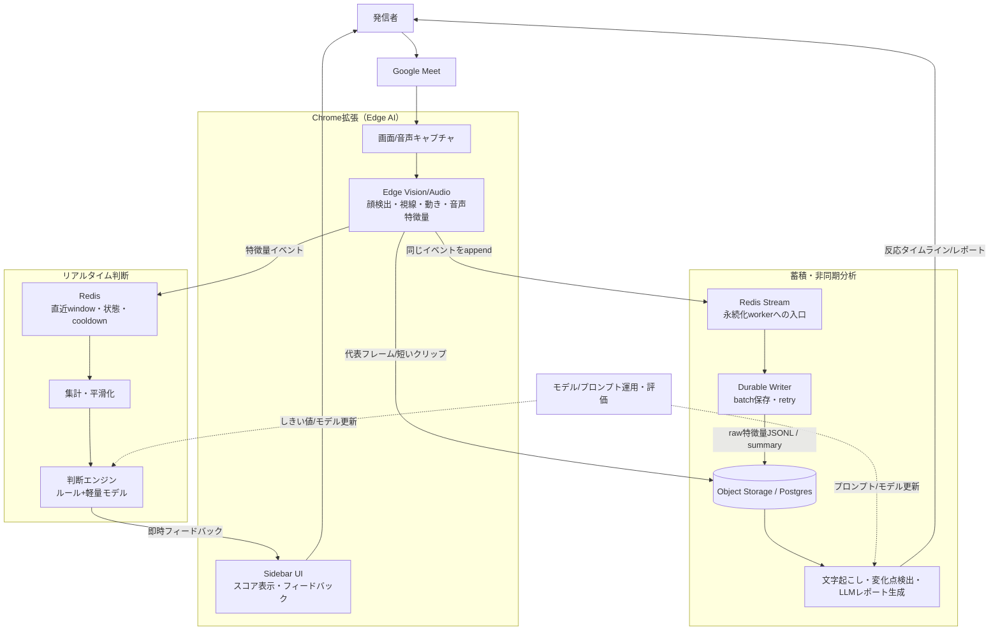
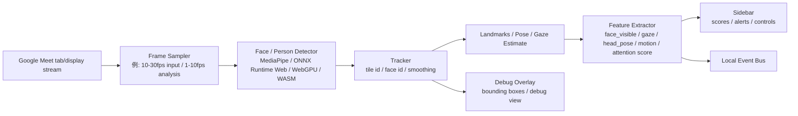
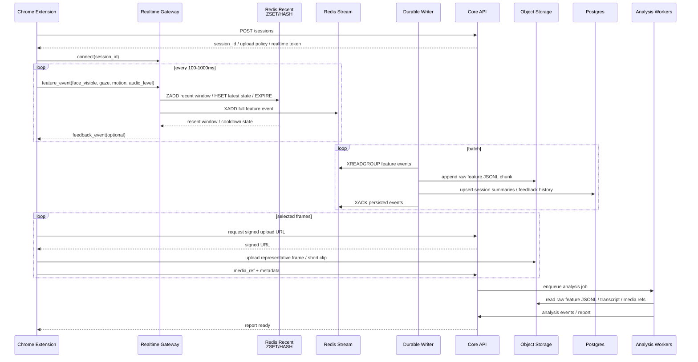
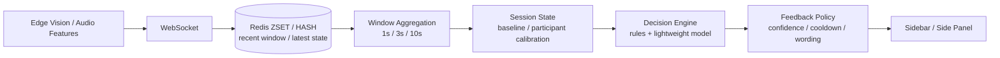
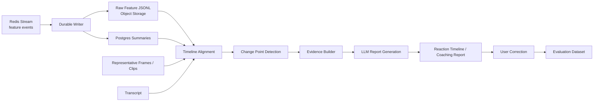

# Google Meet リアクション分析プロダクト アーキテクチャ案

## 目的

Google Meet 上の発表・商談・授業・社内共有などで、発信者に対して次の価値を返す。

1. **リアルタイム理解**: 傍聴者の顔・タイル・視線・姿勢・動き・音声反応を会議中に解析し、発信者へ小さなフィードバックを返す。
2. **セッション後分析**: 発話内容、画面上の反応、傍聴者ごとの時系列変化を統合し、反応が落ちた区間や改善点を根拠つきで提示する。
3. **継続改善**: ユーザー修正、確定ラベル、評価データを蓄積し、プロンプト・モデル・しきい値・個人較正を継続的に改善する。

重要なのは、Chrome 拡張で画像を扱うとしても、画像を常にサーバーへ流す設計にしないこと。最終形では、**リアルタイムな視覚処理はできるだけブラウザ内で実行し、サーバーには特徴量・イベント・必要最小限の代表フレームだけを送る**。

## リアルタイムな顔分析は可能か

可能。カメラ映像や画面キャプチャから人の顔を検出して、顔の周囲を矩形で囲うような処理は、ブラウザ上でも実装できる。

ただし Google Meet 連携では、カメラの生映像を直接扱うというより、以下のどちらかになる。

- **画面キャプチャ方式**: Google Meet の画面またはタブをキャプチャし、映っている参加者タイルから顔・上半身・動き・視線推定を行う。
- **DOM 補助方式**: Google Meet の DOM から参加者タイル、発話者状態、名前表示などを補助的に取得し、画面キャプチャ上の検出結果と対応づける。

最終形ではこの2つを併用する。DOM は変更に弱いので主経路にはせず、視覚検出の補助情報として扱う。

## 全体アーキテクチャ



## 全体アーキテクチャ（簡易版）

上図は詳細度が高いため、第三者にも一目で伝わるよう概念レベルに圧縮したもの。5つの塊（発信者〜Meet、Chrome拡張、リアルタイム判断、蓄積・非同期分析、運用）で全体の流れを示す。

なお本セクション時点で実装済みなのは Chrome 拡張（Edge Vision MVP）のみで、リアルタイム判断/蓄積・非同期分析/運用は未実装（設計段階）。



**読み方**

- 左上〜拡張: 発信者が Meet を開くと、拡張がタブ画面をキャプチャし、ブラウザ内（Edge）で顔・視線・動き・音声の特徴量を抽出する。画像そのものは基本的にサーバーに送らない。
- リアルタイム判断: 特徴量イベントを Redis の直近 window に入れ、集計し、断定しすぎない軽いフィードバック（例:「反応が薄くなっている可能性」）を即座に発信者へ返す。
- 蓄積・非同期分析: 同じ特徴量イベントを Redis Stream に append し、Durable Writer が raw JSONL / summary として保存する。会議後は保存済み特徴量、transcript、代表フレームを使って変化点検出・LLMレポート化を行う。
- 運用: プロンプト/モデル/しきい値は継続的に評価・更新され、リアルタイム判断と非同期分析の両方にフィードバックされる。

## Edge Vision Pipeline

発信者が見たことのある「顔を四角で囲ってリアルタイムに検出する」処理は、この層で実現する。基本は Chrome 拡張内で `video -> canvas -> detector -> tracking -> features -> sidebar/debug overlay` の流れを作る。



この処理はリアルタイムにできる。ただし負荷が高いので、常に30fpsで重いモデルを回すのではなく、以下のように分ける。

- 表示用の矩形追跡: 軽量・高頻度
- 反応スコア用の特徴抽出: 中頻度
- 高精度ラベリング: 低頻度またはサーバー後処理

## 通信設計

画像そのものを WebSocket で送ることは可能だが、最終形でも主経路にはしない。リアルタイムで必要なのは画像本体ではなく、画像から抽出した特徴量とイベントだから。



### リアルタイム特徴量の保存方針

Realtime Gateway は `realtime_feature` を受け取ったら、1回の ingest で2つの経路に流す。

1. **Redis ZSET / HASH**
   - 目的: リアルタイム feedback のための直近 window、最新状態、cooldown。
   - 保存期間: 数分から数時間。TTL で消える前提。
   - 例:
     - `features:recent:{session_id}`: timestamp score の ZSET
     - `session:state:{session_id}`: latest feature / status の HASH
     - `feedback:cooldown:{session_id}`: feedback 種別ごとの cooldown HASH

2. **Redis Stream**
   - 目的: Durable Writer / 後分析 worker へ渡す処理待ち event log。
   - 保存期間: writer が保存済みになるまでの短中期。無限保存先にはしない。
   - 例:
     - `features:stream`: `XADD` で full event を append
     - consumer group: `durable-writers`

Gateway は Postgres や Object Storage へ同期保存しない。低遅延 path では Redis への軽い書き込みまでに留め、永続化は Durable Writer が batch で行う。

```text
on realtime_feature:
  validate payload
  assign event_id
  Redis pipeline:
    ZADD features:recent:{session_id} t_ms compact_payload
    ZREMRANGEBYSCORE features:recent:{session_id} -inf now-60000
    HSET session:state:{session_id} latest_feature compact_payload latest_t_ms t_ms
    EXPIRE features:recent:{session_id} 3600
    EXPIRE session:state:{session_id} 3600
    XADD features:stream * event_id ... payload full_payload
```

### 永続化タイミング

- **feature 受信時**: Gateway が Redis recent と Redis Stream に書く。
- **数秒単位または N events 単位**: Durable Writer が Redis Stream を batch で読み、raw feature JSONL を Object Storage に保存し、summary / feedback history を Postgres に upsert する。
- **セッション終了時**: session status を `ended` にし、未保存 event を final flush し、post-session analysis job を enqueue する。
- **後分析時**: Worker は Object Storage の raw feature JSONL、transcript、代表フレーム/clip を読んで report を作る。

Durable Writer は `XREADGROUP` で読み、保存成功後に `XACK` する。保存前に worker が落ちた event は pending に残るため、別 worker が `XAUTOCLAIM` で回収する。再処理に備えて `event_id` を持たせ、Postgres 側は冪等 upsert、Object Storage 側は重複許容または後分析時の dedupe を前提にする。

### WebSocket で送るもの

- `face_visible`
- `face_bbox`
- `tile_bbox`
- `gaze_estimate`
- `head_pose`
- `motion_score`
- `attention_score`
- `audio_level`
- `silence_ms`
- `speaking_rate`
- `speaker_change`
- `feedback_ack`

### REST / signed upload で送るもの

- 代表フレーム
- 短いクリップ
- transcript chunk
- セッション終了イベント
- レポート取得
- ユーザー修正・確定ラベル

### 原則

- WebSocket は **低遅延イベント用**。
- Redis ZSET / HASH は **リアルタイム判定用の短期 state**。
- Redis Stream は **永続化 worker への入口**。最終保存先ではない。
- REST は **状態変更・確定データ・メディア参照用**。
- Object Storage は **画像・短い動画・分析 artifact 用**。
- Object Storage には **raw feature JSONL** も保存し、セッション後分析の source of truth にする。
- DB には画像本体や全 raw feature を入れず、session、summary、feedback history、report、`media_ref` と metadata を保存する。

## リアルタイム分析パス



リアルタイムパスは Redis の直近 window だけを見る。RDB や Object Storage を判定のたびに読まない。低遅延 feedback のために、直近 10秒/30秒程度の特徴量、session state、cooldown state を Redis に置く。

リアルタイムパスでは断定的な感情推定を避ける。出すべきなのは「退屈しています」ではなく、「一部の反応が薄くなっている可能性があります」「発話速度が上がっています」「間を置いて確認するとよさそうです」のような、発信者がすぐ行動に移せる表現。

## セッション後分析パス



セッション後分析では、Redis Stream から Durable Writer が保存した raw feature JSONL を基本入力にする。リアルタイム判定用 Redis state は TTL で消える前提なので、後分析の source of truth にはしない。代表フレーム、発話前後の transcript、反応スコアの変化点をまとめて Gemini に渡し、理由・根拠・確信度を生成する。

## Chrome 拡張の責務

Chrome 拡張は最終形でも重要な分析コンポーネントになる。ただし、重い統合分析や長期保存は担当しない。

- Google Meet 上に sidebar / side panel を表示する
- 顔 bbox などの矩形表示は、通常 UI ではなく debug overlay として扱う
- ユーザー同意を取り、Meet のタブ/画面/音声を取得する
- 画面キャプチャから参加者タイルと顔領域を検出する
- 顔 bbox、タイル bbox、視線推定、頭部姿勢、動き量をリアルタイムに抽出する
- 発信者音声の音量、無音、話速、話者交代を抽出する
- 参加者ごとの baseline をローカルで保持する
- WebSocket で軽量イベントを送る
- 必要な代表フレーム/短いクリップだけを upload する
- サーバーからの feedback event を UI に反映する

## バックエンドの責務

バックエンドは「セッション状態、リアルタイム判断、後処理分析、評価」を管理する。

- session lifecycle、role、consent、retention policy の管理
- WebSocket gateway によるリアルタイムイベント受信
- Redis ZSET / HASH への直近 window、latest state、cooldown state の保存
- Redis Stream への full feature event append
- window aggregation、baseline 補正、cooldown 制御
- feedback policy による文言・頻度・確信度制御
- Durable Writer による raw feature JSONL、summary、feedback history の永続化
- 代表フレーム/短いクリップの保存先管理
- 文字起こし、視覚ラベリング、変化点検出、LLM レポート生成
- ユーザー修正の収集
- golden sessions による評価
- prompt/model/threshold version の管理
- cost、latency、quality、confidence の可観測性

## データ契約

### 1. Session

```json
{
  "session_id": "sess_123",
  "started_at": "2026-07-01T10:00:00Z",
  "meeting_provider": "google_meet",
  "speaker_user_id": "user_1",
  "consent": {
    "capture_screen": true,
    "capture_audio": true,
    "store_representative_frames": true,
    "store_raw_video": false,
    "retention_days": 30
  }
}
```

### 2. Realtime Feature Event

```json
{
  "event_id": "evt_123",
  "type": "realtime_feature",
  "schema_version": 1,
  "session_id": "sess_123",
  "t_ms": 12345,
  "server_received_at_ms": 12380,
  "audience_id": "aud_2",
  "tile_bbox": { "x": 112, "y": 240, "w": 320, "h": 180 },
  "face_bbox": { "x": 174, "y": 265, "w": 82, "h": 92 },
  "features": {
    "face_visible": true,
    "gaze_estimate": "screen",
    "head_pose": { "yaw": -8.2, "pitch": 4.1, "roll": 1.0 },
    "motion_score": 0.42,
    "attention_score": 0.66
  },
  "client_model_version": "edge-vision-v1"
}
```

`event_id` は Gateway 側で採番する。Redis Stream から Durable Writer が再処理する可能性があるため、永続化側は `event_id` で冪等に扱う。`t_ms` は client event time、`server_received_at_ms` は Gateway 受信時刻として分ける。

### 3. Media Reference

```json
{
  "type": "media_ref",
  "session_id": "sess_123",
  "t_ms": 12345,
  "audience_id": "aud_2",
  "media_ref": "storage://sessions/sess_123/frames/frame_12345.webp",
  "mime": "image/webp",
  "purpose": "representative_frame",
  "redaction": {
    "applied": false
  }
}
```

### 4. Transcript Chunk

```json
{
  "session_id": "sess_123",
  "t_start_ms": 12000,
  "t_end_ms": 17000,
  "speaker": "presenter",
  "text": "ここから価格戦略について説明します",
  "confidence": 0.91
}
```

### 5. Feedback Event

```json
{
  "type": "feedback_event",
  "session_id": "sess_123",
  "t_ms": 65000,
  "feedback_type": "reaction_down_candidate",
  "severity": "low",
  "message": "一部の反応が薄くなっている可能性があります",
  "reason_codes": ["attention_score_drop", "motion_drop"],
  "confidence": 0.64,
  "cooldown_ms": 30000
}
```

### 6. Analysis Event

```json
{
  "session_id": "sess_123",
  "t_start_ms": 60000,
  "t_end_ms": 90000,
  "audience_id": "aud_2",
  "event_type": "reaction_drop",
  "score_before": 0.72,
  "score_after": 0.48,
  "delta": -0.24,
  "label": "説明密度が高く反応が低下した可能性",
  "evidence": ["価格表の説明開始後に視線推定と動きが低下", "同区間で発話速度が上昇"],
  "confidence": 0.68,
  "model_version": "gemini-flash",
  "prompt_version": "reaction_report_v1"
}
```

## 画像データの扱い

Chrome 拡張は画像を扱う。ただし、常時サーバーへ転送するのではなく、以下の3段階に分ける。

| データ | 主な用途 | 通信 | 保存 |
| --- | --- | --- | --- |
| 顔 bbox / 視線 / 動き量などの特徴量 | リアルタイム判断 | WebSocket | Redis ZSET / HASH |
| raw feature event | 後分析、再集計、監査 | Gateway -> Redis Stream -> Durable Writer | Object Storage JSONL |
| feature summary / feedback history | 画面表示、レポート、検索 | Durable Writer | Postgres |
| 代表フレーム | 後処理分析、根拠表示、評価 | REST + signed upload | Object Storage |
| 短いクリップ | 詳細分析、デバッグ、ユーザー許可ありの再分析 | REST + signed upload | Object Storage |

WebSocket で画像バイナリを送ること自体は可能。ただし、低遅延 feedback と大きな画像転送を同じ経路に混ぜると、詰まりや再送設計が難しくなる。最終形でも、画像本体は upload 経路、リアルタイム判断は特徴量経路に分ける。

## 技術選定

- Extension: Chrome MV3, TypeScript, React または Web Components
- Capture: `chrome.tabCapture`, `getDisplayMedia`, Web Audio API
- Edge Vision: MediaPipe Tasks Vision, ONNX Runtime Web, WebGPU/WASM backend
- Realtime: WebSocket
- Realtime State: Redis ZSET / HASH
- Event Stream: Redis Streams（MVP）; 将来は SQS / Pub/Sub / Kafka / Redpanda に差し替え可能
- Core API: FastAPI または Node.js/Fastify
- Durable Writer: Redis Stream consumer group + batch persist + retry / `XACK`
- Job Queue: Redis Stream / BullMQ / Cloud Tasks / Pub/Sub
- DB: Postgres
- Time-series: MVP では Object Storage JSONL + Postgres summary。高頻度検索が必要になったら TimescaleDB / ClickHouse / BigQuery など
- Object Storage: GCS / S3 互換
- Analysis Workers: Python
- Transcription: Whisper 系 API またはクラウド ASR
- Vision/LLM: Gemini Flash 系
- Evaluation: golden sessions + expected feedback/analysis events

## 責務分担

| Role | Ownership | 主な成果物 |
| --- | --- | --- |
| A. Extension / Edge AI | Chrome 拡張、Google Meet 連携、画面/音声取得、Edge Vision、sidebar | 顔 bbox デバッグ表示、特徴量抽出、WebSocket 送信、feedback 表示 |
| B. Realtime / Product Intelligence | リアルタイム集計、baseline 補正、feedback policy、低遅延判断 | feedback engine、cooldown、文言制御、反応スコア |
| C. Analysis / LLM | 文字起こし、変化点検出、Gemini 統合分析、レポート | reaction timeline、analysis events、coaching report |
| D. Platform / Evaluation | API、DB、queue、media storage、評価、可観測性、コスト | session platform、評価 dashboard、prompt/model registry |

3人で作る場合は B と C を統合してもよい。ただし最終形の責務としては、リアルタイム判断とセッション後分析は分けて考える。

## 主要リスク

- Google Meet の DOM / UI 変更
- Chrome 拡張での画面/音声取得制約
- Edge Vision の CPU/GPU 負荷
- 顔・視線・反応推定の過信
- プライバシー、同意、保存期間の設計
- リアルタイム feedback が発信者の邪魔になること
- 生メディア保存によるコスト増大
- 個人ごとの反応差を無視した誤判定

対策として、最終形でも「画像本体より特徴量中心」「代表フレームのみ保存」「断定しない feedback」「個人 baseline 補正」「モデル/プロンプト/しきい値の評価管理」を設計原則にする。
