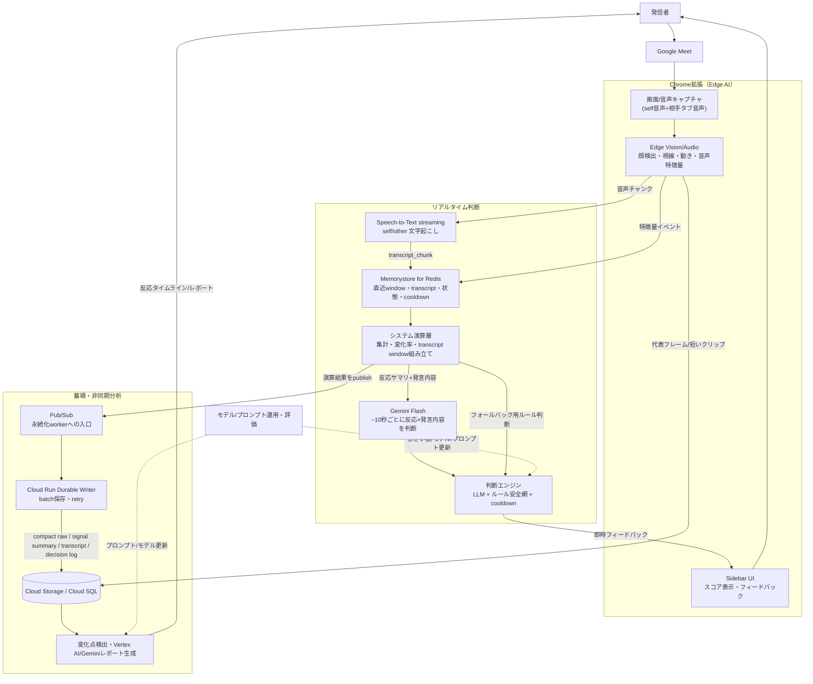
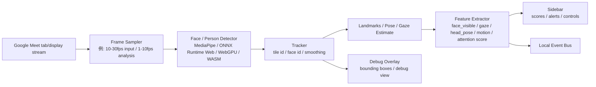
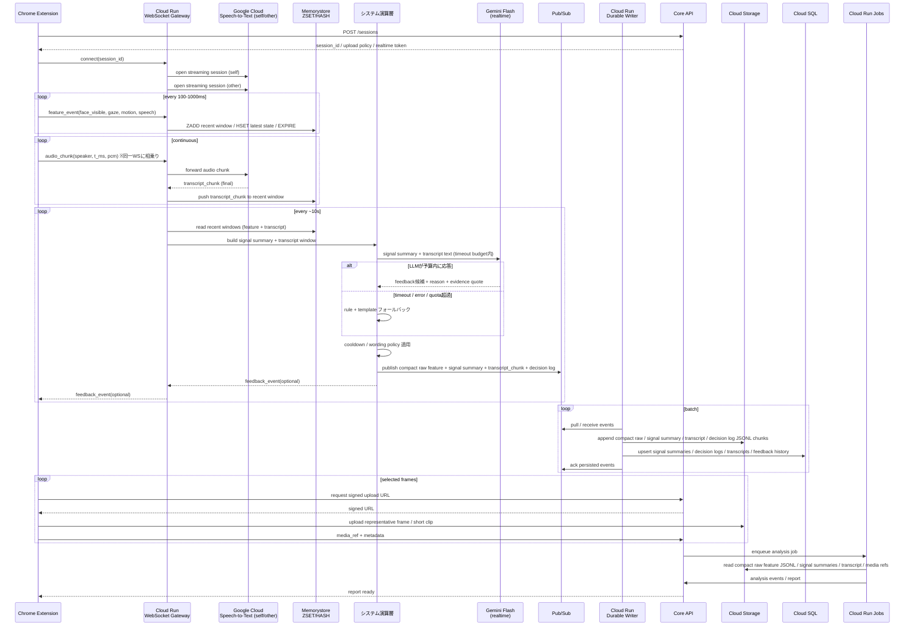
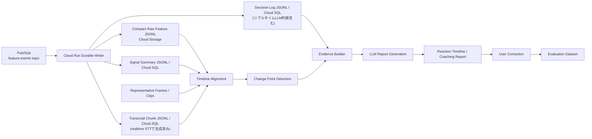

# Google Meet リアクション分析プロダクト アーキテクチャ案

## 目的

Google Meet 上の発表・商談・授業・社内共有などで、発信者に対して次の価値を返す。

1. **リアルタイム理解**: 傍聴者の顔・タイル・視線・姿勢・動き・音声反応を会議中に解析し、発信者へ小さなフィードバックを返す。
2. **セッション後分析**: 発話内容、画面上の反応、傍聴者ごとの時系列変化を統合し、反応が落ちた区間や改善点を根拠つきで提示する。
3. **継続改善**: ユーザー修正、確定ラベル、評価データを蓄積し、プロンプト・モデル・しきい値・個人較正を継続的に改善する。

重要なのは、Chrome 拡張で画像を扱うとしても、画像を常にサーバーへ流す設計にしないこと。最終形では、**リアルタイムな視覚処理はできるだけブラウザ内で実行し、サーバーには特徴量・イベント・必要最小限の代表フレームだけを送る**。

## リアルタイムな顔分析は可能か

可能。カメラ映像や画面キャプチャから人の顔を検出して、顔の周囲を矩形で囲うような処理は、ブラウザ上でも実装できる。

ただし Google Meet 連携では、カメラの生映像を直接扱うというより、以下のどちらかになる。

- **画面キャプチャ方式**: Google Meet の画面またはタブをキャプチャし、映っている参加者タイルから顔・上半身・動き・視線推定を行う。
- **DOM 補助方式**: Google Meet の DOM から参加者タイル、発話者状態、名前表示などを補助的に取得し、画面キャプチャ上の検出結果と対応づける。

最終形ではこの2つを併用する。DOM は変更に弱いので主経路にはせず、視覚検出の補助情報として扱う。

## 全体アーキテクチャ

```mermaid
flowchart TB
  presenter["発信者"]
  meet["Google Meet<br/>meet.google.com"]

  subgraph extension["Chrome Extension"]
    content["Content Script<br/>Meet UI integration / debug overlay"]
    sidebar["Sidebar / Side Panel<br/>realtime feedback / timeline / controls"]
    capture["Capture Layer<br/>tab capture / display capture / audio capture"]
    edgeVision["Edge Vision Pipeline<br/>face detection / tile tracking / gaze estimate / motion"]
    edgeAudio["Edge Audio Pipeline<br/>volume / silence / speaking rate / turn-taking / self+other PCM chunking"]
    localState["Local Session State<br/>participant map / calibration / buffers"]
    realtimeClient["Realtime Client<br/>WebSocket uplink + downlink (features + audio chunk 相乗り)"]
    uploadClient["Upload Client<br/>representative frame / clip upload"]
  end

  subgraph realtimeBackend["Realtime Backend"]
    gateway["Cloud Run<br/>WebSocket Gateway"]
    sttStream["Google Cloud Speech-to-Text<br/>streaming (self / other 各1本)"]
    redisRecent[("Memorystore for Redis<br/>ZSET / HASH recent windows / transcript window / session state / cooldown")]
    pubsub[("Pub/Sub<br/>feature-events topic")]
    systemCompute["システム演算層<br/>window aggregation / signal summary / transcript window 組み立て / decision log"]
    llmRealtime["Vertex AI / Gemini Flash<br/>realtime reasoning (~10秒間隔 / timeout付き)"]
    realtimeDecision["Realtime Decision Engine<br/>LLM出力 + rule fallback + template + cooldown"]
    feedbackApi["Feedback Delivery<br/>speaker hints / sidebar events"]
  end

  subgraph coreBackend["Core Backend"]
    sessionApi["Session API<br/>consent / roles / lifecycle"]
    ingestApi["Ingest API<br/>events / features / media refs"]
    mediaApi["Media API<br/>signed upload / retention / redaction"]
    reportApi["Report API<br/>timeline / coaching report"]
  end

  subgraph asyncPlatform["Async Analysis Platform"]
    durableWriter["Cloud Run Durable Writer<br/>batch persist / ack / retry"]
    jobQueue["Pub/Sub / Cloud Tasks<br/>post-session jobs"]
    visionWorker["Vision Worker<br/>high accuracy labeling / representative frames"]
    changeWorker["Change Point Worker<br/>reaction delta / anomaly detection"]
    llmWorker["LLM Analysis Worker<br/>Gemini report / evidence generation"]
    evalWorker["Evaluation Worker<br/>golden sessions / regression checks"]
  end

  subgraph dataPlatform["Data Platform"]
    postgres[("Cloud SQL for PostgreSQL<br/>sessions / participants / summaries / transcripts / reports")]
    timeseries[("BigQuery optional<br/>analytics / evaluation")]
    objectStorage[("Cloud Storage<br/>compact raw feature JSONL / signal summaries / decision logs / transcript JSONL / frames / clips / artifacts")]
    vectorStore[("Vector Store<br/>examples / report snippets / retrieval")]
    warehouse[("Analytics Warehouse<br/>cost / latency / quality metrics")]
  end

  subgraph ops["Model Ops / Product Ops"]
    promptRegistry["Prompt Registry"]
    modelRegistry["Model Registry"]
    evalDashboard["Evaluation Dashboard"]
    costDashboard["Cost / Latency Dashboard"]
    privacyControls["Privacy / Retention Controls"]
  end

  presenter --> meet
  meet --> content
  content --> sidebar
  content --> capture
  capture --> edgeVision
  capture --> edgeAudio
  edgeVision --> localState
  edgeAudio --> localState

  localState -->|features / audio chunk / events| realtimeClient
  realtimeClient --> gateway
  gateway -->|recent compact feature| redisRecent
  gateway -->|self/other PCM chunk| sttStream
  sttStream -->|transcript_chunk (final)| redisRecent
  redisRecent --> systemCompute
  systemCompute -->|signal summary + transcript window| llmRealtime
  llmRealtime -->|feedback候補 + reason（timeout/失敗時は空）| realtimeDecision
  systemCompute -->|rule fallback + decision log| realtimeDecision
  systemCompute -->|compact raw feature + signal summary + transcript_chunk + decision log| pubsub
  realtimeDecision --> feedbackApi
  feedbackApi --> gateway
  gateway --> realtimeClient
  realtimeClient --> sidebar
  sidebar -->|feedback / controls| presenter

  content --> sessionApi
  localState -->|lifecycle events| ingestApi
  uploadClient -->|selected frames / short clips| mediaApi

  sessionApi --> postgres
  ingestApi --> postgres
  mediaApi --> objectStorage
  ingestApi --> jobQueue
  mediaApi --> jobQueue

  pubsub --> durableWriter
  durableWriter -->|compact raw / signal summary / transcript / decision log JSONL| objectStorage
  durableWriter -->|signal summaries / decision logs / transcripts / feedback history| postgres
  durableWriter -.->|optional high-volume signals| timeseries
  durableWriter --> jobQueue

  jobQueue --> visionWorker
  postgres -->|transcript| changeWorker
  objectStorage -->|transcript JSONL| changeWorker
  visionWorker --> changeWorker
  changeWorker --> llmWorker
  llmWorker --> reportApi

  reportApi --> postgres
  llmWorker --> vectorStore
  visionWorker --> timeseries
  changeWorker --> timeseries

  evalWorker --> evalDashboard
  postgres --> evalWorker
  timeseries --> evalWorker
  objectStorage --> evalWorker

  promptRegistry --> llmWorker
  promptRegistry --> llmRealtime
  modelRegistry --> llmRealtime
  modelRegistry --> visionWorker
  llmRealtime -.->|呼び出しレイテンシ/コストログ| warehouse
  postgres --> warehouse
  timeseries --> warehouse
  warehouse --> costDashboard
  privacyControls --> mediaApi
  privacyControls -.-> sttStream
```

`transcriptWorker`（事後ASR）は廃止した。文字起こしは会議中の Google Cloud Speech-to-Text streaming（self/other 各1本）で完結させ、確定した `transcript_chunk` をリアルタイム経路とそのまま同じ Pub/Sub → Durable Writer 経路で永続化する。セッション後分析はこの永続化済み transcript を読むだけで、ASR をやり直さない。

## 全体アーキテクチャ（簡易版）

上図は詳細度が高いため、第三者にも一目で伝わるよう概念レベルに圧縮したもの。5つの塊（発信者〜Meet、Chrome拡張、リアルタイム判断、蓄積・非同期分析、運用）で全体の流れを示す。

なお本セクション時点で実装済みなのは Chrome 拡張（Edge Vision MVP、音声はVADのみ）で、音声ストリーミング/リアルタイムLLM判断/蓄積・非同期分析/運用は未実装（設計段階）。



**読み方**

- 左上〜拡張: 発信者が Meet を開くと、拡張がタブ画面をキャプチャし、ブラウザ内（Edge）で顔・視線・動きの特徴量を抽出しつつ、self（マイク）/other（タブ音声）の音声も取得する。画像そのものは基本的にサーバーに送らない。
- リアルタイム判断: 特徴量イベントと音声チャンクを送り、音声は Speech-to-Text streaming でその場文字起こしされ `transcript_chunk` として Memorystore に入る。システム演算層が直近window（特徴量+発話テキスト）を約10秒ごとに Gemini Flash に渡し、「発言内容 × 反応の変化」を根拠つきで判断する。LLMがタイムアウト/失敗した場合はルールベースの判断にフォールバックし、断定しすぎない軽いフィードバック（例:「価格の話の間、反応が薄くなっている可能性があります」）を即座に発信者へ返す。
- 蓄積・非同期分析: Gateway が作った compact raw feature、signal summary、transcript_chunk、decision log を Pub/Sub に publish し、Cloud Run Durable Writer が Cloud Storage に JSONL、Cloud SQL に保存する。会議後は保存済み特徴量・transcript・代表フレームを使って変化点検出・LLMレポート化を行う（文字起こしはリアルタイムで完了しているため、事後ASRは行わない）。
- 運用: プロンプト/モデル/しきい値は継続的に評価・更新され、リアルタイム判断（LLM+ルール）と非同期分析の両方にフィードバックされる。

## Edge Vision Pipeline

発信者が見たことのある「顔を四角で囲ってリアルタイムに検出する」処理は、この層で実現する。基本は Chrome 拡張内で `video -> canvas -> detector -> tracking -> features -> sidebar/debug overlay` の流れを作る。



この処理はリアルタイムにできる。ただし負荷が高いので、常に30fpsで重いモデルを回すのではなく、以下のように分ける。

- 表示用の矩形追跡: 軽量・高頻度
- 反応スコア用の特徴抽出: 中頻度
- 高精度ラベリング: 低頻度またはサーバー後処理

## 通信設計

画像そのものを WebSocket で送ることは可能だが、最終形でも主経路にはしない。リアルタイムで必要なのは画像本体ではなく、画像から抽出した特徴量とイベントだから。



### リアルタイム特徴量・音声の保存方針

Cloud Run WebSocket Gateway は `realtime_feature` と `audio_chunk` を同じ WebSocket コネクションで受け取り、それぞれ以下に流す。

1. **Memorystore for Redis ZSET / HASH**
   - 目的: リアルタイム feedback のための直近 window（特徴量+transcript）、最新状態、cooldown。
   - 保存期間: 数分から数時間。TTL で消える前提。
   - 例:
     - `features:recent:{session_id}`: timestamp score の ZSET
     - `transcript:recent:{session_id}`: transcript_chunk（final）の ZSET
     - `session:state:{session_id}`: latest feature / status の HASH
     - `feedback:cooldown:{session_id}`: feedback 種別ごとの cooldown HASH

2. **Google Cloud Speech-to-Text streaming**
   - 目的: `audio_chunk`（self/other の PCM）をリアルタイムでテキスト化する。
   - セッションごとに self/other 各1本の streaming セッションを維持し、Gateway が定期的に再接続する（1ストリームの継続時間上限があるため）。
   - 確定（final）した結果のみ `transcript_chunk` として組み立て、Memorystore recent と Pub/Sub の両方に送る。中間(interim)結果はリアルタイム表示に使う場合のみ保持し、永続化はしない。

3. **Pub/Sub**
   - 目的: Cloud Run Durable Writer / 後分析 worker へ渡す durable event pipeline。
   - 保存期間: Pub/Sub retention と retry / dead-letter policy に従う。無限保存先にはしない。
   - 例:
     - topic: `feature-events`
     - subscription: `feature-events-durable-writer`

Gateway は Cloud SQL や Cloud Storage へ同期保存しない。低遅延 path では Memorystore と Pub/Sub への軽い書き込みまでに留め、永続化は Cloud Run Durable Writer が batch で行う。リアルタイムの window 集計、signal summary、transcript window 組み立て、decision log 作成は Gateway 内の **システム演算層** で行う。

```text
on realtime_feature:
  validate payload
  assign event_id
  Redis pipeline:
    ZADD features:recent:{session_id} t_ms compact_payload
    ZREMRANGEBYSCORE features:recent:{session_id} -inf now-60000
    HSET session:state:{session_id} latest_feature compact_payload latest_t_ms t_ms
    EXPIRE features:recent:{session_id} 3600
    EXPIRE session:state:{session_id} 3600

on audio_chunk:
  forward pcm to STT streaming session (speaker=self|other)
  on STT final result:
    assign event_id
    ZADD transcript:recent:{session_id} t_start_ms transcript_chunk
    EXPIRE transcript:recent:{session_id} 3600

every ~10s (per session):
  read 5s / 10s / 30s recent feature windows + transcript window
  calculate signal_summary
  call Gemini Flash(signal_summary, transcript_window) with timeout budget
  if response within budget:
    use LLM feedback candidate + evidence quote
  else:
    fall back to rule + template decision
  apply cooldown / wording policy
  create decision_log
  publish feature-events compact_raw_feature + signal_summary + transcript_chunk + decision_log
```

### 永続化タイミング

- **feature / transcript 受信時**: Gateway が Memorystore recent に書く（signal summary / decision log / LLM呼び出しはこの時点では行わない）。
- **~10秒ごと**: システム演算層が signal summary と transcript window を作り、Gemini Flash を timeout付きで呼び出し、feedback を決定し、Pub/Sub に compact raw feature + signal summary + transcript_chunk + decision log を publish する。
- **数秒単位または N events 単位**: Cloud Run Durable Writer が Pub/Sub から event を読み、JSONL を Cloud Storage に保存し、signal summary / transcript / decision log / feedback history を Cloud SQL に upsert する。
- **セッション終了時**: session status を `ended` にし、未保存 event を final flush し、STT streaming セッションを閉じ、post-session analysis job を enqueue する。
- **後分析時**: Cloud Run Job は Cloud Storage の compact raw feature JSONL、signal summary、transcript（リアルタイムSTTで生成済み）、代表フレーム/clip を読んで report を作る。ASR はやり直さない。

Durable Writer は Pub/Sub message を受け取り、保存成功後に ack する。保存前に worker が落ちた event は retry される。繰り返し失敗する message は dead-letter topic に送る。Pub/Sub は at-least-once delivery 前提なので、`event_id` を持たせ、Cloud SQL 側は冪等 upsert、Cloud Storage 側は重複許容または後分析時の dedupe を前提にする。

### WebSocket で送るもの

- `face_visible`
- `face_bbox`
- `tile_bbox`
- `gaze_estimate`
- `head_pose`
- `motion_score`
- `attention_score`
- `audio_level`
- `silence_ms`
- `speaking_rate`
- `speaker_change`
- `audio_chunk`（self/other PCM、既存の feature 用WSに相乗り）
- `feedback_ack`

### REST / signed upload で送るもの

- 代表フレーム
- 短いクリップ
- セッション終了イベント
- レポート取得
- ユーザー修正・確定ラベル

`transcript chunk` はリアルタイムSTT経由でWebSocket/Pub/Sub側から生成されるため、REST経路では扱わない。

### 原則

- WebSocket は **低遅延イベント用**（特徴量・音声チャンクの両方）。
- Memorystore for Redis ZSET / HASH は **リアルタイム判定用の短期 state**（特徴量とtranscript window）。
- STT streaming セッションは **session_id単位・self/other各1本**。Gatewayが継続時間上限に応じて再接続する。
- リアルタイムLLM呼び出しは **~10秒間隔・timeout必須・失敗時はrule fallback**。呼び出し頻度と結果はコスト/レイテンシダッシュボードで可視化する。
- Pub/Sub は **永続化 worker への入口**。最終保存先ではない。
- REST は **状態変更・確定データ・メディア参照用**。
- Cloud Storage は **画像・短い動画・分析 artifact 用**。
- Cloud Storage には **compact raw feature JSONL / signal summary / transcript JSONL / decision log** も保存し、セッション後分析の source of truth にする。
- Cloud SQL には画像本体や compact raw feature 全件を入れず、session、signal summary、transcript、decision log、feedback history、report、`media_ref` と metadata を保存する。

## リアルタイム分析パス

```mermaid
flowchart LR
  edge["Edge Vision / Audio Features"]
  audio["Self/Other PCM Chunk"]
  ws["WebSocket"]
  stt["STT streaming<br/>self/other"]
  recent[("Memorystore for Redis<br/>recent window + transcript window")]
  window["Window Aggregation<br/>1s / 3s / 10s"]
  summary["Signal Summary<br/>avg / delta / slope / duration"]
  transcriptWindow["Transcript Window<br/>直近~10秒の発話テキスト"]
  state["Session State<br/>baseline / participant calibration"]
  llm["Gemini Flash<br/>~10秒間隔・timeout付き"]
  decision["Decision Engine<br/>LLM出力 + rule fallback + decision log"]
  policy["Feedback Policy<br/>confidence / cooldown / wording"]
  ui["Sidebar / Side Panel"]

  edge --> ws
  audio --> ws
  ws --> stt
  stt --> recent
  ws --> recent
  recent --> window
  recent --> transcriptWindow
  window --> summary
  summary --> state
  transcriptWindow --> llm
  state --> llm
  llm --> decision
  state --> decision
  decision --> policy
  policy --> ui
```



リアルタイムパスは Cloud Run Gateway 内で処理する。Gateway は Memorystore for Redis の直近 window（特徴量+transcript）だけを読み、Cloud SQL や Cloud Storage を判定のたびに読まない。低遅延 feedback のために、直近 5秒/10秒/30秒程度の特徴量、直近~10秒の transcript、session state、cooldown state を Memorystore に置く。

Gateway は latest、window average、直前 window との差分、baseline 差、slope、低下/上昇の継続時間、confidence を signal summary として計算する。~10秒間隔で signal summary + transcript window を Gemini Flash に渡し、「どんな発言をしている間にどう反応が変化したか」を根拠（evidence quote）つきで判断させる。LLM呼び出しには厳格な timeout を設け、予算内に応答が無い・失敗した・quotaに達した場合は既存の rule + template によるフォールバックに切り替える。Decision Engine はどちらの経路で作られた feedback も同じ cooldown / wording policy を通してから返す。

リアルタイムパスでは断定的な感情推定・因果の言い切りを避ける。同じ時間窓に発言と反応変化が同時に見えても、それは相関であって因果の証明ではない。出すべきなのは「退屈しています」ではなく、「価格の話をしている間、視線が画面から外れる頻度が上がっている可能性があります」「発話速度が上がっています」「間を置いて確認するとよさそうです」のような、発信者がすぐ行動に移せる表現。LLM呼び出しの頻度・レイテンシ・コストは Cost / Latency Dashboard で継続的に監視する。

## セッション後分析パス



セッション後分析では、Pub/Sub から Cloud Run Durable Writer が保存した compact raw feature JSONL、signal summary、transcript chunk（会議中の streaming STT で確定済み）、decision log（リアルタイムLLMの判断結果も含む）を基本入力にする。リアルタイム判定用 Memorystore state は TTL で消える前提なので、後分析の source of truth にはしない。文字起こしは会議中に完了しているため、事後の ASR/diarization はやり直さない。代表フレーム、発話前後の transcript、反応スコアの変化点、そしてリアルタイムLLMが既に出した decision log（どの発言区間でどう判断したか）をまとめて Vertex AI / Gemini に渡し、より確度の高い理由・根拠・確信度を生成する。

## Chrome 拡張の責務

Chrome 拡張は最終形でも重要な分析コンポーネントになる。ただし、重い統合分析や長期保存は担当しない。

- Google Meet 上に sidebar / side panel を表示する
- 顔 bbox などの矩形表示は、通常 UI ではなく debug overlay として扱う
- ユーザー同意を取り、Meet のタブ/画面/音声を取得する
- 画面キャプチャから参加者タイルと顔領域を検出する
- 顔 bbox、タイル bbox、視線推定、頭部姿勢、動き量をリアルタイムに抽出する
- 発信者音声（self）とタブ音声（other）の音量、無音、話速、話者交代を抽出する
- self/other の音声を PCM チャンクとして既存WebSocketに送る（画像・特徴量イベントと同じコネクション）
- 参加者ごとの baseline をローカルで保持する
- WebSocket で軽量イベント・音声チャンクを送る
- 必要な代表フレーム/短いクリップだけを upload する
- サーバーからの feedback event を UI に反映する

## バックエンドの責務

バックエンドは「セッション状態、リアルタイム判断、後処理分析、評価」を管理する。

- session lifecycle、role、consent、retention policy の管理
- WebSocket gateway によるリアルタイムイベント・音声チャンク受信
- session_id ごとに self/other 各1本の Google Cloud Speech-to-Text streaming セッションを維持・再接続管理する
- Memorystore for Redis ZSET / HASH への直近 window（特徴量+transcript）、latest state、cooldown state の保存
- Pub/Sub への compact raw feature / signal summary / transcript_chunk / decision log publish
- window aggregation、baseline 補正、cooldown 制御
- 約10秒間隔で signal summary + transcript window を Gemini Flash に渡し、timeout/フォールバック付きでリアルタイム feedback を生成する
- feedback policy による文言・頻度・確信度制御（LLM出力・rule出力どちらにも適用）
- Cloud Run Durable Writer による compact raw feature JSONL、signal summary、transcript、decision log、feedback history の永続化
- 代表フレーム/短いクリップの保存先管理
- 視覚ラベリング、変化点検出、LLM レポート生成（文字起こしは会議中のリアルタイムSTTで完了済み）
- リアルタイムLLM呼び出しのレイテンシ・コスト・失敗率の可観測性
- ユーザー修正の収集
- golden sessions による評価（リアルタイムLLM判断も対象に含む）
- prompt/model/threshold version の管理
- cost、latency、quality、confidence の可観測性

## データ契約

### 1. Session

```json
{
  "session_id": "sess_123",
  "started_at": "2026-07-01T10:00:00Z",
  "meeting_provider": "google_meet",
  "speaker_user_id": "user_1",
  "consent": {
    "capture_screen": true,
    "capture_audio": true,
    "transcribe_audio": true,
    "store_representative_frames": true,
    "store_raw_video": false,
    "retention_days": 30
  }
}
```

`transcribe_audio` は音声をリアルタイムでテキスト化・保存することへの同意。`capture_audio`（音量ベースのVAD利用）とは別に明示的な同意項目として分ける。

### 2. Realtime Feature Event

```json
{
  "event_id": "evt_123",
  "type": "realtime_feature",
  "schema_version": 1,
  "session_id": "sess_123",
  "t_ms": 12345,
  "server_received_at_ms": 12380,
  "audience_id": "aud_2",
  "tile_bbox": { "x": 112, "y": 240, "w": 320, "h": 180 },
  "face_bbox": { "x": 174, "y": 265, "w": 82, "h": 92 },
  "features": {
    "face_visible": true,
    "gaze_estimate": "screen",
    "head_pose": { "yaw": -8.2, "pitch": 4.1, "roll": 1.0 },
    "motion_score": 0.42,
    "attention_score": 0.66
  },
  "client_model_version": "edge-vision-v1"
}
```

`event_id` は Gateway 側で採番する。Pub/Sub は at-least-once delivery 前提なので、永続化側は `event_id` で冪等に扱う。`t_ms` は client event time、`server_received_at_ms` は Gateway 受信時刻として分ける。

### 3. Media Reference

```json
{
  "type": "media_ref",
  "session_id": "sess_123",
  "t_ms": 12345,
  "audience_id": "aud_2",
  "media_ref": "storage://sessions/sess_123/frames/frame_12345.webp",
  "mime": "image/webp",
  "purpose": "representative_frame",
  "redaction": {
    "applied": false
  }
}
```

### 4. Transcript Chunk

```json
{
  "event_id": "evt_456",
  "type": "transcript_chunk",
  "schema_version": 1,
  "session_id": "sess_123",
  "speaker": "self",
  "t_start_ms": 12000,
  "t_end_ms": 17000,
  "text": "ここから価格戦略について説明します",
  "confidence": 0.91,
  "is_final": true
}
```

`speaker` は `self`（発信者マイク）/ `other`（タブ音声＝参加者側）の2値。Google Cloud Speech-to-Text streaming の確定（final）結果のみを `transcript_chunk` として発行し、中間(interim)結果は永続化しない。`event_id` は他イベントと同様 Gateway 側で採番し、Pub/Sub の at-least-once delivery に対して冪等に扱う。

### 5. Feedback Event

```json
{
  "type": "feedback_event",
  "session_id": "sess_123",
  "t_ms": 65000,
  "feedback_type": "reaction_down_candidate",
  "severity": "low",
  "message": "価格の話をしている間、視線が画面から逸れる参加者が増えている可能性があります",
  "reason_codes": ["attention_score_drop", "motion_drop"],
  "evidence_quote": "ここから価格戦略について説明します",
  "source": "llm",
  "model_version": "gemini-flash-realtime",
  "confidence": 0.64,
  "cooldown_ms": 30000
}
```

`source` は `"llm"` か `"rule"`。LLM呼び出しがtimeout/失敗した場合は `source: "rule"` で `evidence_quote: null` のテンプレート文言にフォールバックする。`evidence_quote` は判断根拠にした transcript の抜粋で、evalDashboardでの検証やユーザーへの説明性のために保持する。

### 6. Analysis Event

```json
{
  "session_id": "sess_123",
  "t_start_ms": 60000,
  "t_end_ms": 90000,
  "audience_id": "aud_2",
  "event_type": "reaction_drop",
  "score_before": 0.72,
  "score_after": 0.48,
  "delta": -0.24,
  "label": "説明密度が高く反応が低下した可能性",
  "evidence": ["価格表の説明開始後に視線推定と動きが低下", "同区間で発話速度が上昇"],
  "confidence": 0.68,
  "model_version": "gemini-flash",
  "prompt_version": "reaction_report_v1"
}
```

## 画像・音声データの扱い

Chrome 拡張は画像と音声を扱う。ただし、常時生データをサーバーへ転送するのではなく、以下のように段階を分ける。

| データ | 主な用途 | 通信 | 保存 |
| --- | --- | --- | --- |
| 顔 bbox / 視線 / 動き量などの特徴量 | リアルタイム判断 | WebSocket | Memorystore for Redis |
| self/other 音声チャンク（PCM） | リアルタイム文字起こし | WebSocket（同一コネクションに相乗り）-> STT streaming | 生音声は保存しない（STTに中継するのみ） |
| transcript_chunk（テキスト） | リアルタイムLLM判断根拠、後分析 | STT streaming -> Gateway -> Pub/Sub -> Durable Writer | Cloud Storage JSONL / Cloud SQL |
| compact raw feature | 後分析、再集計、監査 | Gateway -> Pub/Sub -> Durable Writer | Cloud Storage JSONL |
| signal summary | リアルタイム判断根拠、後分析 | Gateway -> Pub/Sub -> Durable Writer | Cloud Storage JSONL / Cloud SQL |
| decision log / feedback history | 判断根拠、評価、レポート | Gateway -> Pub/Sub -> Durable Writer | Cloud Storage JSONL / Cloud SQL |
| 代表フレーム | 後処理分析、根拠表示、評価 | REST + signed upload | Cloud Storage |
| 短いクリップ | 詳細分析、デバッグ、ユーザー許可ありの再分析 | REST + signed upload | Cloud Storage |

WebSocket で画像バイナリを送ること自体は可能。ただし、低遅延 feedback と大きな画像転送を同じ経路に混ぜると、詰まりや再送設計が難しくなる。最終形でも、画像本体は upload 経路、リアルタイム判断は特徴量経路に分ける。

音声は self/other の PCM チャンクを既存の特徴量用WebSocketに相乗りさせ、Gateway が Google Cloud Speech-to-Text streaming に中継する。生のPCM自体は永続化せず、確定した `transcript_chunk`（テキスト）だけを保存する。これにより、音声データについても「生データより特徴量（この場合はテキスト）中心」の原則を維持する。

## 技術選定

- Extension: Chrome MV3, TypeScript, React または Web Components
- Capture: `chrome.tabCapture`, `getDisplayMedia`, Web Audio API（AudioWorklet で self/other PCM抽出）
- Edge Vision: MediaPipe Tasks Vision, ONNX Runtime Web, WebGPU/WASM backend
- Realtime: WebSocket on Cloud Run（特徴量イベント + 音声チャンクを同一コネクションで多重化）
- Realtime State: Memorystore for Redis ZSET / HASH
- Realtime Transcription: Google Cloud Speech-to-Text streaming（session_idごとにself/other各1本）
- Realtime LLM: Vertex AI / Gemini Flash（~10秒間隔、timeout + rule fallback）
- Event Stream: Pub/Sub
- Core API: Go service on Cloud Run
- WebSocket Gateway: Go + `net/http` + WebSocket library
- Durable Writer: Go Cloud Run service / worker + Pub/Sub ack / retry / dead-letter topic
- Media API: Go Cloud Run service + Cloud Storage signed URL
- Image Analysis Worker: Go Cloud Run service / Jobs + Pub/Sub + Vertex AI / Gemini Vision
- Job Queue: Pub/Sub / Cloud Tasks
- DB: Cloud SQL for PostgreSQL
- Time-series: MVP では Cloud Storage JSONL + Cloud SQL summary。高頻度検索が必要になったら BigQuery
- Object Storage: Cloud Storage
- Analysis Workers: Cloud Run Jobs（ASRは行わず、視覚ラベリング・変化点検出・レポート生成のみ）
- Vision/LLM: Vertex AI / Gemini（post-session report + realtime reasoning）
- Evaluation: golden sessions + expected feedback/analysis events（リアルタイムLLM判断も含む）

## 責務分担

| Role | Ownership | 主な成果物 |
| --- | --- | --- |
| A. Extension / Edge AI | Chrome 拡張、Google Meet 連携、画面/音声取得（self+other PCM含む）、Edge Vision、sidebar | 顔 bbox デバッグ表示、特徴量抽出、WebSocket 送信（特徴量+音声）、feedback 表示 |
| B. Realtime / Product Intelligence | リアルタイム集計、STT streaming連携、baseline 補正、realtime LLM呼び出し（timeout/fallback含む）、feedback policy、低遅延判断 | feedback engine、cooldown、文言制御、反応スコア、realtimeフィードバック |
| C. Analysis / LLM | 変化点検出、Gemini 統合分析、レポート（文字起こしはリアルタイムSTTの結果を利用） | reaction timeline、analysis events、coaching report |
| D. Platform / Evaluation | API、DB、queue、media storage、評価、可観測性、コスト（realtime LLM呼び出しコスト含む） | session platform、評価 dashboard、prompt/model registry |

3人で作る場合は B と C を統合してもよい。ただし最終形の責務としては、リアルタイム判断とセッション後分析は分けて考える。

## 主要リスク

- Google Meet の DOM / UI 変更
- Chrome 拡張での画面/音声取得制約
- Edge Vision の CPU/GPU 負荷
- 顔・視線・反応推定の過信
- プライバシー、同意、保存期間の設計（発話内容のテキスト化は特に機微度が高い）
- リアルタイム feedback が発信者の邪魔になること
- 生メディア保存によるコスト増大
- 個人ごとの反応差を無視した誤判定
- リアルタイムLLM呼び出しのレイテンシ・コスト超過、quota到達によるフィードバック欠落
- 発言内容と反応変化の相関を因果と誤解させる表現（同時刻に見えても遅延反応の可能性がある）

対策として、最終形でも「画像・生音声本体より特徴量/テキスト中心」「代表フレームのみ保存」「断定しない feedback」「個人 baseline 補正」「モデル/プロンプト/しきい値の評価管理」「リアルタイムLLMは timeout必須・ruleフォールバック必須・呼び出しコストを常時監視」を設計原則にする。
